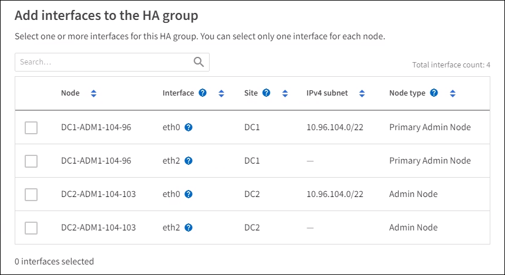

= 고가용성 그룹 구성
:allow-uri-read: 
:icons: font
:imagesdir: ../media/

[role="lead"]
고가용성(HA) 그룹을 구성하여 관리 노드 또는 게이트웨이 노드의 서비스에 대한 고가용성 액세스를 제공할 수 있습니다.

.시작하기 전에
* 다음을 사용하여 Grid Manager에 로그인했습니다.link:../admin/web-browser-requirements.html["지원되는 웹 브라우저"] .
* 당신은 가지고있다link:admin-group-permissions.html["루트 액세스 권한"] .
* HA 그룹에서 VLAN 인터페이스를 사용하려는 경우 VLAN 인터페이스를 생성해야 합니다. 보다 link:../admin/configure-vlan-interfaces.html["VLAN 인터페이스 구성"] .
* HA 그룹의 노드에 대한 액세스 인터페이스를 사용하려는 경우 인터페이스를 생성해야 합니다.
+
** *Red Hat Enterprise Linux(노드 설치 전)*:link:../rhel/creating-node-configuration-files.html["노드 구성 파일 생성"]
** *Ubuntu 또는 Debian(노드 설치 전)*:link:../ubuntu/creating-node-configuration-files.html["노드 구성 파일 생성"]
** *Linux(노드 설치 후)*:link:../maintain/linux-adding-trunk-or-access-interfaces-to-node.html["Linux: 노드에 트렁크 또는 액세스 인터페이스 추가"]
** *VMware(노드 설치 후)*:link:../maintain/vmware-adding-trunk-or-access-interfaces-to-node.html["VMware: 노드에 트렁크 또는 액세스 인터페이스 추가"]

== 고가용성 그룹 만들기

고가용성 그룹을 만들 때는 하나 이상의 인터페이스를 선택하고 우선순위 순서대로 구성합니다.  그런 다음 그룹에 하나 이상의 VIP 주소를 할당합니다.

HA 그룹에 게이트웨이 노드나 관리 노드를 포함하려면 인터페이스가 있어야 합니다.  HA 그룹은 주어진 노드에 대해 하나의 인터페이스만 사용할 수 있습니다. 그러나 동일한 노드에 대한 다른 인터페이스는 다른 HA 그룹에서 사용될 수 있습니다.

=== 마법사에 접속하세요

.단계
. *구성* > *네트워크* > *고가용성 그룹*을 선택합니다.
. *만들기*를 선택하세요.

=== HA 그룹에 대한 세부 정보를 입력하세요

.단계
. HA 그룹에 고유한 이름을 제공합니다.
. 선택적으로 HA 그룹에 대한 설명을 입력합니다.
. *계속*을 선택하세요.

=== HA 그룹에 인터페이스 추가

.단계
. 이 HA 그룹에 추가할 하나 이상의 인터페이스를 선택하세요.
+
열 머리글을 사용하여 행을 정렬하거나 검색어를 입력하여 인터페이스를 더 빠르게 찾으세요.

+

+

NOTE: VLAN 인터페이스를 만든 후 새 인터페이스가 테이블에 나타날 때까지 최대 5분 정도 기다리세요.

+
.인터페이스 선택을 위한 지침
** 최소한 하나의 인터페이스를 선택해야 합니다.
** 노드에 대해 하나의 인터페이스만 선택할 수 있습니다.
** HA 그룹이 Grid Manager와 Tenant Manager를 포함하는 관리 노드 서비스의 HA 보호를 위한 것이라면 관리 노드에서만 인터페이스를 선택하세요.
** HA 그룹이 S3 클라이언트 트래픽의 HA 보호를 위한 것이라면 관리 노드, 게이트웨이 노드 또는 둘 다에서 인터페이스를 선택하세요.
** 다양한 유형의 노드에서 인터페이스를 선택하면 정보 메모가 나타납니다.  장애 조치가 발생하는 경우 이전에 활성화된 노드에서 제공하던 서비스를 새로 활성화된 노드에서 사용하지 못할 수 있습니다.  예를 들어, 백업 게이트웨이 노드는 관리 노드 서비스에 대한 HA 보호를 제공할 수 없습니다.  마찬가지로 백업 관리 노드는 기본 관리 노드가 제공할 수 있는 모든 유지 관리 절차를 수행할 수 없습니다.
** 인터페이스를 선택할 수 없는 경우 해당 체크박스가 비활성화됩니다.  도구 설명에서 자세한 정보를 확인할 수 있습니다.
+
image::../media/vlan_parent_interface_tooltip.png[VLAN 인터페이스 도구 설명]

** 서브넷 값이나 게이트웨이가 다른 선택된 인터페이스와 충돌하는 경우 인터페이스를 선택할 수 없습니다.
** 정적 IP 주소가 없으면 구성된 인터페이스를 선택할 수 없습니다.

. *계속*을 선택하세요.

=== 우선순위를 결정하세요

HA 그룹에 두 개 이상의 인터페이스가 포함된 경우 어떤 인터페이스가 기본 인터페이스이고 어떤 인터페이스가 백업(장애 조치) 인터페이스인지 확인할 수 있습니다.  기본 인터페이스에 장애가 발생하면 VIP 주소는 사용 가능한 가장 우선순위가 높은 인터페이스로 이동합니다.  해당 인터페이스에 장애가 발생하면 VIP 주소는 사용 가능한 가장 높은 우선순위의 인터페이스로 이동하고, 이런 식으로 계속됩니다.

.단계
. *우선순위* 열의 행을 끌어서 기본 인터페이스와 백업 인터페이스를 결정합니다.
+
목록의 첫 번째 인터페이스는 기본 인터페이스입니다.  장애가 발생하지 않는 한 기본 인터페이스가 활성 인터페이스입니다.

+
image::../media/ha_group_determine_failover.png[HA 그룹은 우선순위를 결정합니다.]

+

TIP: HA 그룹이 Grid Manager에 대한 액세스 권한을 제공하는 경우 기본 관리 노드에서 기본 인터페이스가 될 인터페이스를 선택해야 합니다.  일부 유지 관리 절차는 기본 관리 노드에서만 수행할 수 있습니다.

. *계속*을 선택하세요.

=== IP 주소를 입력하세요

.단계
. *서브넷 CIDR* 필드에서 CIDR 표기법으로 VIP 서브넷을 지정합니다. IPv4 주소 뒤에 슬래시와 서브넷 길이(0-32)를 입력합니다.
+
네트워크 주소에는 호스트 비트가 설정되어서는 안 됩니다. 예를 들어,  `192.16.0.0/22` .

+

NOTE: 32비트 접두사를 사용하는 경우 VIP 네트워크 주소는 게이트웨이 주소와 VIP 주소 역할도 합니다.

+
image::../media/ha_group_select_virtual_ips.png[HA 그룹, VIP 진입]

. 선택적으로, S3 관리 또는 테넌트 클라이언트가 다른 서브넷에서 이러한 VIP 주소에 액세스하는 경우 *게이트웨이 IP 주소*를 입력합니다.  게이트웨이 주소는 VIP 서브넷 내에 있어야 합니다.
+
클라이언트 및 관리자 사용자는 이 게이트웨이를 사용하여 가상 IP 주소에 액세스합니다.

. HA 그룹의 활성 인터페이스에 대해 최소 1개, 최대 10개의 VIP 주소를 입력하세요.  모든 VIP 주소는 VIP 서브넷 내에 있어야 하며, 모든 주소는 활성 인터페이스에서 동시에 활성화됩니다.
+
최소한 하나의 IPv4 주소를 제공해야 합니다.  선택적으로 추가 IPv4 및 IPv6 주소를 지정할 수 있습니다.

. *HA 그룹 만들기*를 선택하고 *마침*을 선택합니다.
+
HA 그룹이 생성되었으며 이제 구성된 가상 IP 주소를 사용할 수 있습니다.

=== 다음 단계

이 HA 그룹을 부하 분산에 사용할 경우 포트와 네트워크 프로토콜을 결정하고 필요한 인증서를 첨부하기 위해 부하 분산 장치 엔드포인트를 만듭니다. 보다 link:configuring-load-balancer-endpoints.html["로드 밸런서 엔드포인트 구성"] .

== 고가용성 그룹 편집

고가용성(HA) 그룹을 편집하여 이름과 설명을 변경하고, 인터페이스를 추가하거나 제거하고, 우선순위 순서를 변경하거나, 가상 IP 주소를 추가하거나 업데이트할 수 있습니다.

예를 들어, 사이트 또는 노드 해제 절차에서 선택한 인터페이스와 연결된 노드를 제거하려면 HA 그룹을 편집해야 할 수 있습니다.

.단계
. *구성* > *네트워크* > *고가용성 그룹*을 선택합니다.
+
고가용성 그룹 페이지에는 모든 기존 HA 그룹이 표시됩니다.

. 편집하려는 HA 그룹의 확인란을 선택하세요.
. 업데이트하려는 내용에 따라 다음 중 하나를 수행하세요.
+
** VIP 주소를 추가하거나 제거하려면 *작업* > *가상 IP 주소 편집*을 선택하세요.
** *작업* > *HA 그룹 편집*을 선택하여 그룹 이름이나 설명을 업데이트하고, 인터페이스를 추가하거나 제거하고, 우선순위 순서를 변경하거나, VIP 주소를 추가하거나 제거합니다.

. *가상 IP 주소 편집*을 선택한 경우:
+
.. HA 그룹의 가상 IP 주소를 업데이트합니다.
.. *저장*을 선택하세요.
.. *마침*을 선택하세요.

. *HA 그룹 편집*을 선택한 경우:
+
.. 선택적으로 그룹의 이름이나 설명을 업데이트합니다.
.. 선택적으로, 확인란을 선택하거나 선택 취소하여 인터페이스를 추가하거나 제거합니다.
+

NOTE: HA 그룹이 Grid Manager에 대한 액세스 권한을 제공하는 경우 기본 관리 노드에서 기본 인터페이스가 될 인터페이스를 선택해야 합니다.  일부 유지 관리 절차는 기본 관리 노드에서만 수행할 수 있습니다.

.. 필요한 경우 행을 끌어서 이 HA 그룹에 대한 기본 인터페이스와 백업 인터페이스의 우선 순위를 변경합니다.
.. 선택적으로 가상 IP 주소를 업데이트합니다.
.. *저장*을 선택한 다음 *마침*을 선택합니다.

== 고가용성 그룹 제거

한 번에 하나 이상의 고가용성(HA) 그룹을 제거할 수 있습니다.

TIP: HA 그룹이 로드 밸런서 엔드포인트에 바인딩된 경우 해당 그룹을 제거할 수 없습니다.  HA 그룹을 삭제하려면 해당 그룹을 사용하는 모든 로드 밸런서 엔드포인트에서 제거해야 합니다.

클라이언트 중단을 방지하려면 HA 그룹을 제거하기 전에 영향을 받는 모든 S3 클라이언트 애플리케이션을 업데이트하세요.  예를 들어 다른 HA 그룹의 가상 IP 주소나 설치 중에 인터페이스에 구성된 IP 주소 등 다른 IP 주소를 사용하여 연결하도록 각 클라이언트를 업데이트합니다.

.단계
. *구성* > *네트워크* > *고가용성 그룹*을 선택합니다.
. 제거하려는 각 HA 그룹에 대한 *로드 밸런서 엔드포인트* 열을 검토합니다.  로드 밸런서 엔드포인트가 나열된 경우:
+
.. *구성* > *네트워크* > *로드 밸런서 엔드포인트*로 이동합니다.
.. 종료지점의 확인란을 선택하세요.
.. *작업* > *엔드포인트 바인딩 모드 편집*을 선택합니다.
.. HA 그룹을 제거하려면 바인딩 모드를 업데이트하세요.
.. *변경 사항 저장*을 선택하세요.

. 로드 밸런서 엔드포인트가 나열되어 있지 않으면 제거하려는 각 HA 그룹의 확인란을 선택합니다.
. *작업* > *HA 그룹 제거*를 선택합니다.
. 메시지를 검토하고 *HA 그룹 삭제*를 선택하여 선택 사항을 확인합니다.
+
선택한 모든 HA 그룹이 제거됩니다.  고가용성 그룹 페이지에 녹색 성공 배너가 나타납니다.

