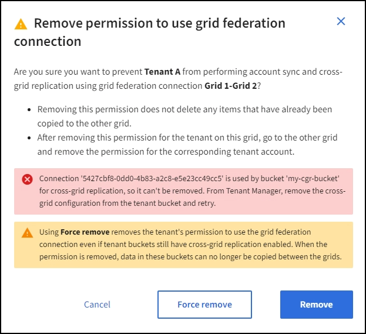

= 그리드 연합을 위한 허용된 세입자 관리
:allow-uri-read: 
:icons: font
:imagesdir: ../media/

[role="lead"]
S3 테넌트 계정이 두 StorageGRID 시스템 간의 그리드 페더레이션 연결을 사용하도록 허용할 수 있습니다.  세입자가 연결을 사용할 수 있도록 허용된 경우 세입자 세부 정보를 편집하거나 세입자의 연결 사용 권한을 영구적으로 제거하기 위한 특별한 단계가 필요합니다.

.시작하기 전에
* 두 그리드 중 하나를 사용하여 그리드 관리자에 로그인했습니다.link:../admin/web-browser-requirements.html["지원되는 웹 브라우저"] .
* 당신은 가지고있다link:admin-group-permissions.html["루트 액세스 권한"] 귀하가 로그인한 그리드에 대해.
* 당신은 가지고있다link:grid-federation-create-connection.html["그리드 연합 연결을 생성했습니다"] 두 개의 격자 사이.
* 당신은 워크플로를 검토했습니다link:grid-federation-what-is-account-clone.html["계정 복제"] 그리고link:grid-federation-what-is-cross-grid-replication.html["크로스 그리드 복제"] .
* 필요에 따라 연결에 있는 두 그리드 모두에 대해 SSO(Single Sign-On) 또는 식별 페더레이션을 이미 구성했습니다. 보다 link:grid-federation-what-is-account-clone.html["계정 복제란 무엇입니까?"] .

== 허가된 세입자를 만드세요

새 테넌트 계정이나 기존 테넌트 계정이 계정 복제 및 그리드 간 복제를 위해 그리드 페더레이션 연결을 사용할 수 있도록 허용하려면 일반 지침을 따르십시오.link:creating-tenant-account.html["새로운 S3 테넌트 생성"] 또는link:editing-tenant-account.html["테넌트 계정 편집"] 다음 사항에 유의하세요.

* 연결의 두 그리드 중 하나에서 테넌트를 생성할 수 있습니다.  테넌트가 생성된 그리드는 _테넌트의 소스 그리드_입니다.
* 연결 상태는 *연결됨*이어야 합니다.
* 테넌트를 생성하거나 편집하여 *그리드 페더레이션 연결 사용* 권한을 활성화한 다음 첫 번째 그리드에 저장하면 동일한 테넌트가 다른 그리드에 자동으로 복제됩니다.  테넌트가 복제되는 그리드는 _테넌트의 대상 그리드_입니다.
* 두 그리드의 테넌트는 모두 동일한 20자리 계정 ID, 이름, 설명, 할당량 및 권한을 갖습니다.  선택적으로 *설명* 필드를 사용하여 어떤 테넌트가 소스 테넌트이고 어떤 테넌트가 대상 테넌트인지 식별할 수 있습니다.  예를 들어, 그리드 1에서 생성된 테넌트에 대한 이 설명은 그리드 2에 복제된 테넌트에도 나타납니다. "이 테넌트는 그리드 1에서 생성되었습니다."
* 보안상의 이유로 로컬 루트 사용자의 비밀번호는 대상 그리드에 복사되지 않습니다.
+

TIP: 로컬 루트 사용자가 대상 그리드의 복제된 테넌트에 로그인하려면 해당 그리드의 그리드 관리자가 다음을 수행해야 합니다.link:changing-password-for-tenant-local-root-user.html["로컬 루트 사용자의 비밀번호를 변경합니다"] .

* 새 테넌트 또는 편집된 테넌트가 두 그리드 모두에서 사용 가능해지면 테넌트 사용자는 다음 작업을 수행할 수 있습니다.
+
** 테넌트의 소스 그리드에서 그룹과 로컬 사용자를 만듭니다. 이는 테넌트의 대상 그리드에 자동으로 복제됩니다. 보다 link:../tenant/grid-federation-account-clone.html["테넌트 그룹 및 사용자 복제"] .
** 테넌트의 대상 그리드에 선택적으로 복제할 수 있는 새로운 S3 액세스 키를 만듭니다. 보다 link:../tenant/grid-federation-clone-keys-with-api.html["API를 사용하여 S3 액세스 키 복제"] .
** 연결의 두 그리드에 동일한 버킷을 만들고 한 방향 또는 양방향으로 그리드 간 복제를 활성화합니다. 보다 link:../tenant/grid-federation-manage-cross-grid-replication.html["그리드 간 복제 관리"] .

== 허가된 세입자 보기

그리드 페더레이션 연결을 사용할 수 있는 테넌트에 대한 세부 정보를 볼 수 있습니다.

.단계
. *임차인*을 선택하세요.
. 세입자 페이지에서 세입자 이름을 선택하면 세입자 세부 정보 페이지가 표시됩니다.
+
이것이 테넌트의 소스 그리드인 경우(즉, 테넌트가 이 그리드에서 생성된 경우), 테넌트가 다른 그리드로 복제되었음을 알려주는 배너가 나타납니다.  이 테넌트를 편집하거나 삭제하면 변경 사항이 다른 그리드와 동기화되지 않습니다.

+
image::../media/grid-federation-tenant-detail.png[테넌트 세부 정보 페이지의 그리드 연합 탭]

. 선택적으로 *그리드 연합* 탭을 선택하십시오.link:../monitor/grid-federation-monitor-connections.html["그리드 연합 연결 모니터링"] .

== 허용된 세입자 편집

*그리드 페더레이션 연결 사용* 권한이 있는 테넌트를 편집해야 하는 경우 일반 지침을 따르세요.link:editing-tenant-account.html["테넌트 계정 편집"] 다음 사항에 유의하세요.

* 테넌트에게 *그리드 페더레이션 연결 사용* 권한이 있는 경우 연결의 두 그리드에서 테넌트 세부 정보를 편집할 수 있습니다.  하지만 변경한 내용은 다른 그리드에 복사되지 않습니다.  그리드 간에 테넌트 세부 정보를 동기화된 상태로 유지하려면 두 그리드에서 동일한 편집을 수행해야 합니다.
* 테넌트를 편집하는 동안 *그리드 페더레이션 연결 사용* 권한을 지울 수 없습니다.
* 테넌트를 편집하는 동안 다른 그리드 페더레이션 연결을 선택할 수 없습니다.

== 허용된 세입자 삭제

*그리드 페더레이션 연결 사용* 권한이 있는 테넌트를 제거해야 하는 경우 일반 지침을 따르세요.link:deleting-tenant-account.html["테넌트 계정 삭제"] 다음 사항에 유의하세요.

* 소스 그리드에서 원래 테넌트를 제거하려면 먼저 소스 그리드에서 해당 계정의 모든 버킷을 제거해야 합니다.
* 대상 그리드에서 복제된 테넌트를 제거하려면 먼저 대상 그리드에서 해당 계정의 모든 버킷을 제거해야 합니다.
* 원본 테넌트나 복제된 테넌트를 제거하면 해당 계정을 더 이상 크로스 그리드 복제에 사용할 수 없습니다.
* 소스 그리드에서 원래 테넌트를 제거하는 경우 대상 그리드에 복제된 테넌트 그룹, 사용자 또는 키는 영향을 받지 않습니다.  복제된 테넌트를 삭제하거나 테넌트가 자체 그룹, 사용자, 액세스 키 및 버킷을 관리하도록 허용할 수 있습니다.
* 대상 그리드에서 복제된 테넌트를 제거하는 경우 원래 테넌트에 새 그룹이나 사용자가 추가되면 복제 오류가 발생합니다.
+
이러한 오류를 방지하려면 이 그리드에서 테넌트를 삭제하기 전에 그리드 페더레이션 연결을 사용할 수 있는 테넌트의 권한을 제거하세요.

== [[remove-grid-federation-connection-permission]]그리드 페더레이션 연결 사용 권한 제거

테넌트가 그리드 페더레이션 연결을 사용하지 못하도록 하려면 *그리드 페더레이션 연결 사용* 권한을 제거해야 합니다.

image::../media/grid-federation-remove-permission.png[그리드 페더레이션 연결을 제거하는 단계]

테넌트의 그리드 페더레이션 연결 사용 권한을 제거하기 전에 다음 사항에 유의하세요.

* 테넌트의 버킷 중 하나에서 크로스 그리드 복제가 활성화된 경우 *그리드 페더레이션 연결 사용* 권한을 제거할 수 없습니다.  테넌트 계정은 먼저 모든 버킷에 대해 크로스 그리드 복제를 비활성화해야 합니다.
* *그리드 연합 연결 사용* 권한을 제거해도 그리드 간에 이미 복제된 항목은 삭제되지 않습니다.  예를 들어, 두 그리드에 모두 존재하는 테넌트 사용자, 그룹 및 개체는 테넌트의 권한이 제거되어도 두 그리드에서 모두 삭제되지 않습니다.  이러한 항목을 삭제하려면 두 그리드에서 모두 수동으로 삭제해야 합니다.
* 동일한 그리드 페더레이션 연결로 이 권한을 다시 활성화하려면 먼저 대상 그리드에서 이 테넌트를 삭제하세요. 그렇지 않으면 이 권한을 다시 활성화하면 오류가 발생합니다.

NOTE: *그리드 페더레이션 연결 사용* 권한을 다시 활성화하면 로컬 그리드가 소스 그리드가 되고 선택한 그리드 페더레이션 연결에서 지정한 원격 그리드로 복제가 트리거됩니다.  원격 그리드에 이미 테넌트 계정이 있는 경우 복제하면 충돌 오류가 발생합니다.

.시작하기 전에
* 당신은 사용 중입니다link:../admin/web-browser-requirements.html["지원되는 웹 브라우저"] .
* 당신은 가지고있다link:admin-group-permissions.html["루트 액세스 권한"] 두 그리드 모두에 대해.

=== 테넌트 버킷에 대한 복제 비활성화

첫 번째 단계로 모든 테넌트 버킷에 대해 크로스 그리드 복제를 비활성화합니다.

.단계
. 두 그리드 중 하나에서 시작하여 기본 관리 노드에서 그리드 관리자에 로그인합니다.
. *구성* > *시스템* > *그리드 연합*을 선택합니다.
. 연결 이름을 선택하면 세부 정보가 표시됩니다.
. *허용된 세입자* 탭에서 세입자가 연결을 사용하고 있는지 확인합니다.
. 세입자가 등록되어 있는 경우 세입자에게 지시하십시오.link:../tenant/grid-federation-manage-cross-grid-replication.html["크로스 그리드 복제 비활성화"] 연결된 두 그리드의 모든 버킷에 대해.
+

TIP: 테넌트 버킷에 크로스 그리드 복제가 활성화된 경우 *그리드 페더레이션 연결 사용* 권한을 제거할 수 없습니다.  테넌트는 두 그리드 모두에서 버킷에 대한 크로스 그리드 복제를 비활성화해야 합니다.

=== 세입자에 대한 허가 제거

테넌트 버킷에 대한 크로스 그리드 복제가 비활성화된 후에는 테넌트의 그리드 페더레이션 연결 사용 권한을 제거할 수 있습니다.

.단계
. 기본 관리 노드에서 Grid Manager에 Sign in .
. 그리드 연합 페이지 또는 테넌트 페이지에서 권한을 제거합니다.
+
[role="tabbed-block"]
====
.그리드 연합 페이지
--
.. *구성* > *시스템* > *그리드 연합*을 선택합니다.
.. 연결 이름을 선택하면 세부 정보 페이지가 표시됩니다.
.. *허용된 세입자* 탭에서 세입자에 대한 라디오 버튼을 선택합니다.
.. *권한 제거*를 선택하세요.

--
.세입자 페이지
--
.. *임차인*을 선택하세요.
.. 세입자 이름을 선택하면 세부 정보 페이지가 표시됩니다.
.. *그리드 연합* 탭에서 연결에 대한 라디오 버튼을 선택합니다.
.. *권한 제거*를 선택하세요.

--
====
. 확인 대화 상자에서 경고를 검토하고 *제거*를 선택하세요.
+
** 권한을 제거할 수 있는 경우 세부 정보 페이지로 돌아가고 성공 메시지가 표시됩니다.  이 테넌트는 더 이상 그리드 페더레이션 연결을 사용할 수 없습니다.
** 하나 이상의 테넌트 버킷에 여전히 크로스 그리드 복제가 활성화되어 있는 경우 오류가 표시됩니다.
+

+
다음 중 하나를 수행할 수 있습니다.

+
*** (추천합니다.)  테넌트 관리자에 Sign in 테넌트의 각 버킷에 대한 복제를 비활성화합니다. 보다 link:../tenant/grid-federation-manage-cross-grid-replication.html["그리드 간 복제 관리"] .  그런 다음, *그리드 연결 사용* 권한을 제거하기 위한 단계를 반복합니다.
*** 강제로 허가를 취소하세요.  다음 섹션을 참조하세요.

. 다른 그리드로 이동하여 이 단계를 반복하여 다른 그리드의 동일한 테넌트에 대한 권한을 제거합니다.

== [[force_remove_permission]]강제로 권한을 제거합니다.

필요한 경우 테넌트 버킷에 크로스 그리드 복제가 활성화되어 있어도 그리드 페더레이션 연결을 사용하는 테넌트의 권한을 강제로 제거할 수 있습니다.

강제로 세입자의 허가를 제거하기 전에 일반적인 고려 사항을 참고하세요.<<remove-grid-federation-connection-permission,권한 제거>> 다음과 같은 추가 고려 사항도 있습니다.

* 강제로 *그리드 페더레이션 연결 사용* 권한을 제거하면 다른 그리드로의 복제를 보류 중인 모든 개체(수집되었지만 아직 복제되지 않은 개체)는 계속 복제됩니다.  이러한 진행 중인 개체가 대상 버킷에 도달하지 못하게 하려면 다른 그리드에서도 테넌트의 권한을 제거해야 합니다.
* *그리드 페더레이션 연결 사용* 권한을 제거한 후 소스 버킷에 수집된 모든 개체는 대상 버킷에 복제되지 않습니다.

.단계
. 기본 관리 노드에서 Grid Manager에 Sign in .
. *구성* > *시스템* > *그리드 연합*을 선택합니다.
. 연결 이름을 선택하면 세부 정보 페이지가 표시됩니다.
. *허용된 세입자* 탭에서 세입자에 대한 라디오 버튼을 선택합니다.
. *권한 제거*를 선택하세요.
. 확인 대화 상자에서 경고를 검토하고 *강제 제거*를 선택하세요.
+
성공 메시지가 나타납니다.  이 테넌트는 더 이상 그리드 페더레이션 연결을 사용할 수 없습니다.

. 필요에 따라 다른 그리드로 이동하여 이 단계를 반복하여 다른 그리드에서 동일한 테넌트 계정에 대한 권한을 강제로 제거합니다.  예를 들어, 처리 중인 객체가 대상 버킷에 도달하지 못하도록 하려면 다른 그리드에서 이 단계를 반복해야 합니다.

