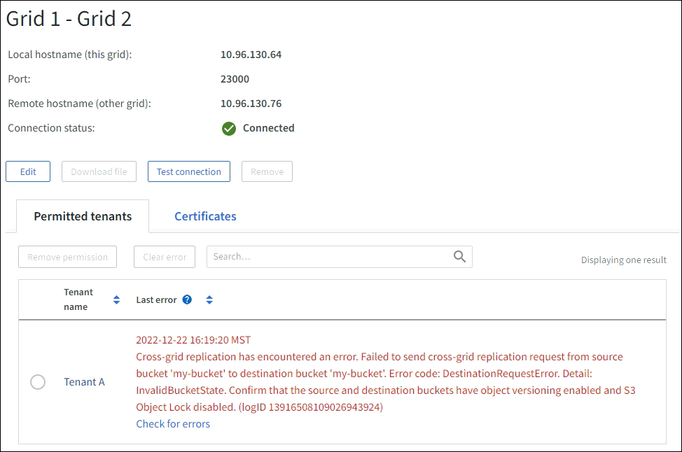

= 그리드 페더레이션 오류 문제 해결
:allow-uri-read: 
:icons: font
:imagesdir: ../media/

[role="lead"]
그리드 페더레이션 연결, 계정 복제, 그리드 간 복제와 관련된 알림 및 오류를 해결해야 할 수도 있습니다.

== [[grid-federation-errors]]그리드 페더레이션 연결 경고 및 오류

그리드 연합 연결과 관련하여 경고를 받거나 오류가 발생할 수 있습니다.

연결 문제를 해결하기 위해 변경 작업을 한 후에는 연결을 테스트하여 연결 상태가 *연결됨*으로 돌아오는지 확인하세요. 지침은 다음을 참조하세요.link:grid-federation-manage-connection.html["그리드 연합 연결 관리"] .

=== 그리드 페더레이션 연결 실패 경고

.문제
*그리드 연합 연결 실패* 경고가 발생했습니다.

.세부
이 경고는 그리드 간 그리드 연합 연결이 작동하지 않음을 나타냅니다.

.권장되는 작업
. 두 그리드의 그리드 연합 페이지에서 설정을 검토하세요.  모든 값이 올바른지 확인하세요. 보다 link:grid-federation-manage-connection.html["그리드 연합 연결 관리"] .
. 연결에 사용된 인증서를 검토합니다.  만료된 그리드 연합 인증서에 대한 알림이 없는지, 각 인증서에 대한 세부 정보가 유효한지 확인하세요.  연결 인증서 순환에 대한 지침을 참조하세요.link:grid-federation-manage-connection.html["그리드 연합 연결 관리"] .
. 두 그리드의 모든 관리자 및 게이트웨이 노드가 온라인이고 사용 가능한지 확인합니다.  이러한 노드에 영향을 줄 수 있는 경고를 해결하고 다시 시도하세요.
. 로컬 또는 원격 그리드에 대한 정규화된 도메인 이름(FQDN)을 제공한 경우 DNS 서버가 온라인이고 사용 가능한지 확인하세요.  보다link:grid-federation-overview.html["그리드 연합이란 무엇인가요?"] 네트워킹, IP 주소, DNS 요구 사항.

=== 그리드 페더레이션 인증서 만료 알림

.문제
*그리드 연합 인증서 만료* 경고가 발생했습니다.

.세부
이 알림은 하나 이상의 그리드 연합 인증서가 만료되려고 한다는 것을 나타냅니다.

.권장되는 작업
연결 인증서 순환에 대한 지침을 참조하세요.link:grid-federation-manage-connection.html["그리드 연합 연결 관리"] .

=== 그리드 연합 연결 편집 오류

.문제
그리드 연합 연결을 편집할 때 *저장 및 테스트*를 선택하면 다음과 같은 경고 메시지가 표시됩니다. "하나 이상의 노드에서 후보 구성 파일을 만들지 못했습니다."

.세부
그리드 페더레이션 연결을 편집하면 StorageGRID 첫 번째 그리드의 모든 관리 노드에 "후보 구성" 파일을 저장하려고 시도합니다.  예를 들어, 관리 노드가 오프라인인 경우와 같이 이 파일을 모든 관리 노드에 저장할 수 없는 경우 경고 메시지가 나타납니다.

.권장되는 작업
. 연결을 편집하는 데 사용하는 그리드에서 *노드*를 선택합니다.
. 해당 그리드의 모든 관리 노드가 온라인인지 확인하세요.
. 노드가 오프라인 상태인 경우 다시 온라인으로 전환하고 연결을 다시 편집해 보세요.

== 계정 복제 오류

=== 복제된 테넌트 계정에 로그인할 수 없습니다.

.문제
복제된 테넌트 계정에 로그인할 수 없습니다.  테넌트 관리자 로그인 페이지의 오류 메시지는 "이 계정에 대한 자격 증명이 잘못되었습니다.  다시 시도해 주세요.

.세부
보안상의 이유로 테넌트 계정이 테넌트의 소스 그리드에서 테넌트의 대상 그리드로 복제될 때 테넌트의 로컬 루트 사용자에 대해 설정한 비밀번호는 복제되지 않습니다.  마찬가지로 테넌트가 소스 그리드에 로컬 사용자를 생성하면 로컬 사용자 비밀번호는 대상 그리드에 복제되지 않습니다.

.권장되는 작업
루트 사용자가 테넌트의 대상 그리드에 로그인하기 전에 그리드 관리자는 먼저 다음을 수행해야 합니다.link:changing-password-for-tenant-local-root-user.html["로컬 루트 사용자의 비밀번호를 변경합니다"] 목적지 그리드에서.

복제된 로컬 사용자가 테넌트의 대상 그리드에 로그인하려면 먼저 복제된 테넌트의 루트 사용자가 대상 그리드에서 해당 사용자의 비밀번호를 추가해야 합니다. 지침은 다음을 참조하세요.link:../tenant/managing-local-users.html["로컬 사용자 관리"] 테넌트 관리자 사용에 대한 지침에서.

=== 복제본 없이 생성된 테넌트

.문제
*그리드 페더레이션 연결 사용* 권한으로 새 테넌트를 생성한 후 "복제본 없이 테넌트가 생성되었습니다"라는 메시지가 표시됩니다.

.세부
이 문제는 연결 상태 업데이트가 지연되는 경우 발생할 수 있으며, 이로 인해 비정상 연결이 *연결됨*으로 표시될 수 있습니다.

.권장되는 작업
. 오류 메시지에 나열된 이유를 검토하고 연결이 작동하지 못하게 하는 네트워킹 문제나 기타 문제를 해결하세요. 보다 <<grid-federation-errors,그리드 연합 연결 경고 및 오류>> .
. 그리드 연합 연결을 테스트하려면 지침을 따르세요.link:grid-federation-manage-connection.html["그리드 연합 연결 관리"] 문제가 해결되었는지 확인하세요.
. 테넌트의 소스 그리드에서 *TENANTS*를 선택합니다.
. 복제에 실패한 테넌트 계정을 찾습니다.
. 세입자 이름을 선택하면 세부 정보 페이지가 표시됩니다.
. *계정 복제 재시도*를 선택하세요.
+
image::../media/grid-federation-retry-account-clone.png[오류 메시지와 계정 복제 재시도 버튼을 보여주는 스크린샷]

+
오류가 해결된 경우 테넌트 계정이 다른 그리드에 복제됩니다.

== 크로스 그리드 복제 경고 및 오류

=== 연결 또는 테넌트에 대해 표시된 마지막 오류

.문제
언제link:../monitor/grid-federation-monitor-connections.html["그리드 페더레이션 연결 보기"] (또는 언제link:grid-federation-manage-tenants.html["허가된 세입자 관리"] 연결의 경우, 연결 세부 정보 페이지의 *마지막 오류* 열에 오류가 있는 것을 발견했습니다. 예를 들어:

.세부
각 그리드 연합 연결의 *마지막 오류* 열에는 테넌트의 데이터가 다른 그리드로 복제될 때 발생한 가장 최근의 오류(있는 경우)가 표시됩니다. 이 열에는 마지막으로 발생한 그리드 간 복제 오류만 표시되며, 이전에 발생했을 수 있는 오류는 표시되지 않습니다. 이 열의 오류는 다음과 같은 이유 중 하나로 발생할 수 있습니다.

* 소스 개체 버전을 찾을 수 없습니다.
* 소스 버킷을 찾을 수 없습니다.
* 대상 버킷이 삭제되었습니다.
* 대상 버킷이 다른 계정으로 다시 생성되었습니다.
* 대상 버킷의 버전 관리가 중단되었습니다.
* 대상 버킷은 동일한 계정으로 다시 생성되었지만 현재 버전이 지정되지 않았습니다.

.권장되는 작업
*마지막 오류* 열에 오류 메시지가 나타나면 다음 단계를 따르세요.

. 메시지 내용을 검토하세요.
. 권장되는 작업을 수행하세요.  예를 들어, 크로스 그리드 복제를 위해 대상 버킷에서 버전 관리가 중단된 경우 해당 버킷의 버전 관리를 다시 활성화합니다.
. 표에서 연결 또는 테넌트 계정을 선택하세요.
. *오류 지우기*를 선택하세요.
. *예*를 선택하면 메시지가 지워지고 시스템 상태가 업데이트됩니다.
. 5~6분 정도 기다린 후 새로운 물건을 양동이에 넣으세요.  오류 메시지가 다시 나타나지 않는지 확인하세요.
+

NOTE: 오류 메시지가 지워졌는지 확인하려면 메시지의 타임스탬프가 나온 후 최소 5분을 기다린 후 새 객체를 수집하세요.

+

TIP: 오류를 지운 후, 오류가 있는 다른 버킷에서 객체를 수집한 경우 새로운 *마지막 오류*가 나타날 수 있습니다.

. 버킷 오류로 인해 개체 복제에 실패했는지 확인하려면 다음을 참조하세요.link:../admin/grid-federation-retry-failed-replication.html["실패한 복제 작업을 식별하고 다시 시도합니다."] .

=== 크로스 그리드 복제 영구 실패 경고

.문제
*크로스 그리드 복제 영구 실패* 경고가 발생했습니다.

.세부
이 알림은 사용자 개입이 필요한 이유로 두 그리드의 버킷 간에 테넌트 객체를 복제할 수 없음을 나타냅니다.  이 알림은 일반적으로 소스 또는 대상 버킷이 변경되면 발생합니다.

.권장되는 작업
. 알림이 발생한 그리드에 Sign in .
. *구성* > *시스템* > *그리드 연합*으로 이동하여 알림에 나열된 연결 이름을 찾습니다.
. 허용된 세입자 탭에서 *마지막 오류* 열을 확인하여 오류가 있는 세입자 계정을 확인하세요.
. 실패에 대해 자세히 알아보려면 다음 지침을 참조하세요.link:../monitor/grid-federation-monitor-connections.html["그리드 연합 연결 모니터링"] 그리드 간 복제 지표를 검토합니다.
. 영향을 받는 각 세입자 계정에 대해:
+
.. 지침을 참조하세요link:../monitor/monitoring-tenant-activity.html["세입자 활동 모니터링"] 테넌트가 크로스 그리드 복제를 위한 대상 그리드에서 할당량을 초과하지 않았는지 확인합니다.
.. 필요에 따라 대상 그리드에서 테넌트 할당량을 늘려 새 객체를 저장할 수 있도록 합니다.

. 영향을 받는 각 세입자에 대해 두 그리드 모두에서 세입자 관리자에 로그인하여 버킷 목록을 비교할 수 있습니다.
. 크로스 그리드 복제가 활성화된 각 버킷에 대해 다음을 확인하세요.
+
** 다른 그리드에는 동일한 세입자에 대한 해당 버킷이 있습니다(정확한 이름을 사용해야 함).
** 두 버킷 모두 객체 버전 관리가 활성화되어 있습니다(두 그리드 모두에서 버전 관리를 일시 중단할 수 없습니다).
** 두 버킷 모두 S3 객체 잠금이 비활성화되어 있습니다.
** 두 버킷 모두 *객체 삭제: 읽기 전용* 상태가 아닙니다.

. 문제가 해결되었는지 확인하려면 다음 지침을 참조하세요.link:../monitor/grid-federation-monitor-connections.html["그리드 연합 연결 모니터링"] 그리드 간 복제 지표를 검토하거나 다음 단계를 수행하세요.
+
.. 그리드 연합 페이지로 돌아가세요.
.. 영향을 받은 세입자를 선택하고 *마지막 오류* 열에서 *오류 지우기*를 선택합니다.
.. *예*를 선택하면 메시지가 지워지고 시스템 상태가 업데이트됩니다.
.. 5~6분 정도 기다린 후 새로운 물건을 양동이에 넣으세요.  오류 메시지가 다시 나타나지 않는지 확인하세요.
+

NOTE: 오류 메시지가 지워졌는지 확인하려면 메시지의 타임스탬프가 나온 후 최소 5분을 기다린 후 새 객체를 수집하세요.

+

NOTE: 알림이 해결된 후 삭제되기까지 최대 하루가 걸릴 수 있습니다.

.. 로 가다link:grid-federation-retry-failed-replication.html["실패한 복제 작업을 식별하고 다시 시도합니다."] 다른 그리드로 복제에 실패한 객체를 식별하거나 마커를 삭제하고 필요에 따라 복제를 다시 시도합니다.

=== 크로스 그리드 복제 리소스 사용 불가 경고

.문제
*크로스 그리드 복제 리소스를 사용할 수 없습니다* 경고가 발생했습니다.

.세부
이 경고는 리소스를 사용할 수 없기 때문에 크로스 그리드 복제 요청이 보류 중임을 나타냅니다.  예를 들어, 네트워크 오류가 있을 수 있습니다.

.권장되는 작업
. 문제가 스스로 해결되는지 확인하려면 알림을 모니터링하세요.
. 문제가 지속되면 두 그리드 중 하나에 동일한 연결에 대한 *그리드 페더레이션 연결 실패* 경고가 있는지, 아니면 노드에 대한 *노드와 통신할 수 없음* 경고가 있는지 확인하세요.  해당 알림을 해결하면 이 알림도 해결될 수 있습니다.
. 실패에 대해 자세히 알아보려면 다음 지침을 참조하세요.link:../monitor/grid-federation-monitor-connections.html["그리드 연합 연결 모니터링"] 그리드 간 복제 지표를 검토합니다.
. 경고를 해결할 수 없는 경우 기술 지원팀에 문의하세요.

문제가 해결된 후에는 그리드 간 복제가 정상적으로 진행됩니다.
