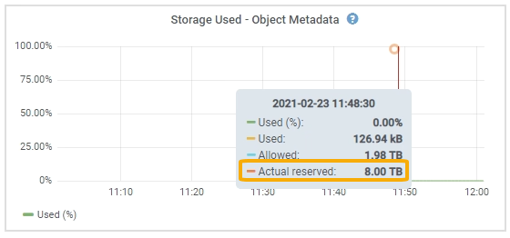

= 개체 메타데이터 저장소 관리
:allow-uri-read: 
:icons: font
:imagesdir: ../media/

[role="lead"]
StorageGRID 시스템의 개체 메타데이터 용량은 해당 시스템에 저장할 수 있는 최대 개체 수를 제어합니다.  StorageGRID 시스템에 새 객체를 저장할 충분한 공간이 있는지 확인하려면 StorageGRID 객체 메타데이터를 어디에 어떻게 저장하는지 이해해야 합니다.

== 객체 메타데이터란 무엇인가요?

객체 메타데이터는 객체를 설명하는 모든 정보입니다.  StorageGRID 객체 메타데이터를 사용하여 그리드 전체의 모든 객체 위치를 추적하고 시간에 따른 각 객체의 수명 주기를 관리합니다.

StorageGRID 의 개체에 대한 개체 메타데이터에는 다음 유형의 정보가 포함됩니다.

* 각 개체의 고유 ID(UUID), 개체 이름, S3 버킷 이름, 테넌트 계정 이름 또는 ID, 개체의 논리적 크기, 개체가 처음 생성된 날짜 및 시간, 개체가 마지막으로 수정된 날짜 및 시간을 포함한 시스템 메타데이터입니다.
* 개체와 연관된 사용자 정의 메타데이터 키-값 쌍입니다.
* S3 객체의 경우 객체와 연관된 모든 객체 태그 키-값 쌍입니다.
* 복제된 객체 복사본의 경우 각 복사본의 현재 저장 위치입니다.
* 삭제된 객체 복사본의 경우 각 조각의 현재 저장 위치입니다.
* Cloud Storage 풀의 객체 복사본의 경우 외부 버킷의 이름과 객체의 고유 식별자를 포함한 객체의 위치입니다.
* 분할된 객체와 다중 부분 객체의 경우 세그먼트 식별자와 데이터 크기입니다.

== 객체 메타데이터는 어떻게 저장되나요?

StorageGRID 객체 데이터와 독립적으로 저장되는 Cassandra 데이터베이스에 객체 메타데이터를 유지 관리합니다.  중복성을 제공하고 개체 메타데이터의 손실을 방지하기 위해 StorageGRID 각 사이트의 시스템에 있는 모든 개체에 대한 메타데이터 사본을 세 개씩 저장합니다.

이 그림은 두 사이트의 저장 노드를 나타냅니다.  각 사이트에는 동일한 양의 개체 메타데이터가 있으며, 각 사이트의 메타데이터는 해당 사이트의 모든 스토리지 노드에 세분화됩니다.

image::../media/metadata_space_across_sites.png[사이트 간 메타데이터 공간]

== 객체 메타데이터는 어디에 저장되나요?

이 그림은 단일 스토리지 노드의 저장 볼륨을 나타냅니다.

image::../media/metadata_space_storage_node.png[메타데이터 공간 저장 노드]

그림에서 볼 수 있듯이 StorageGRID 각 스토리지 노드의 스토리지 볼륨 0에 개체 메타데이터를 위한 공간을 예약합니다.  예약된 공간을 사용하여 개체 메타데이터를 저장하고 필수 데이터베이스 작업을 수행합니다.  스토리지 볼륨 0과 스토리지 노드의 다른 모든 스토리지 볼륨에 남아 있는 공간은 객체 데이터(복제된 복사본과 삭제 코딩된 조각)에만 사용됩니다.

특정 스토리지 노드에서 개체 메타데이터에 예약된 공간의 양은 아래에 설명된 여러 요인에 따라 달라집니다.

== 메타데이터 예약 공간 설정

_메타데이터 예약 공간_은 모든 스토리지 노드의 볼륨 0에 있는 메타데이터에 예약될 공간의 양을 나타내는 시스템 전체 설정입니다.  표에 표시된 대로 이 설정의 기본값은 다음을 기준으로 합니다.

* StorageGRID 처음 설치할 때 사용하던 소프트웨어 버전입니다.
* 각 스토리지 노드의 RAM 용량.

[cols="1a,1a,1a"]
|===
| 초기 StorageGRID 설치에 사용된 버전 | 스토리지 노드의 RAM 양 | 기본 메타데이터 예약 공간 설정 

 a| 
11.5에서 11.9까지
 a| 
그리드의 각 스토리지 노드에 128GB 이상
 a| 
8TB(8,000GB)

 a| 
 a| 
그리드의 모든 스토리지 노드에서 128GB 미만
 a| 
3TB(3,000GB)

 a| 
11.1에서 11.4까지
 a| 
모든 사이트의 각 스토리지 노드에 128GB 이상
 a| 
4TB(4,000GB)

 a| 
 a| 
각 사이트의 모든 스토리지 노드에 128GB 미만
 a| 
3TB(3,000GB)

 a| 
11.0 또는 이전 버전
 a| 
어떤 금액이든
 a| 
2TB(2,000GB)

|===

=== 메타데이터 예약 공간 설정 보기

StorageGRID 시스템의 메타데이터 예약 공간 설정을 보려면 다음 단계를 따르세요.

.단계
. *구성* > *시스템* > *저장소 설정*을 선택합니다.
. 저장소 설정 페이지에서 *메타데이터 예약 공간* 섹션을 확장합니다.

StorageGRID 11.8 이상의 경우 메타데이터 예약 공간 값은 최소 100GB, 최대 1PB여야 합니다.

각 스토리지 노드에 128GB 이상의 RAM이 있는 새로운 StorageGRID 11.6 이상 설치의 기본 설정은 8,000GB(8TB)입니다.

== 메타데이터에 대한 실제 예약 공간

시스템 전체 메타데이터 예약 공간 설정과 달리, 개체 메타데이터에 대한 _실제 예약 공간_은 각 스토리지 노드별로 결정됩니다.  주어진 스토리지 노드의 경우, 메타데이터에 대한 실제 예약 공간은 노드의 볼륨 0 크기와 시스템 전체 메타데이터 예약 공간 설정에 따라 달라집니다.

[cols="1a,1a"]
|===
| 노드의 볼륨 0 크기 | 메타데이터에 대한 실제 예약 공간 

 a| 
500GB 미만(비생산용)
 a| 
볼륨의 10% 0

 a| 
500GB 이상 + 또는 + 메타데이터 전용 스토리지 노드
 a| 
다음 값 중 작은 값:

* 제0권
* 메타데이터 예약 공간 설정

*참고*: 메타데이터 전용 스토리지 노드에는 rangedb가 하나만 필요합니다.

|===

=== 메타데이터에 대한 실제 예약 공간 보기

특정 스토리지 노드에서 메타데이터에 대한 실제 예약 공간을 보려면 다음 단계를 따르세요.

.단계
. 그리드 관리자에서 *노드* > *_스토리지 노드_*를 선택합니다.
. *저장소* 탭을 선택하세요.
. 저장소 사용량 - 개체 메타데이터 차트 위에 커서를 놓고 *실제 예약* 값을 찾으세요.
+

스크린샷에서 *실제 예약* 값은 8TB입니다.  이 스크린샷은 새로운 StorageGRID 11.6 설치의 대규모 스토리지 노드에 대한 것입니다.  이 스토리지 노드의 시스템 전체 메타데이터 예약 공간 설정이 볼륨 0보다 작으므로 이 노드의 실제 예약 공간은 메타데이터 예약 공간 설정과 같습니다.

== 실제로 예약된 메타데이터 공간의 예

버전 11.7 이상을 사용하여 새로운 StorageGRID 시스템을 설치한다고 가정해 보겠습니다.  이 예에서는 각 스토리지 노드에 128GB 이상의 RAM이 있고 스토리지 노드 1(SN1)의 볼륨 0이 6TB라고 가정합니다.  이러한 값을 기준으로:

* 시스템 전체의 *메타데이터 예약 공간*은 8TB로 설정됩니다.  (각 스토리지 노드에 128GB 이상의 RAM이 있는 경우 새 StorageGRID 11.6 이상 설치의 기본값입니다.)
* SN1의 메타데이터에 실제로 예약된 공간은 6TB입니다.  (볼륨 0이 *메타데이터 예약 공간* 설정보다 작기 때문에 전체 볼륨이 예약됩니다.)

== 허용된 메타데이터 공간

각 스토리지 노드의 실제 메타데이터 예약 공간은 개체 메타데이터에 사용 가능한 공간(허용된 메타데이터 공간)과 필수 데이터베이스 작업(압축 및 복구 등)과 향후 하드웨어 및 소프트웨어 업그레이드에 필요한 공간으로 세분됩니다.  허용된 메타데이터 공간은 전체 개체 용량을 관리합니다.

image::../media/metadata_allowed_space_volume_0.png[메타데이터 허용 공간 볼륨 0]

다음 표는 StorageGRID 노드의 메모리 양과 메타데이터에 예약된 실제 공간을 기반으로 다양한 스토리지 노드에 대해 *허용되는 메타데이터 공간*을 계산하는 방식을 보여줍니다.

[cols="1a,1a,2a,2a"]
|===

 a| 
 a| 
 a| 
*스토리지 노드의 메모리 양*

 a| 
 a| 
 a| 
128GB 미만
 a| 
>= 128GB

 a| 
*메타데이터를 위한 실제 예약 공간*
 a| 
<= 4TB
 a| 
실제 예약된 메타데이터 공간의 60%, 최대 1.32TB
 a| 
실제 예약된 메타데이터 공간의 60%, 최대 1.98TB

 a| 
4TB 이상
 a| 
(메타데이터를 위한 실제 예약 공간 - 1TB) × 60%, 최대 1.32TB
 a| 
(메타데이터를 위한 실제 예약 공간 - 1TB) × 60%, 최대 3.96TB

|===

=== 허용된 메타데이터 공간 보기

스토리지 노드에 허용되는 메타데이터 공간을 보려면 다음 단계를 따르세요.

.단계
. 그리드 관리자에서 *노드*를 선택합니다.
. 저장 노드를 선택하세요.
. *저장소* 탭을 선택하세요.
. 사용된 저장소 - 개체 메타데이터 차트 위에 커서를 놓고 *허용* 값을 찾으세요.
+
image::../media/storage_used_object_metadata_allowed.png[사용된 저장소 - 개체 메타데이터 - 허용됨]

스크린샷에서 *허용* 값은 3.96TB입니다. 이는 메타데이터에 대한 실제 예약 공간이 4TB를 초과하는 스토리지 노드의 최대값입니다.

*허용* 값은 다음 Prometheus 메트릭에 해당합니다.

`storagegrid_storage_utilization_metadata_allowed_bytes`

== 허용된 메타데이터 공간의 예

버전 11.6을 사용하여 StorageGRID 시스템을 설치한다고 가정해 보겠습니다.  이 예에서는 각 스토리지 노드에 128GB 이상의 RAM이 있고 스토리지 노드 1(SN1)의 볼륨 0이 6TB라고 가정합니다.  이러한 값을 기준으로:

* 시스템 전체의 *메타데이터 예약 공간*은 8TB로 설정됩니다.  (이것은 각 스토리지 노드에 128GB 이상의 RAM이 있는 경우 StorageGRID 11.6 이상의 기본값입니다.)
* SN1의 메타데이터에 실제로 예약된 공간은 6TB입니다.  (볼륨 0이 *메타데이터 예약 공간* 설정보다 작기 때문에 전체 볼륨이 예약됩니다.)
* SN1의 메타데이터에 허용되는 공간은 3TB입니다. 이는 다음 계산에 따른 것입니다.<<table-allowed-space-for-metadata,메타데이터에 허용된 공간 표>> : (메타데이터에 대한 실제 예약 공간 - 1TB) × 60%, 최대 3.96TB.

== 다양한 크기의 스토리지 노드가 객체 용량에 미치는 영향

위에서 설명한 대로 StorageGRID 각 사이트의 스토리지 노드에 개체 메타데이터를 균등하게 분산합니다.  이러한 이유로 사이트에 서로 다른 크기의 스토리지 노드가 있는 경우, 사이트에서 가장 작은 노드가 사이트의 메타데이터 용량을 결정합니다.

다음 예를 살펴보세요.

* 서로 다른 크기의 스토리지 노드 3개가 포함된 단일 사이트 그리드가 있습니다.
* *메타데이터 예약 공간* 설정은 4TB입니다.
* 저장 노드는 실제로 예약된 메타데이터 공간과 허용된 메타데이터 공간에 대해 다음과 같은 값을 갖습니다.
+
[cols="1a,1a,1a,1a"]
|===
| 저장 노드 | 볼륨 0의 크기 | 실제로 예약된 메타데이터 공간 | 허용된 메타데이터 공간 

 a| 
SN1
 a| 
2.2TB
 a| 
2.2TB
 a| 
1.32TB

 a| 
SN2
 a| 
5TB
 a| 
4TB
 a| 
1.98TB

 a| 
SN3
 a| 
6TB
 a| 
4TB
 a| 
1.98TB

|===

개체 메타데이터는 사이트의 스토리지 노드에 균등하게 분산되므로 이 예에서 각 노드는 1.32TB의 메타데이터만 보관할 수 있습니다.  SN2 및 SN3에 허용된 추가 메타데이터 공간인 0.66TB를 사용할 수 없습니다.

image::../media/metadata_space_three_storage_nodes.png[메타데이터 공간 3개 저장 노드]

마찬가지로 StorageGRID 각 사이트에서 StorageGRID 시스템의 모든 개체 메타데이터를 유지 관리하므로 StorageGRID 시스템의 전체 메타데이터 용량은 가장 작은 사이트의 개체 메타데이터 용량에 따라 결정됩니다.

또한 객체 메타데이터 용량은 최대 객체 수를 제어하므로 한 노드의 메타데이터 용량이 부족해지면 그리드가 실제로 가득 찹니다.

.관련 정보
* 각 스토리지 노드의 개체 메타데이터 용량을 모니터링하는 방법을 알아보려면 다음 지침을 참조하세요.link:../monitor/index.html["StorageGRID 모니터링"] .
* 시스템의 개체 메타데이터 용량을 늘리려면link:../expand/index.html["그리드 확장"] 새로운 스토리지 노드를 추가하여.

