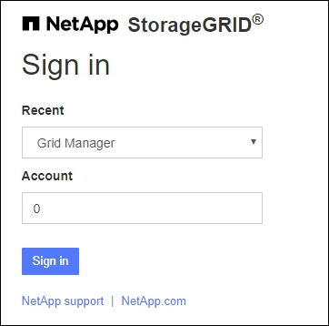

= 그리드 관리자에 Sign in
:allow-uri-read: 
:icons: font
:imagesdir: ../media/

[role="lead"]
지원되는 웹 브라우저의 주소창에 관리 노드의 정규화된 도메인 이름(FQDN) 또는 IP 주소를 입력하여 Grid Manager 로그인 페이지에 액세스합니다.

각 StorageGRID 시스템에는 하나의 기본 관리 노드와 원하는 수의 비기본 관리 노드가 포함됩니다.  모든 관리 노드에서 Grid Manager에 로그인하여 StorageGRID 시스템을 관리할 수 있습니다.  그러나 일부 유지 관리 절차는 기본 관리 노드에서만 수행할 수 있습니다.

=== HA 그룹에 연결

관리 노드가 고가용성(HA) 그룹에 포함된 경우 HA 그룹의 가상 IP 주소나 가상 IP 주소에 매핑되는 정규화된 도메인 이름을 사용하여 연결합니다.  기본 관리 노드를 그룹의 기본 인터페이스로 선택해야 합니다. 그러면 기본 관리 노드를 사용할 수 없는 경우를 제외하고 Grid Manager에 액세스할 때 기본 관리 노드에서 액세스할 수 있습니다. 보다 link:managing-high-availability-groups.html["고가용성 그룹 관리"] .

=== SSO 사용

로그인 단계는 다음과 같이 약간 다릅니다.link:configuring-sso.html["Single Sign-On(SSO)이 구성되었습니다."] .

== 첫 번째 관리 노드에서 Grid Manager에 Sign in.

.시작하기 전에
* 로그인 자격증명이 있습니다.
* 당신은 사용 중입니다link:../admin/web-browser-requirements.html["지원되는 웹 브라우저"] .
* 귀하의 웹 브라우저에서 쿠키가 활성화되어 있습니다.
* 귀하는 최소한 하나 이상의 권한이 있는 사용자 그룹에 속해 있습니다.
* 그리드 관리자의 URL은 다음과 같습니다.
+
`https://_FQDN_or_Admin_Node_IP_/`

+
정규화된 도메인 이름, 관리 노드의 IP 주소 또는 관리 노드의 HA 그룹의 가상 IP 주소를 사용할 수 있습니다.

+
HTTPS의 기본 포트(443)가 아닌 다른 포트에서 Grid Manager에 액세스하려면 URL에 포트 번호를 포함하세요.

+
`https://_FQDN_or_Admin_Node_IP:port_/`

+

NOTE: 제한된 Grid Manager 포트에서는 SSO를 사용할 수 없습니다.  포트 443을 사용해야 합니다.

.단계
. 지원되는 웹 브라우저를 실행합니다.
. 브라우저의 주소창에 Grid Manager의 URL을 입력합니다.
. 보안 경고가 나타나면 브라우저의 설치 마법사를 사용하여 인증서를 설치하세요. 보다 link:using-storagegrid-security-certificates.html["보안 인증서 관리"] .
. 그리드 관리자에 Sign in .
+
표시되는 로그인 화면은 StorageGRID 에 대해 SSO(Single Sign-On)가 구성되었는지 여부에 따라 달라집니다.

+
[role="tabbed-block"]
====
.SSO를 사용하지 않음
--
.. 그리드 관리자의 사용자 이름과 비밀번호를 입력하세요.
.. *로그인*을 선택하세요.
+
image::../media/sign_in_grid_manager_no_sso.png[Sign in 페이지]

--
.SSO 사용
--
** StorageGRID SSO를 사용하고 이 브라우저에서 처음으로 URL에 액세스하는 경우:
+
... * Sign in*을 선택하세요.  계정 필드에 0을 그대로 두어도 됩니다.
+
image::../media/sso_sign_in_first_time.png[SSO가 활성화되어 있고 쿠키가 없는 경우 Sign in 화면]

... 조직의 SSO 로그인 페이지에 표준 SSO 자격 증명을 입력합니다. 예를 들어:
+
image::../media/sso_organization_page.gif[SSO를 위한 조직 로그인 페이지 예시]

** StorageGRID SSO를 사용하고 이전에 Grid Manager 또는 테넌트 계정에 액세스한 적이 있는 경우:
+
... *0* (그리드 관리자의 계정 ID)을 입력하거나 최근 계정 목록에 *그리드 관리자*가 나타나면 선택합니다.
+

... * Sign in*을 선택하세요.
... 조직의 SSO 로그인 페이지에서 표준 SSO 자격 증명을 사용하여 Sign in .

--
====

로그인하면 대시보드가 포함된 Grid Manager의 홈페이지가 나타납니다.  제공되는 정보를 알아보려면 다음을 참조하세요.link:../monitor/viewing-dashboard.html["대시보드 보기 및 관리"] .

image::../media/grid_manager_dashboard.png[계기반]

== 다른 관리 노드에 로그인

다른 관리 노드에 로그인하려면 다음 단계를 따르세요.

[role="tabbed-block"]
====
.SSO를 사용하지 않음
--
.단계
. 브라우저의 주소창에 다른 관리 노드의 정규화된 도메인 이름이나 IP 주소를 입력합니다.  필요에 따라 포트 번호를 포함하세요.
. 그리드 관리자의 사용자 이름과 비밀번호를 입력하세요.
. *로그인*을 선택하세요.

--
.SSO 사용
--
StorageGRID SSO를 사용하고 하나의 관리 노드에 로그인한 경우, 다시 로그인하지 않고도 다른 관리 노드에 액세스할 수 있습니다.

.단계
. 브라우저의 주소창에 다른 관리 노드의 정규화된 도메인 이름이나 IP 주소를 입력합니다.
. SSO 세션이 만료된 경우 자격 증명을 다시 입력하세요.

--
====