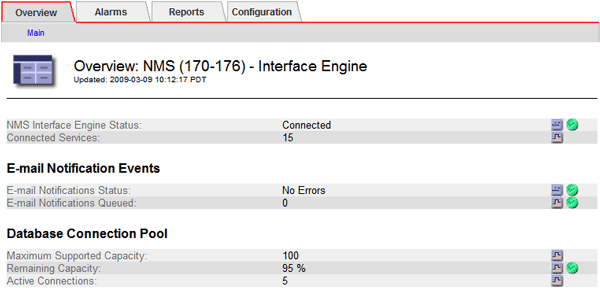

= 알림 상태 및 대기열 보기
:allow-uri-read: 
:icons: font
:imagesdir: ../media/

[role="lead"]
관리 노드의 NMS(네트워크 관리 시스템) 서비스는 메일 서버로 알림을 보냅니다.  인터페이스 엔진 페이지에서 NMS 서비스의 현재 상태와 알림 대기열 크기를 볼 수 있습니다.

인터페이스 엔진 페이지에 액세스하려면 *지원* > *도구* > *그리드 토폴로지*를 선택하세요.  그런 다음 *_site_* > *_Admin Node_* > *NMS* > *Interface Engine*을 선택합니다.

알림은 이메일 알림 대기열을 통해 처리되며 트리거된 순서대로 하나씩 메일 서버로 전송됩니다.  문제(예: 네트워크 연결 오류)가 발생하여 알림을 보내려고 시도할 때 메일 서버를 사용할 수 없는 경우, 최선을 다해 60초 동안 메일 서버로 알림을 다시 보내려고 시도합니다.  60초 후에도 알림이 메일 서버로 전송되지 않으면 알림은 알림 대기열에서 삭제되고 대기열에 있는 다음 알림을 보내려고 시도합니다.
