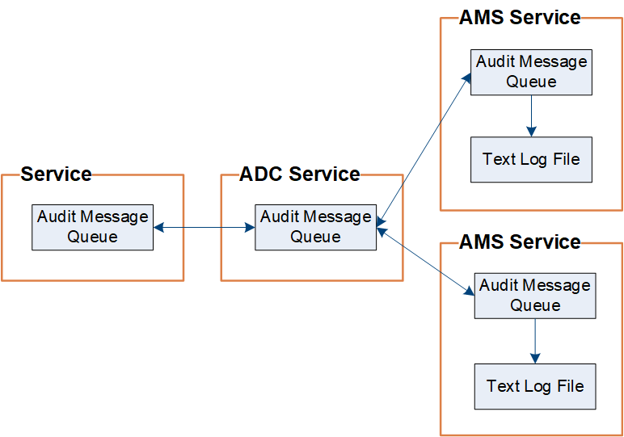

= 감사 메시지 흐름 및 보존
:allow-uri-read: 
:icons: font
:imagesdir: ../media/

[role="lead"]
모든 StorageGRID 서비스는 정상적인 시스템 작동 중에 감사 메시지를 생성합니다.  이러한 감사 메시지가 StorageGRID 시스템을 통해 어떻게 이동하는지 이해해야 합니다. `audit.log` 파일.

== 감사 메시지 흐름

감사 메시지는 관리 노드와 관리 도메인 컨트롤러(ADC) 서비스가 있는 스토리지 노드에서 처리됩니다.

감사 메시지 흐름도에 표시된 것처럼 각 StorageGRID 노드는 데이터 센터 사이트의 ADC 서비스 중 하나에 감사 메시지를 보냅니다.  ADC 서비스는 각 사이트에 설치된 처음 3개의 스토리지 노드에 대해 자동으로 활성화됩니다.

각 ADC 서비스는 릴레이 역할을 하며 감사 메시지 컬렉션을 StorageGRID 시스템의 모든 관리 노드로 전송합니다. 이를 통해 각 관리 노드는 시스템 활동에 대한 전체 기록을 얻게 됩니다.

각 관리 노드는 감사 메시지를 텍스트 로그 파일에 저장합니다. 활성 로그 파일의 이름은 다음과 같습니다. `audit.log` .

image::../media/audit_message_flow.gif[릴레이를 통한 감사 메시지 흐름을 요약한 다이어그램]

=== 감사 메시지 보존

StorageGRID 감사 로그에 기록되기 전에 감사 메시지가 손실되지 않도록 복사 및 삭제 프로세스를 사용합니다.

노드가 감사 메시지를 생성하거나 전달하면 해당 메시지는 그리드 노드의 시스템 디스크에 있는 감사 메시지 대기열에 저장됩니다. 메시지가 관리 노드의 감사 로그 파일에 기록될 때까지 메시지 사본은 항상 감사 메시지 대기열에 보관됩니다. `/var/local/log` 예배 규칙서. 이는 전송 중 감사 메시지가 손실되는 것을 방지하는 데 도움이 됩니다.

감사 메시지 대기열은 네트워크 연결 문제나 감사 용량 부족으로 인해 일시적으로 증가할 수 있습니다. 대기열이 증가함에 따라 각 노드의 사용 가능한 공간을 더 많이 소모합니다. `/var/local/` 예배 규칙서. 문제가 지속되고 노드의 감사 메시지 디렉토리가 너무 가득 차면 개별 노드는 백로그 처리를 우선시하고 일시적으로 새 메시지를 처리할 수 없게 됩니다.

구체적으로 다음과 같은 동작이 나타날 수 있습니다.

* 만약 `/var/local/log` 관리 노드에서 사용하는 디렉토리가 가득 차면, 디렉토리가 더 이상 가득 차지 않을 때까지 관리 노드는 새 감사 메시지를 받을 수 없음으로 표시됩니다. S3 클라이언트 요청은 영향을 받지 않습니다. XAMS(도달할 수 없는 감사 저장소) 알람은 감사 저장소에 접근할 수 없을 때 발생합니다.
* 만약 `/var/local/` ADC 서비스가 있는 스토리지 노드에서 사용하는 디렉토리가 92% 채워지면 해당 노드는 디렉토리가 87% 채워질 때까지 메시지를 감사할 수 없다는 플래그가 지정됩니다. 다른 노드에 대한 S3 클라이언트 요청은 영향을 받지 않습니다. NRLY(사용 가능한 감사 릴레이) 알람은 감사 릴레이에 도달할 수 없을 때 발생합니다.
+

NOTE: ADC 서비스를 사용할 수 있는 스토리지 노드가 없는 경우 스토리지 노드는 감사 메시지를 로컬로 저장합니다. `/var/local/log/localaudit.log` 파일.

* 만약 `/var/local/` 스토리지 노드에서 사용하는 디렉토리가 85% 채워지면 노드는 S3 클라이언트 요청을 거부하기 시작합니다. `503 Service Unavailable` .

다음과 같은 유형의 문제로 인해 감사 메시지 대기열이 매우 커질 수 있습니다.

* ADC 서비스를 사용하는 관리 노드 또는 스토리지 노드가 중단되었습니다.  시스템 노드 중 하나가 다운되면 나머지 노드도 백로그가 될 수 있습니다.
* 시스템의 감사 용량을 초과하는 지속적인 활동률입니다.
* 그만큼 `/var/local/` 감사 메시지와 관련 없는 이유로 ADC 스토리지 노드의 공간이 가득 차는 현상.  이런 일이 발생하면 노드는 새로운 감사 메시지 수신을 중단하고 현재 백로그를 우선시하게 되며, 이로 인해 다른 노드에 백로그가 발생할 수 있습니다.

=== 대규모 감사 대기열 경고 및 감사 메시지 대기열(AMQS) 알람

시간 경과에 따른 감사 메시지 대기열의 크기를 모니터링하는 데 도움이 되도록 스토리지 노드 대기열이나 관리 노드 대기열의 메시지 수가 특정 임계값에 도달하면 *대규모 감사 대기열* 경고 및 레거시 AMQS 경고가 트리거됩니다.

*대규모 감사 대기열* 경고나 기존 AMQS 경고가 발생하면 먼저 시스템 부하를 확인하세요. 최근 거래가 상당히 많았다면 경고와 경고는 시간이 지나면서 해결되므로 무시해도 됩니다.

경고나 알람이 지속되고 심각도가 높아지면 대기열 크기 차트를 확인하세요. 숫자가 몇 시간 또는 며칠 동안 꾸준히 증가한다면 감사 부하가 시스템의 감사 용량을 초과했을 가능성이 높습니다. 클라이언트 쓰기 및 클라이언트 읽기에 대한 감사 수준을 오류 또는 꺼짐으로 변경하여 클라이언트 작업 속도를 줄이거나 기록되는 감사 메시지 수를 줄입니다. 보다 link:../monitor/configure-audit-messages.html["감사 메시지 및 로그 대상 구성"] .

=== 중복된 메시지

StorageGRID 시스템은 네트워크나 노드에 장애가 발생하는 경우 보수적인 접근 방식을 취합니다.  이러한 이유로 감사 로그에 중복된 메시지가 존재할 수 있습니다.
