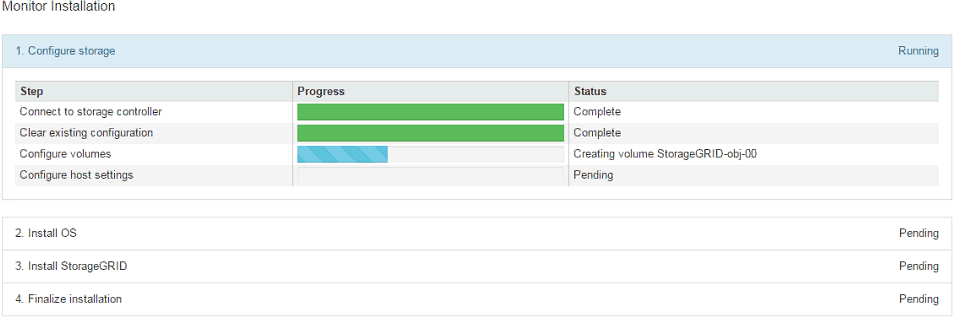

= 새로운 그리드 노드 배포
:allow-uri-read: 
:icons: font
:imagesdir: ../media/

[role="lead"]
확장 시 새로운 그리드 노드를 배포하는 단계는 그리드를 처음 설치할 때 사용한 단계와 동일합니다.  확장을 수행하려면 먼저 모든 새로운 그리드 노드를 배포해야 합니다.

그리드를 확장할 때 추가하는 노드는 기존 노드 유형과 일치할 필요가 없습니다.  VMware 노드, Linux 컨테이너 기반 노드 또는 어플라이언스 노드를 추가할 수 있습니다.

== VMware: 그리드 노드 배포

확장에 추가하려는 각 VMware 노드에 대해 VMware vSphere에 가상 머신을 배포해야 합니다.

.단계
. link:../vmware/deploying-storagegrid-node-as-virtual-machine.html["새 노드를 가상 머신으로 배포"]하나 이상의 StorageGRID 네트워크에 연결합니다.
+
노드를 배포할 때 선택적으로 노드 포트를 다시 매핑하거나 CPU 또는 메모리 설정을 늘릴 수 있습니다.

. 모든 새 VMware 노드를 배포한 후link:performing-expansion.html["확장 절차를 수행하다"] .

== Linux: 그리드 노드 배포

새로운 Linux 호스트나 기존 Linux 호스트에 그리드 노드를 배포할 수 있습니다.  그리드에 추가하려는 StorageGRID 노드의 CPU, RAM 및 스토리지 요구 사항을 지원하는 추가 Linux 호스트가 필요한 경우, 처음 호스트를 설치할 때와 같은 방식으로 호스트를 준비합니다.  그런 다음 설치 중에 그리드 노드를 배포한 것과 같은 방식으로 확장 노드를 배포합니다.

.시작하기 전에
* Linux 버전에 맞는 StorageGRID 설치하는 방법에 대한 지침이 있으며, 하드웨어 및 스토리지 요구 사항을 검토했습니다.
+
** link:../rhel/index.html["Red Hat Enterprise Linux에 StorageGRID 설치"]
** link:../ubuntu/index.html["Ubuntu 또는 Debian에 StorageGRID 설치"]

* 기존 호스트에 새로운 그리드 노드를 배포할 계획이라면 기존 호스트에 추가 노드에 필요한 CPU, RAM, 스토리지 용량이 충분한지 확인해야 합니다.
* 실패 도메인을 최소화하기 위한 계획이 있습니다.  예를 들어, 모든 게이트웨이 노드를 단일 물리적 호스트에 배포해서는 안 됩니다.
+

CAUTION: 실제 운영 환경에서는 하나의 물리적 호스트나 가상 호스트에 두 개 이상의 스토리지 노드를 실행하지 마세요.  각 스토리지 노드에 전용 호스트를 사용하면 격리된 장애 도메인이 제공됩니다.

* StorageGRID 노드가 NetApp ONTAP 시스템에서 할당된 스토리지를 사용하는 경우 볼륨에 FabricPool 계층화 정책이 활성화되어 있지 않은지 확인합니다.  StorageGRID 노드와 함께 사용되는 볼륨에 대해 FabricPool 계층화를 비활성화하면 문제 해결 및 스토리지 작업이 간소화됩니다.

.단계
. 새로운 호스트를 추가하는 경우 StorageGRID 노드 배포에 대한 설치 지침을 확인하세요.
. 새로운 호스트를 배포하려면 호스트 준비 지침을 따르세요.
. 노드 구성 파일을 만들고 StorageGRID 구성을 검증하려면 그리드 노드 배포에 대한 지침을 따르세요.
. 새로운 Linux 호스트에 노드를 추가하는 경우 StorageGRID 호스트 서비스를 시작합니다.
. 기존 Linux 호스트에 노드를 추가하는 경우 storagegrid 호스트 서비스 CLI를 사용하여 새 노드를 시작합니다.``sudo storagegrid node start [<node name\>]``

.당신이 완료한 후
모든 새로운 그리드 노드를 배포한 후에는 다음을 수행할 수 있습니다.link:performing-expansion.html["확장을 수행하다"] .

== 어플라이언스: 스토리지, 게이트웨이 또는 기본이 아닌 관리 노드 배포

어플라이언스 노드에 StorageGRID 소프트웨어를 설치하려면 어플라이언스에 포함된 StorageGRID Appliance Installer를 사용합니다.  확장 시 각 스토리지 어플라이언스는 단일 스토리지 노드로 작동하고, 각 서비스 어플라이언스는 단일 게이트웨이 노드 또는 기본이 아닌 관리 노드로 작동합니다.  모든 기기는 그리드 네트워크, 관리 네트워크, 클라이언트 네트워크에 연결할 수 있습니다.

.시작하기 전에
* 기기는 랙이나 캐비닛에 설치되고, 네트워크에 연결되고, 전원이 켜졌습니다.
* 완료되었습니다 https://docs.netapp.com/us-en/storagegrid-appliances/installconfig/configuring-hardware.html["하드웨어 설정"^] 단계.
+
어플라이언스 하드웨어 설정에는 StorageGRID 연결(네트워크 링크 및 IP 주소)을 구성하는 데 필요한 단계와 노드 암호화 활성화, RAID 모드 변경, 네트워크 포트 재매핑을 위한 선택적 단계가 포함됩니다.

* StorageGRID Appliance 설치 프로그램의 IP 구성 페이지에 나열된 모든 그리드 네트워크 서브넷은 기본 관리 노드의 그리드 네트워크 서브넷 목록에 정의되어 있습니다.
* 교체 기기의 StorageGRID Appliance Installer 펌웨어는 현재 그리드에서 실행 중인 StorageGRID 소프트웨어 버전과 호환됩니다.  버전이 호환되지 않으면 StorageGRID Appliance Installer 펌웨어를 업그레이드해야 합니다.
* 서비스 노트북이 있습니다link:../admin/web-browser-requirements.html["지원되는 웹 브라우저"] .
* 어플라이언스의 컴퓨팅 컨트롤러에 할당된 IP 주소 중 하나를 알고 있습니다.  연결된 모든 StorageGRID 네트워크에 IP 주소를 사용할 수 있습니다.

.이 작업에 관하여
어플라이언스 노드에 StorageGRID 설치하는 프로세스는 다음과 같은 단계로 구성됩니다.

* 기본 관리 노드의 IP 주소와 어플라이언스 노드의 이름을 지정하거나 확인합니다.
* 설치를 시작하고 볼륨이 구성되고 소프트웨어가 설치될 때까지 기다립니다.
+
기기 설치 작업 중간에 설치가 일시 중지됩니다.  설치를 재개하려면 Grid Manager에 로그인하고 모든 그리드 노드를 승인한 다음 StorageGRID 설치 프로세스를 완료합니다.

+

NOTE: 한 번에 여러 어플라이언스 노드를 배포해야 하는 경우 다음을 사용하여 설치 프로세스를 자동화할 수 있습니다. `configure-sga.py` 가전제품 설치 스크립트.

.단계
. 브라우저를 열고 어플라이언스의 컴퓨팅 컨트롤러에 대한 IP 주소 중 하나를 입력합니다.
+
`https://_Controller_IP_:8443`

+
StorageGRID Appliance 설치 프로그램 홈페이지가 나타납니다.

. *기본 관리 노드* 연결 섹션에서 기본 관리 노드의 IP 주소를 지정해야 하는지 여부를 결정합니다.
+
이전에 이 데이터 센터에 다른 노드를 설치한 경우 StorageGRID Appliance 설치 프로그램은 기본 관리 노드 또는 ADMIN_IP가 구성된 다른 그리드 노드가 하나 이상 동일한 서브넷에 있다고 가정하고 이 IP 주소를 자동으로 검색할 수 있습니다.

. 이 IP 주소가 표시되지 않거나 변경해야 하는 경우 주소를 지정하세요.
+
[cols="1a,2a"]
|===
| 옵션 | 설명 

 a| 
수동 IP 입력
 a| 
.. *관리 노드 검색 사용* 체크박스를 선택 취소합니다.
.. IP 주소를 수동으로 입력하세요.
.. *저장*을 클릭하세요.
.. 새로운 IP 주소가 준비될 때까지 연결 상태를 기다립니다.

 a| 
연결된 모든 기본 관리 노드의 자동 검색
 a| 
.. *관리자 노드 검색 활성화* 확인란을 선택합니다.
.. 검색된 IP 주소 목록이 표시될 때까지 기다리세요.
.. 이 어플라이언스 스토리지 노드가 배포될 그리드에 대한 기본 관리 노드를 선택하세요.
.. *저장*을 클릭하세요.
.. 새로운 IP 주소가 준비될 때까지 연결 상태를 기다립니다.

|===
. *노드 이름* 필드에 이 어플라이언스 노드에 사용할 이름을 입력하고 *저장*을 선택합니다.
+
노드 이름은 StorageGRID 시스템의 이 어플라이언스 노드에 할당됩니다.  이는 그리드 관리자의 노드 페이지(개요 탭)에 표시됩니다.  필요한 경우 노드를 승인할 때 이름을 변경할 수 있습니다.

. *설치* 섹션에서 현재 상태가 "기본 관리 노드 _admin_ip_를 사용하여 그리드에 _노드 이름_ 설치를 시작할 준비가 되었습니다"이고 *설치 시작* 버튼이 활성화되어 있는지 확인합니다.
+
*설치 시작* 버튼이 활성화되어 있지 않으면 네트워크 구성이나 포트 설정을 변경해야 할 수도 있습니다.  자세한 지침은 해당 기기의 유지관리 지침을 참조하세요.

. StorageGRID Appliance Installer 홈페이지에서 *설치 시작*을 선택합니다.
+
image::../media/appliance_installer_home_start_installation_enabled.gif[이 이미지는 주변 텍스트로 설명됩니다.]

+
현재 상태가 "설치가 진행 중입니다."로 변경되고, 모니터 설치 페이지가 표시됩니다.

. 확장에 여러 개의 어플라이언스 노드가 포함된 경우 각 어플라이언스에 대해 이전 단계를 반복합니다.
+

NOTE: 한 번에 여러 개의 어플라이언스 스토리지 노드를 배포해야 하는 경우 configure-sga.py 어플라이언스 설치 스크립트를 사용하여 설치 프로세스를 자동화할 수 있습니다.

. 모니터 설치 페이지에 수동으로 액세스해야 하는 경우 메뉴 표시줄에서 *모니터 설치*를 선택하세요.
+
모니터 설치 페이지에서는 설치 진행률이 표시됩니다.

+

+
파란색 상태 표시줄은 현재 진행 중인 작업을 나타냅니다.  녹색 상태 표시줄은 작업이 성공적으로 완료되었음을 나타냅니다.

+

NOTE: 설치 프로그램은 이전 설치에서 완료된 작업이 다시 실행되지 않도록 보장합니다.  설치를 다시 실행하는 경우, 다시 실행할 필요가 없는 작업은 녹색 상태 표시줄과 "건너뜀" 상태로 표시됩니다.

. 처음 두 설치 단계의 진행 상황을 검토합니다.
+
*1.  기기 구성*

+
이 단계에서는 다음 프로세스 중 하나가 발생합니다.

+
** 스토리지 어플라이언스의 경우, 설치 프로그램은 스토리지 컨트롤러에 연결하고, 기존 구성을 지우고, SANtricity OS와 통신하여 볼륨을 구성하고, 호스트 설정을 구성합니다.
** 서비스 어플라이언스의 경우 설치 프로그램은 컴퓨팅 컨트롤러의 드라이브에서 기존 구성을 지우고 호스트 설정을 구성합니다.
+
*2.  OS 설치*

+
이 단계에서 설치 프로그램은 StorageGRID 의 기본 운영 체제 이미지를 어플라이언스에 복사합니다.

. 콘솔 창에 메시지가 나타날 때까지 설치 진행 상황을 계속 모니터링하고, 그리드 관리자를 사용하여 노드를 승인하라는 메시지를 표시합니다.
+

NOTE: 이 확장팩에 추가한 모든 노드가 승인될 준비가 될 때까지 기다린 후 그리드 관리자로 가서 노드를 승인하세요.

+
image::../media/monitor_installation_install_sgws.gif[이 이미지는 주변 텍스트로 설명됩니다.]

