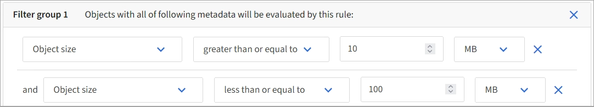

= 3단계 중 1단계: 세부 정보 입력
:allow-uri-read: 
:icons: font
:imagesdir: ../media/

[role="lead"]
ILM 규칙 만들기 마법사의 *세부 정보 입력* 단계에서는 규칙의 이름과 설명을 입력하고 규칙에 대한 필터를 정의할 수 있습니다.

규칙에 대한 설명을 입력하고 필터를 정의하는 것은 선택 사항입니다.

.이 작업에 관하여
객체를 다른 객체와 비교 평가할 때link:what-ilm-rule-is.html["ILM 규칙"] StorageGRID 개체 메타데이터를 규칙의 필터와 비교합니다.  개체 메타데이터가 모든 필터와 일치하면 StorageGRID 규칙을 사용하여 개체를 배치합니다.  모든 개체에 적용할 규칙을 디자인하거나, 하나 이상의 테넌트 계정이나 버킷 이름과 같은 기본 필터나 개체의 크기나 사용자 메타데이터와 같은 고급 필터를 지정할 수 있습니다.

.단계
. *이름* 필드에 규칙에 대한 고유한 이름을 입력합니다.
. 선택적으로 *설명* 필드에 규칙에 대한 간략한 설명을 입력합니다.
+
나중에 규칙을 알아볼 수 있도록 규칙의 목적이나 기능을 설명해야 합니다.

. 선택적으로, 이 규칙이 적용되는 하나 이상의 S3 테넌트 계정을 선택합니다.  이 규칙이 모든 세입자에게 적용되는 경우 이 필드를 비워 두세요.
+
루트 액세스 권한 또는 테넌트 계정 권한이 없으면 목록에서 테넌트를 선택할 수 없습니다.  대신 테넌트 ID를 입력하거나 여러 ID를 쉼표로 구분된 문자열로 입력하세요.

. 선택적으로, 이 규칙이 적용되는 S3 버킷을 지정합니다.
+
*모든 버킷에 적용*을 선택한 경우(기본값), 규칙은 모든 S3 버킷에 적용됩니다.

. S3 테넌트의 경우, 버전 관리가 활성화된 S3 버킷의 이전 개체 버전에만 규칙을 적용하려면 선택적으로 *예*를 선택합니다.
+
*예*를 선택하면 참조 시간에 대해 "비현재 시간"이 자동으로 선택됩니다.link:create-ilm-rule-define-placements.html["ILM 규칙 만들기 마법사의 2단계"] .

+

NOTE: 비현재 시간은 버전 관리가 활성화된 버킷의 S3 객체에만 적용됩니다. 보다link:../s3/operations-on-buckets.html["버킷 작업, PutBucketVersioning"] 그리고link:managing-objects-with-s3-object-lock.html["S3 객체 잠금으로 객체 관리"] .

+
이 옵션을 사용하면 최신이 아닌 개체 버전을 필터링하여 버전이 지정된 개체의 저장소 영향을 줄일 수 있습니다. 보다 link:example-4-ilm-rules-and-policy-for-s3-versioned-objects.html["예제 4: S3 버전 객체에 대한 ILM 규칙 및 정책"] .

. 선택적으로 *고급 필터 추가*를 선택하여 추가 필터를 지정합니다.
+
고급 필터링을 구성하지 않으면 규칙은 기본 필터와 일치하는 모든 개체에 적용됩니다.  고급 필터링에 대한 자세한 내용은 다음을 참조하세요.<<ILM 규칙에서 고급 필터 사용>> 그리고<<여러 메타데이터 유형 및 값 지정>> .

. *계속*을 선택하세요. link:create-ilm-rule-define-placements.html["2단계(배치 정의)"]ILM 규칙 만들기 마법사가 나타납니다.

== ILM 규칙에서 고급 필터 사용

고급 필터링을 사용하면 메타데이터를 기반으로 특정 개체에만 적용되는 ILM 규칙을 만들 수 있습니다.  규칙에 대한 고급 필터링을 설정할 때 일치시키려는 메타데이터 유형을 선택하고, 연산자를 선택하고, 메타데이터 값을 지정합니다.  객체를 평가할 때 ILM 규칙은 고급 필터와 일치하는 메타데이터가 있는 객체에만 적용됩니다.

이 표에서는 고급 필터에서 지정할 수 있는 메타데이터 유형, 각 메타데이터 유형에 사용할 수 있는 연산자, 예상되는 메타데이터 값을 보여줍니다.

[cols="1a,1a,2a"]
|===
| 메타데이터 유형 | 지원되는 운영자 | 메타데이터 값 

 a| 
섭취 시간
 a| 
* ~이다
* 아니다
* 전에 있다
* ~에 있거나 그 이전이다
* 이후이다
* ~에 있거나 그 이후입니다

 a| 
해당 물체가 섭취된 시간과 날짜.

*참고:* 새로운 ILM 정책을 활성화할 때 리소스 문제가 발생하지 않도록 하려면 기존 개체의 많은 수의 위치를 변경할 수 있는 모든 규칙에서 수집 시간 고급 필터를 사용할 수 있습니다.  기존 객체가 불필요하게 이동되지 않도록 하려면 수집 시간을 새 정책이 적용되는 대략적인 시간보다 크거나 같게 설정하세요.

 a| 
열쇠
 a| 
* 동등하다
* 같지 않다
* 포함하다
* 포함하지 않습니다
* ~로 시작하다
* 로 시작하지 않습니다
* ~로 끝납니다
* ~로 끝나지 않는다

 a| 
고유한 S3 객체 키의 전체 또는 일부.

예를 들어, 다음으로 끝나는 객체를 일치시키고 싶을 수 있습니다. `.txt` 또는 다음으로 시작하세요 `test-object/` .

 a| 
마지막 접속 시간
 a| 
* ~이다
* 아니다
* 전에 있다
* ~에 있거나 그 이전이다
* 이후이다
* ~에 있거나 그 이후입니다

 a| 
객체를 마지막으로 검색(읽거나 본)한 시간과 날짜입니다.

*참고:* 계획하는 경우link:using-last-access-time-in-ilm-rules.html["마지막 액세스 시간 사용"] 고급 필터로, S3 버킷에 대한 마지막 액세스 시간 업데이트를 활성화해야 합니다.

 a| 
위치 제약 조건(S3만 해당)
 a| 
* 동등하다
* 같지 않다

 a| 
S3 버킷이 생성된 지역입니다.  *ILM* > *지역*을 사용하여 표시되는 지역을 정의합니다.

*참고:* us-east-1 값은 us-east-1 지역에서 생성된 버킷의 객체와 지역이 지정되지 않은 버킷의 객체와 일치합니다. 보다 link:configuring-regions-optional-and-s3-only.html["지역 구성(선택 사항 및 S3 전용)"] .

 a| 
객체 크기
 a| 
* 동등하다
* 같지 않다
* 보다 작음
* 이하
* 보다 크다
* 이상

 a| 
물체의 크기.

삭제 코딩은 1MB보다 큰 객체에 가장 적합합니다.  매우 작은 삭제 코딩된 조각을 관리하는 오버헤드를 피하기 위해 200KB보다 작은 객체에는 삭제 코딩을 사용하지 마세요.

 a| 
사용자 메타데이터
 a| 
* 포함하다
* ~로 끝납니다
* 동등하다
* 존재한다
* ~로 시작하다
* 포함하지 않습니다
* ~로 끝나지 않는다
* 같지 않다
* 존재하지 않습니다
* 로 시작하지 않습니다

 a| 
키-값 쌍, 여기서 *사용자 메타데이터 이름*은 키이고 *메타데이터 값*은 값입니다.

예를 들어, 사용자 메타데이터가 있는 객체를 필터링하려면 `color=blue` , 지정하다 `color` *사용자 메타데이터 이름*의 경우, `equals` 운영자를 위해, 그리고 `blue` *메타데이터 값*에 대한 정보입니다.

*참고:* 사용자 메타데이터 이름은 대소문자를 구분하지 않지만, 사용자 메타데이터 값은 대소문자를 구분합니다.

 a| 
객체 태그(S3 전용)
 a| 
* 포함하다
* ~로 끝납니다
* 동등하다
* 존재한다
* ~로 시작하다
* 포함하지 않습니다
* ~로 끝나지 않는다
* 같지 않다
* 존재하지 않습니다
* 로 시작하지 않습니다

 a| 
키-값 쌍, 여기서 *개체 태그 이름*은 키이고 *개체 태그 값*은 값입니다.

예를 들어, 객체 태그가 있는 객체를 필터링하려면 `Image=True` , 지정하다 `Image` *객체 태그 이름*의 경우, `equals` 운영자를 위해, 그리고 `True` *객체 태그 값*에 대한 것입니다.

*참고:* 객체 태그 이름과 객체 태그 값은 대소문자를 구분합니다.  이러한 항목은 개체에 대해 정의된 대로 정확하게 입력해야 합니다.

|===

== 여러 메타데이터 유형 및 값 지정

고급 필터링을 정의하면 여러 유형의 메타데이터와 여러 메타데이터 값을 지정할 수 있습니다.  예를 들어, 크기가 10MB에서 100MB 사이인 객체를 일치시키는 규칙을 원하는 경우 *객체 크기* 메타데이터 유형을 선택하고 두 개의 메타데이터 값을 지정합니다.

* 첫 번째 메타데이터 값은 10MB 이상의 객체를 지정합니다.
* 두 번째 메타데이터 값은 100MB 이하인 객체를 지정합니다.

여러 항목을 사용하면 어떤 개체가 일치하는지 정확하게 제어할 수 있습니다.  다음 예에서 규칙은 camera_type 사용자 메타데이터의 값이 Brand A 또는 Brand B인 개체에 적용됩니다.  하지만 이 규칙은 10MB보다 작은 브랜드 B 객체에만 적용됩니다.

image::../media/advanced_filtering_multiple_rows.png[사용자 메타데이터에 대한 고급 필터링 예]
