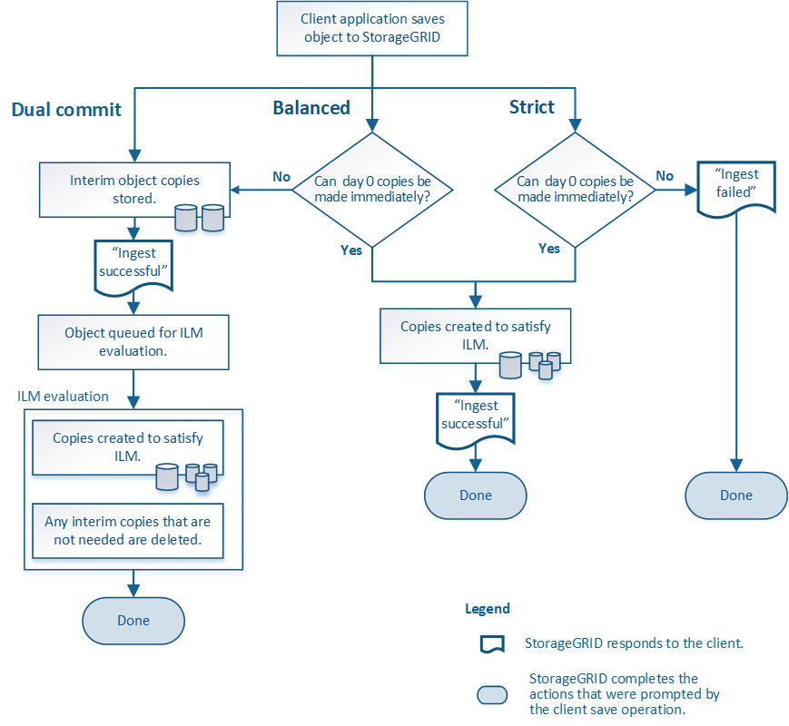

= 수집 옵션
:allow-uri-read: 
:icons: font
:imagesdir: ../media/

[role="lead"]
ILM 규칙을 만들 때는 수집 시 객체를 보호하기 위한 세 가지 옵션(이중 커밋, 엄격, 균형) 중 하나를 지정합니다.

선택에 따라 StorageGRID 임시 복사본을 만들고 나중에 ILM 평가를 위해 객체를 대기열에 추가하거나 동기 배치를 사용하여 ILM 요구 사항을 충족하기 위해 즉시 복사본을 만듭니다.

== 수집 옵션의 흐름도

흐름도는 세 가지 수집 옵션을 사용하는 ILM 규칙에 따라 개체가 일치할 때 어떤 일이 발생하는지 보여줍니다.

== 이중 커밋

듀얼 커밋 옵션을 선택하면 StorageGRID 두 개의 서로 다른 스토리지 노드에 임시 객체 복사본을 즉시 만들고 클라이언트에 "수집 성공" 메시지를 반환합니다.  해당 객체는 ILM 평가를 위해 대기 중이며, 규칙의 배치 지침을 충족하는 사본은 나중에 만들어집니다.  이중 커밋 직후에 ILM 정책을 처리할 수 없는 경우 사이트 손실 방지를 달성하는 데 시간이 걸릴 수 있습니다.

다음 두 경우 모두 이중 커밋 옵션을 사용하세요.

* 여러 사이트 ILM 규칙을 사용하고 있으며 클라이언트 수집 지연 시간이 가장 중요한 고려 사항입니다.  듀얼 커밋을 사용하는 경우 ILM을 충족하지 못할 경우 그리드가 듀얼 커밋 복사본을 만들고 제거하는 추가 작업을 수행할 수 있는지 확인해야 합니다.  구체적으로:
+
** 그리드의 부하는 ILM 백로그를 방지할 만큼 낮아야 합니다.
** 그리드에는 충분한 하드웨어 리소스(IOPS, CPU, 메모리, 네트워크 대역폭 등)가 있어야 합니다.

* 여러 사이트 ILM 규칙을 사용하고 있으며, 사이트 간 WAN 연결은 일반적으로 지연 시간이 길거나 대역폭이 제한적입니다.  이 시나리오에서는 이중 커밋 옵션을 사용하면 클라이언트 시간 초과를 방지하는 데 도움이 될 수 있습니다.  듀얼 커밋 옵션을 선택하기 전에 현실적인 작업 부하로 클라이언트 애플리케이션을 테스트해야 합니다.

== 균형(기본값)

균형 옵션을 선택하면 StorageGRID 수집 시 동기 배치를 사용하고 규칙의 배치 지침에 지정된 모든 복사본을 즉시 만듭니다.  Strict 옵션과 달리 StorageGRID 모든 복사본을 즉시 만들 수 없는 경우 대신 Dual commit을 사용합니다.  ILM 정책이 여러 사이트에 배치를 사용하고 즉각적인 사이트 손실 보호를 달성할 수 없는 경우 *ILM 배치 불가* 경고가 발생합니다.

균형 잡힌 옵션을 사용하면 데이터 보호, 그리드 성능, 수집 성공의 최적 조합을 얻을 수 있습니다.  ILM 규칙 생성 마법사의 기본 옵션은 '균형'입니다.

== 엄격한

Strict 옵션을 선택하면 StorageGRID 수집 시 동기 배치를 사용하고 규칙의 배치 지침에 지정된 모든 개체 복사본을 즉시 만듭니다.  예를 들어, 필요한 저장 위치를 ​​일시적으로 사용할 수 없는 경우와 같이 StorageGRID 모든 복사본을 만들 수 없는 경우 수집이 실패합니다.  클라이언트는 작업을 다시 시도해야 합니다.

ILM 규칙에 명시된 위치에만 객체를 즉시 저장해야 하는 운영 또는 규제 요구 사항이 있는 경우 '엄격' 옵션을 사용하세요.  예를 들어, 규정 요구 사항을 충족하려면 엄격 옵션과 위치 제약 고급 필터를 사용하여 개체가 특정 데이터 센터에 저장되지 않도록 보장해야 할 수 있습니다.

보다 link:example-5-ilm-rules-and-policy-for-strict-ingest-behavior.html["예 5: 엄격한 수집 동작에 대한 ILM 규칙 및 정책"] .
