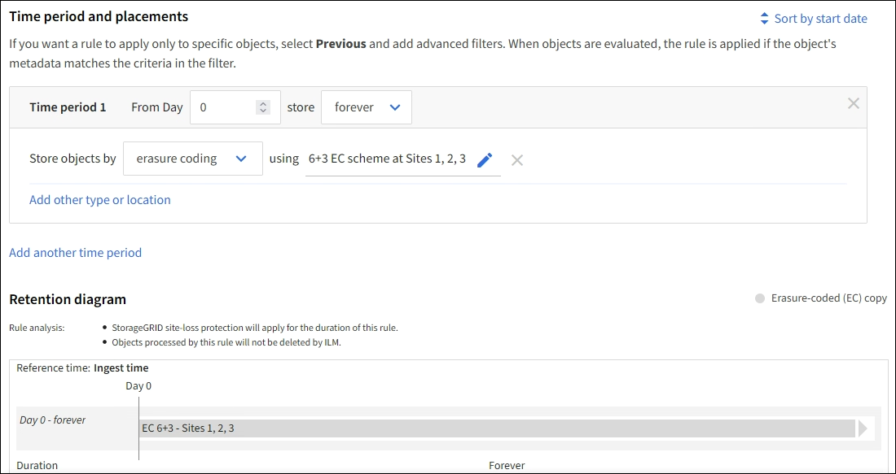

= 예 1: 개체 저장소에 대한 ILM 규칙 및 정책
:allow-uri-read: 
:icons: font
:imagesdir: ../media/

[role="lead"]
다음 예제 규칙과 정책을 시작점으로 사용하여 개체 보호 및 보존 요구 사항을 충족하는 ILM 정책을 정의할 수 있습니다.

CAUTION: 다음 ILM 규칙과 정책은 단지 예시일 뿐입니다.  ILM 규칙을 구성하는 방법은 여러 가지가 있습니다.  새로운 정책을 활성화하기 전에 시뮬레이션하여 콘텐츠 손실을 방지하기 위해 의도한 대로 작동하는지 확인하세요.

== 예시 1에 대한 ILM 규칙 1: 두 사이트에 개체 데이터 복사

이 예제 ILM 규칙은 두 사이트의 스토리지 풀에 개체 데이터를 복사합니다.

[cols="1a,2a"]
|===
| 규칙 정의 | 예시 값 

 a| 
단일 사이트 스토리지 풀
 a| 
각각 다른 사이트를 포함하는 두 개의 스토리지 풀은 사이트 1과 사이트 2로 명명됩니다.

 a| 
규칙 이름
 a| 
두 개의 사본 두 개의 사이트

 a| 
참조 시간
 a| 
섭취 시간

 a| 
배치
 a| 
0일부터 영구적으로 복제본 1개를 사이트 1에, 복제본 1개를 사이트 2에 보관합니다.

|===
보존 다이어그램의 규칙 분석 섹션은 다음과 같이 명시됩니다.

* 이 규칙이 적용되는 기간 동안 StorageGRID 사이트 손실 보호가 적용됩니다.
* 이 규칙에 의해 처리된 객체는 ILM에 의해 삭제되지 않습니다.

image::../media/ilm_rule_two_copies_two_data_centers.png[예시 1에 대한 ILM 규칙 1: 두 사이트에 개체 데이터 복사]

== 예시 1에 대한 ILM 규칙 2: 버킷 매칭을 통한 삭제 코딩 프로필

이 예제 ILM 규칙은 삭제 코딩 프로필과 S3 버킷을 사용하여 객체가 어디에, 얼마나 오랫동안 저장되는지 결정합니다.

[cols="1a,2a"]
|===
| 규칙 정의 | 예시 값 

 a| 
여러 사이트가 있는 스토리지 풀
 a| 
* 3개 사이트(사이트 1, 2, 3)에 걸쳐 하나의 스토리지 풀
* 6+3 삭제 코딩 방식을 사용하세요

 a| 
규칙 이름
 a| 
S3 버킷 재무 기록

 a| 
참조 시간
 a| 
섭취 시간

 a| 
배치
 a| 
S3 버킷에 있는 finance-records라는 객체의 경우, erasure-coding 프로필에서 지정한 풀에 erasure-coded 사본을 하나 만듭니다.  이 사본을 영구히 보관하세요.

|===

== 예시 1의 ILM 정책

실제로 대부분의 ILM 정책은 간단한데, StorageGRID 시스템을 사용하면 정교하고 복잡한 ILM 정책을 설계할 수 있습니다.

다중 사이트 그리드에 대한 일반적인 ILM 정책에는 다음과 같은 ILM 규칙이 포함될 수 있습니다.

* 수집 시 S3 버킷에 속하는 모든 객체를 저장합니다. `finance-records` 3개의 사이트가 있는 스토리지 풀에서.  6+3 지우기 코딩을 사용합니다.
* 객체가 첫 번째 ILM 규칙과 일치하지 않으면 정책의 기본 ILM 규칙인 '두 개의 사본, 두 개의 데이터 센터'를 사용하여 해당 객체의 사본 하나를 사이트 1에 저장하고, 다른 사본 하나를 사이트 2에 저장합니다.
+
image::../media/policy_1_configured_policy.png[예시 1의 ILM 정책]

.관련 정보
* link:ilm-policy-overview.html["ILM 정책 사용"]
* link:creating-ilm-policy.html["ILM 정책 생성"]

