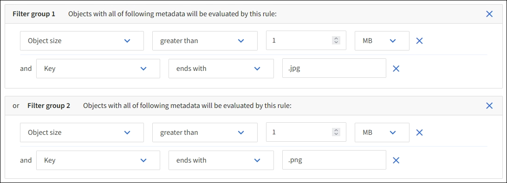
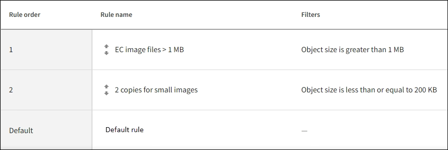

= 예 3: 이미지 파일을 보다 효과적으로 보호하기 위한 ILM 규칙 및 정책
:allow-uri-read: 
:icons: font
:imagesdir: ../media/

[role="lead"]
다음 예제 규칙과 정책을 사용하면 1MB가 넘는 이미지에 삭제 코드를 적용하고, 더 작은 이미지에 대해서는 두 개의 사본을 만들 수 있습니다.

CAUTION: 다음 ILM 규칙과 정책은 단지 예시일 뿐입니다.  ILM 규칙을 구성하는 방법은 여러 가지가 있습니다.  새로운 정책을 활성화하기 전에 시뮬레이션하여 콘텐츠 손실을 방지하기 위해 의도한 대로 작동하는지 확인하세요.

== 예시 3에 대한 ILM 규칙 1: 1MB보다 큰 이미지 파일에 EC 사용

이 ILM 규칙 예에서는 고급 필터링을 사용하여 1MB가 넘는 모든 이미지 파일의 코드를 지웁니다.

NOTE: 삭제 코딩은 1MB보다 큰 객체에 가장 적합합니다.  매우 작은 삭제 코딩된 조각을 관리하는 오버헤드를 피하기 위해 200KB보다 작은 객체에는 삭제 코딩을 사용하지 마세요.

[cols="1a,2a"]
|===
| 규칙 정의 | 예시 값 

 a| 
규칙 이름
 a| 
EC 이미지 파일 > 1MB

 a| 
참조 시간
 a| 
섭취 시간

 a| 
객체 크기에 대한 고급 필터
 a| 
개체 크기가 1MB보다 큽니다.

 a| 
키에 대한 고급 필터
 a| 
* .jpg로 끝납니다
* .png로 끝납니다

 a| 
배치
 a| 
3개의 사이트를 사용하여 2+1 삭제 코드 사본을 만듭니다.

|===

이 규칙은 정책의 첫 번째 규칙으로 구성되므로 삭제 코딩 배치 지침은 1MB보다 큰 .jpg 및 .png 파일에만 적용됩니다.

== 예시 3에 대한 ILM 규칙 2: 나머지 모든 이미지 파일에 대해 복제된 사본 2개를 만듭니다.

이 예제 ILM 규칙은 고급 필터링을 사용하여 더 작은 이미지 파일을 복제하도록 지정합니다.  정책의 첫 번째 규칙은 이미 1MB보다 큰 이미지 파일과 일치하므로 이 규칙은 1MB 이하의 이미지 파일에 적용됩니다.

[cols="1a,2a"]
|===
| 규칙 정의 | 예시 값 

 a| 
규칙 이름
 a| 
이미지 파일용 사본 2개

 a| 
참조 시간
 a| 
섭취 시간

 a| 
키에 대한 고급 필터
 a| 
* .jpg로 끝납니다
* .png로 끝납니다

 a| 
배치
 a| 
두 개의 스토리지 풀에 2개의 복제된 복사본을 만듭니다.

|===

== ILM 정책 예시 3: 이미지 파일에 대한 보다 나은 보호

이 ILM 정책 예시에는 세 가지 규칙이 포함되어 있습니다.

* 첫 번째 규칙은 1MB가 넘는 모든 이미지 파일에 코드를 삭제합니다.
* 두 번째 규칙은 남아 있는 이미지 파일(즉, 1MB 이하의 이미지)의 사본을 두 개 만듭니다.
* 기본 규칙은 나머지 모든 객체(즉, 이미지가 아닌 파일)에 적용됩니다.

