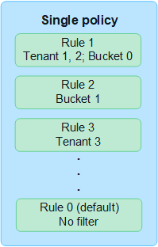
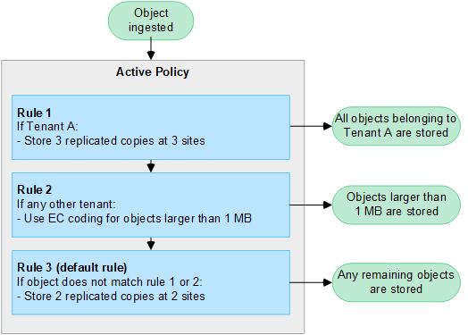

= ILM 정책 사용
:allow-uri-read: 
:icons: font
:imagesdir: ../media/

[role="lead"]
정보 수명 주기 관리(ILM) 정책은 StorageGRID 시스템이 시간 경과에 따라 개체 데이터를 관리하는 방법을 결정하는 일련의 정렬된 ILM 규칙입니다.

CAUTION: ILM 정책이 잘못 구성되면 복구할 수 없는 데이터 손실이 발생할 수 있습니다.  ILM 정책을 활성화하기 전에 ILM 정책과 ILM 규칙을 주의 깊게 검토한 다음 ILM 정책을 시뮬레이션하세요.  ILM 정책이 의도한 대로 작동하는지 항상 확인하세요.

== 기본 ILM 정책

StorageGRID 설치하고 사이트를 추가하면 다음과 같이 기본 ILM 정책이 자동으로 생성됩니다.

* 그리드에 사이트가 하나 포함되어 있는 경우 기본 정책에는 해당 사이트의 각 개체 사본 두 개를 복제하는 기본 규칙이 포함됩니다.
* 그리드에 두 개 이상의 사이트가 포함된 경우 기본 규칙은 각 사이트에서 각 개체의 사본을 하나씩 복제합니다.

기본 정책이 저장 요구 사항을 충족하지 못하는 경우, 직접 규칙과 정책을 만들 수 있습니다. 보다link:what-ilm-rule-is.html["ILM 규칙 만들기"] 그리고link:creating-ilm-policy.html["ILM 정책 생성"] .

== 활성 ILM 정책이 하나 이상 있나요?

한 번에 하나 이상의 활성 ILM 정책을 가질 수 있습니다.

=== 하나의 정책

그리드에서 테넌트별 및 버킷별 규칙이 거의 없는 간단한 데이터 보호 체계를 사용하는 경우 단일 활성 ILM 정책을 사용하세요.  ILM 규칙에는 다양한 버킷이나 테넌트를 관리하기 위한 필터가 포함될 수 있습니다.

정책이 하나뿐인 경우 테넌트의 요구 사항이 변경되면 새 ILM 정책을 만들거나 기존 정책을 복제하여 변경 사항을 적용하고 시뮬레이션한 다음 새 ILM 정책을 활성화해야 합니다.  ILM 정책이 변경되면 객체를 이동하는 데 며칠이 걸릴 수 있으며 시스템 지연이 발생할 수 있습니다.

=== 여러 정책

세입자에게 다양한 서비스 품질 옵션을 제공하려면 한 번에 두 개 이상의 정책을 활성화할 수 있습니다.  각 정책은 특정 테넌트, S3 버킷 및 객체를 관리할 수 있습니다.  특정 테넌트나 객체 집합에 대해 하나의 정책을 적용하거나 변경하는 경우 다른 테넌트와 객체에 적용된 정책은 영향을 받지 않습니다.

ILM 정책 태그:: 테넌트가 버킷별로 여러 데이터 보호 정책 간에 쉽게 전환할 수 있도록 하려면 _ILM 정책 태그_가 있는 여러 ILM 정책을 사용하세요.  각 ILM 정책을 태그에 할당한 다음 테넌트가 버킷에 태그를 지정하여 해당 버킷에 정책을 적용합니다.  S3 버킷에만 ILM 정책 태그를 설정할 수 있습니다.
+
--
예를 들어, Gold, Silver, Bronze라는 이름의 태그가 세 개 있을 수 있습니다.  객체를 저장하는 기간과 위치에 따라 각 태그에 ILM 정책을 할당할 수 있습니다.  세입자는 버킷에 태그를 지정하여 사용할 정책을 선택할 수 있습니다.  Gold 태그가 지정된 버킷은 Gold 정책에 따라 관리되며 Gold 수준의 데이터 보호 및 성능을 받습니다.

--
기본 ILM 정책 태그:: StorageGRID 설치하면 기본 ILM 정책 태그가 자동으로 생성됩니다.  모든 그리드에는 기본 태그에 할당된 활성 정책이 하나 있어야 합니다.  기본 정책은 태그가 지정되지 않은 모든 S3 버킷에 적용됩니다.

image::../media/ilm-policies-tags-conceptual.png[다중 ILM 정책 다이어그램]

== ILM 정책은 객체를 어떻게 평가합니까?

활성 ILM 정책은 객체의 배치, 기간 및 데이터 보호를 제어합니다.

클라이언트가 StorageGRID 에 객체를 저장하면 객체는 다음과 같이 정책의 ILM 규칙의 정렬된 집합에 대해 평가됩니다.

. 정책의 첫 번째 규칙에 대한 필터가 개체와 일치하는 경우, 해당 규칙의 수집 동작에 따라 개체가 수집되고 해당 규칙의 배치 지침에 따라 저장됩니다.
. 첫 번째 규칙에 대한 필터가 개체와 일치하지 않으면 일치할 때까지 정책의 각 후속 규칙에 대해 개체를 평가합니다.
. 개체와 일치하는 규칙이 없으면 정책의 기본 규칙에 대한 수집 동작 및 배치 지침이 적용됩니다.  기본 규칙은 정책의 마지막 규칙입니다.  기본 규칙은 모든 테넌트, 모든 S3 버킷, 모든 개체 버전에 적용되어야 하며 고급 필터는 사용할 수 없습니다.

== ILM 정책 예시

예를 들어, ILM 정책에는 다음을 지정하는 세 가지 ILM 규칙이 포함될 수 있습니다.

* *규칙 1: 세입자 A를 위한 복제본*
+
** 세입자 A가 소유한 모든 객체를 일치시킵니다.
** 이러한 객체를 세 개의 복제본으로 세 곳에 저장합니다.
** 다른 세입자가 소유한 객체는 규칙 1과 일치하지 않으므로 규칙 2에 따라 평가됩니다.

* *규칙 2: 1MB보다 큰 객체에 대한 삭제 코딩*
+
** 다른 테넌트의 모든 객체를 일치시키지만, 객체가 1MB보다 큰 경우에만 해당합니다.  이러한 대형 객체는 3개 장소에 6+3 삭제 코딩을 사용하여 저장됩니다.
** 1MB 이하의 객체는 일치하지 않으므로 이러한 객체는 규칙 3에 따라 평가됩니다.

* *규칙 3: 2개 사본 2개 데이터 센터* (기본값)
+
** 정책의 마지막이자 기본 규칙입니다.  필터를 사용하지 않습니다.
** 규칙 1 또는 규칙 2에 맞지 않는 모든 객체(테넌트 A에 속하지 않고 1MB 이하인 객체)에 대해 복제된 사본을 두 개 만듭니다.

== 활성 정책과 비활성 정책은 무엇입니까?

모든 StorageGRID 시스템에는 최소한 하나의 활성 ILM 정책이 있어야 합니다.  두 개 이상의 활성 ILM 정책을 사용하려면 ILM 정책 태그를 만들고 각 태그에 정책을 할당합니다.  그런 다음 테넌트는 S3 버킷에 태그를 적용합니다.  기본 정책은 정책 태그가 할당되지 않은 버킷의 모든 개체에 적용됩니다.

ILM 정책을 처음 만들 때 하나 이상의 ILM 규칙을 선택하고 특정 순서로 정렬합니다.  정책을 시뮬레이션하여 동작을 확인한 후 정책을 활성화합니다.

ILM 정책 하나를 활성화하면 StorageGRID 해당 정책을 사용하여 기존 개체와 새로 수집된 개체를 포함한 모든 개체를 관리합니다.  새 정책의 ILM 규칙이 구현되면 기존 객체가 새 위치로 이동될 수 있습니다.

한 번에 두 개 이상의 ILM 정책을 활성화하고 테넌트가 S3 버킷에 정책 태그를 적용하는 경우 각 버킷의 개체는 태그에 할당된 정책에 따라 관리됩니다.

StorageGRID 시스템은 활성화되거나 비활성화된 정책의 기록을 추적합니다.

== ILM 정책 생성을 위한 고려 사항

* 테스트 시스템에서는 시스템에서 제공하는 정책인 Baseline 2 복사 정책만 사용합니다.  StorageGRID 11.6 및 이전 버전의 경우 이 정책의 Make 2 Copies 규칙은 모든 사이트를 포함하는 All Storage Nodes 스토리지 풀을 사용합니다.  StorageGRID 시스템에 두 개 이상의 사이트가 있는 경우, 동일한 사이트에 객체의 사본 두 개가 배치될 수 있습니다.
+

NOTE: 모든 스토리지 노드 스토리지 풀은 StorageGRID 11.6 및 이전 버전을 설치하는 동안 자동으로 생성됩니다.  StorageGRID 의 최신 버전으로 업그레이드하면 모든 스토리지 노드 풀이 계속 존재합니다.  StorageGRID 11.7 이상을 새로 설치하면 모든 스토리지 노드 풀이 생성되지 않습니다.

* 새로운 정책을 설계할 때는 그리드에 수집될 수 있는 다양한 유형의 객체를 모두 고려하세요.  정책에 이러한 객체를 일치시키고 필요에 따라 배치하는 규칙이 포함되어 있는지 확인하세요.
* ILM 정책은 가능한 한 간단하게 유지하세요.  이를 통해 시간이 지남에 따라 StorageGRID 시스템이 변경될 때 개체 데이터가 의도한 대로 보호되지 않는 잠재적으로 위험한 상황을 방지할 수 있습니다.
* 정책의 규칙이 올바른 순서로 되어 있는지 확인하세요.  정책이 활성화되면 새 개체와 기존 개체는 위에서부터 나열된 순서대로 규칙에 따라 평가됩니다.  예를 들어, 정책의 첫 번째 규칙이 객체와 일치하는 경우 해당 객체는 다른 규칙에 의해 평가되지 않습니다.
* 모든 ILM 정책의 마지막 규칙은 기본 ILM 규칙으로, 필터를 사용할 수 없습니다.  객체가 다른 규칙과 일치하지 않으면 기본 규칙에 따라 해당 객체가 어디에 배치되고 얼마 동안 보관되는지가 제어됩니다.
* 새로운 정책을 활성화하기 전에 정책이 기존 개체의 배치에 미치는 변경 사항을 검토하세요.  기존 객체의 위치를 변경하면 새로운 배치를 평가하고 구현할 때 일시적인 리소스 문제가 발생할 수 있습니다.

