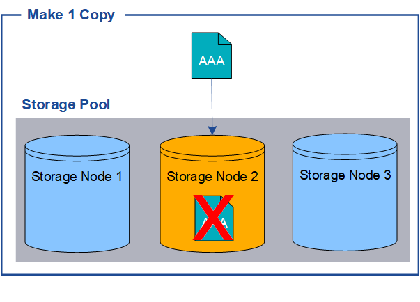

= 단일 사본 복제를 사용하면 안 되는 이유
:allow-uri-read: 
:icons: font
:imagesdir: ../media/

[role="lead"]
복제된 사본을 생성하기 위한 ILM 규칙을 만들 때는 배치 지침에 기간별로 최소 두 개의 사본을 지정해야 합니다.

NOTE: 특정 기간 동안 단 하나의 복제본만 생성하는 ILM 규칙은 사용하지 마세요.  개체의 복제된 사본이 하나만 있는 경우 스토리지 노드에 장애가 발생하거나 심각한 오류가 발생하면 해당 개체는 손실됩니다.  업그레이드 등의 유지 관리 절차가 진행되는 동안에는 해당 객체에 대한 액세스 권한을 일시적으로 잃게 됩니다.

다음 예에서 Make 1 Copy ILM 규칙은 개체의 복제된 사본 하나를 3개의 스토리지 노드가 포함된 스토리지 풀에 배치하도록 지정합니다.  이 규칙과 일치하는 객체가 수집되면 StorageGRID 단 하나의 스토리지 노드에만 단일 사본을 저장합니다.

image::../media/ilm_replication_make_1_copy.png[ILM 복제 1개 복사본 만들기]

ILM 규칙이 개체의 복제된 사본을 하나만 생성하는 경우 스토리지 노드를 사용할 수 없으면 해당 개체에 액세스할 수 없게 됩니다.  이 예에서 스토리지 노드 2가 오프라인이 되는 경우(예: 업그레이드 또는 기타 유지 관리 절차 중) 개체 AAA에 대한 액세스 권한을 일시적으로 잃게 됩니다.  스토리지 노드 2에 장애가 발생하면 AAA 객체를 완전히 잃게 됩니다.

개체 데이터 손실을 방지하려면 복제를 통해 보호하려는 모든 개체의 사본을 최소한 두 개 이상 만들어야 합니다.  두 개 이상의 사본이 있는 경우 하나의 스토리지 노드에 장애가 발생하거나 오프라인이 되어도 여전히 개체에 액세스할 수 있습니다.

image::../media/ilm_replication_make_2_copies_sn_fails.png[ILM 복제에서 2개의 복사본을 만들 때 SN이 실패합니다.]
