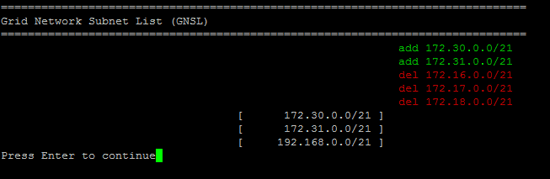

= Grid Network의 서브넷 목록에 추가하거나 변경
:allow-uri-read: 
:icons: font
:imagesdir: ../media/

[role="lead"]
IP 변경 도구를 사용하면 Grid Network에 서브넷을 추가하거나 변경할 수 있습니다.

.시작하기 전에
* 당신은 가지고있다 `Passwords.txt` 파일.

그리드 네트워크 서브넷 목록에서 서브넷을 추가, 삭제 또는 변경할 수 있습니다.  변경 사항은 그리드의 모든 노드에 대한 라우팅에 영향을 미칩니다.

NOTE: 그리드 네트워크 서브넷 목록만 변경하는 경우 그리드 관리자를 사용하여 네트워크 구성을 추가하거나 변경하세요.  그렇지 않은 경우, 네트워크 구성 문제로 인해 Grid Manager에 접근할 수 없는 경우나 Grid Network 라우팅 변경과 기타 네트워크 변경을 동시에 수행하는 경우 IP 변경 도구를 사용하세요.

[NOTE]
====
다음 IPv4 주소가 포함된 서브넷은 모든 노드의 그리드 네트워크, 관리 네트워크 또는 클라이언트 네트워크에 사용하지 마세요.

* 192,168,130,101
* 192,168,131,101
* 192,168,130,102
* 192,168,131,102
* 198.51.100.2
* 198.51.100.4

예를 들어, 어떤 노드의 그리드 네트워크, 관리 네트워크 또는 클라이언트 네트워크에도 다음 서브넷 범위를 사용하지 마세요.

* 192.168.130.0/24는 이 서브넷 범위에 IP 주소 192.168.130.101 및 192.168.130.102가 포함되어 있기 때문입니다.
* 192.168.131.0/24는 이 서브넷 범위에 IP 주소 192.168.131.101 및 192.168.131.102가 포함되어 있기 때문입니다.
* 198.51.100.0/24는 이 서브넷 범위에 IP 주소 198.51.100.2와 198.51.100.4가 포함되어 있기 때문입니다.

====
.단계
. 기본 관리 노드에 로그인합니다.
+
.. 다음 명령을 입력하세요: `ssh admin@_primary_Admin_Node_IP_`
.. 나열된 비밀번호를 입력하세요 `Passwords.txt` 파일.
.. 다음 명령을 입력하여 루트로 전환하세요. `su -`
.. 나열된 비밀번호를 입력하세요 `Passwords.txt` 파일.

+
루트로 로그인하면 프롬프트가 다음과 같이 변경됩니다. `$` 에게 `#` .

. 다음 명령을 입력하여 IP 변경 도구를 시작합니다. `change-ip`
. 프롬프트에 프로비저닝 암호를 입력합니다.
+
메인 메뉴가 나타납니다.

+
image::../media/change_ip_tool_main_menu.png[IP 변경 도구의 시작 화면을 보여주는 스크린샷]

. 메인 메뉴에서 그리드 네트워크의 서브넷을 편집하는 옵션을 선택합니다(옵션 *4*).
+

NOTE: 그리드 네트워크 서브넷 목록의 변경 사항은 그리드 전체에 적용됩니다.

. 다음 중 하나를 선택하세요.
+
--
** 다음 명령을 입력하여 서브넷을 추가합니다. `add CIDR`
** 다음 명령을 입력하여 서브넷을 삭제합니다. `del CIDR`
** 다음 명령을 입력하여 서브넷 목록을 설정합니다. `set CIDR`

--
+
--

NOTE: 모든 명령에 대해 다음 형식을 사용하여 여러 주소를 입력할 수 있습니다. `add CIDR, CIDR`

예: `add 172.14.0.0/16, 172.15.0.0/16, 172.16.0.0/16`

TIP: "위쪽 화살표"를 사용하여 이전에 입력한 값을 현재 입력 프롬프트로 불러온 다음 필요한 경우 편집하면 입력해야 하는 양을 줄일 수 있습니다.

아래의 예시 입력은 Grid Network Subnet List에 대한 서브넷을 설정하는 방법을 보여줍니다.

image::../media/change_ip_tool_gnsl_sample_input.gif[주변 텍스트로 설명된 스크린샷]

--
. 준비가 되면 *q*를 입력하여 메인 메뉴 화면으로 돌아갑니다.  변경 사항은 승인되거나 적용될 때까지 보류됩니다.
. 다음 중 하나를 선택하세요.
+
** 변경된 항목만 표시되도록 출력에서 편집 내용을 분리하여 표시하려면 옵션 *5*를 선택하세요.  변경 사항은 아래 예시 출력에서 볼 수 있듯이 녹색(추가) 또는 빨간색(삭제)으로 강조 표시됩니다.
+

** 전체 구성을 표시하는 출력에서 편집 내용을 표시하려면 옵션 *6*을 선택하세요.  변경 사항은 녹색(추가) 또는 빨간색(삭제)으로 강조 표시됩니다.
+

NOTE: 일부 명령줄 인터페이스에서는 취소선 서식을 사용하여 추가 및 삭제 내용을 표시할 수 있습니다.

. 모든 단계적 변경 사항을 검증하려면 옵션 *7*을 선택하세요.
+
이 검증은 중복되는 서브넷을 사용하는 등 그리드, 관리자 및 클라이언트 네트워크에 대한 규칙이 준수되는지 확인합니다.

. 선택적으로, *8* 옵션을 선택하여 모든 단계적 변경 사항을 저장하고 나중에 다시 돌아와 변경 작업을 계속할 수 있습니다.
+
이 옵션을 사용하면 적용되지 않은 변경 사항을 잃지 않고 IP 변경 도구를 종료하고 나중에 다시 시작할 수 있습니다.

. 다음 중 하나를 수행하세요.
+
** 새 네트워크 구성을 저장하거나 적용하지 않고 모든 변경 사항을 지우려면 옵션 *9*를 선택하세요.
** 변경 사항을 적용하고 새로운 네트워크 구성을 프로비저닝할 준비가 되었다면 옵션 *10*을 선택하세요.  프로비저닝 중에 출력에는 다음 예제 출력과 같이 업데이트가 적용되는 상태가 표시됩니다.
+
[listing]
----
Generating new grid networking description file...

Running provisioning...

Updating grid network configuration on Name
----

. 그리드 네트워크 변경 시 옵션 *10*을 선택한 경우 다음 옵션 중 하나를 선택하세요.
+
** *적용*: 변경 사항을 즉시 적용하고 필요한 경우 각 노드를 자동으로 다시 시작합니다.
+
외부 변경 없이 새 네트워크 구성이 기존 네트워크 구성과 동시에 작동하는 경우, *적용* 옵션을 사용하여 완전 자동화된 구성 변경을 수행할 수 있습니다.

** *단계*: 노드가 다음에 다시 시작될 때 변경 사항을 적용합니다.
+
새로운 네트워크 구성이 작동하도록 물리적 또는 가상 네트워킹 구성을 변경해야 하는 경우 *stage* 옵션을 사용하여 영향을 받는 노드를 종료하고, 필요한 물리적 네트워킹 변경을 수행한 다음, 영향을 받는 노드를 다시 시작해야 합니다.

+

NOTE: *스테이지* 옵션을 사용하는 경우 중단을 최소화하기 위해 스테이징 후 가능한 한 빨리 노드를 다시 시작하세요.

** *취소*: 지금은 네트워크를 변경하지 마세요.
+
제안된 변경 사항을 적용하려면 노드를 다시 시작해야 한다는 사실을 몰랐다면, 사용자에게 미치는 영향을 최소화하기 위해 변경 사항을 연기할 수 있습니다.  *취소*를 선택하면 메인 메뉴로 돌아가고 변경 사항이 저장되어 나중에 적용할 수 있습니다.

+
변경 사항을 적용하거나 단계적으로 적용한 후에는 그리드 구성 변경의 결과로 새로운 복구 패키지가 생성됩니다.

. 오류로 인해 구성이 중지된 경우 다음 옵션을 사용할 수 있습니다.
+
** IP 변경 절차를 종료하고 메인 메뉴로 돌아가려면 *a*를 입력하세요.
** 실패한 작업을 다시 시도하려면 *r*을 입력하세요.
** 다음 작업을 계속하려면 *c*를 입력하세요.
+
실패한 작업은 나중에 주 메뉴에서 옵션 *10*(변경 사항 적용)을 선택하여 다시 시도할 수 있습니다.  모든 작업이 성공적으로 완료될 때까지 IP 변경 절차는 완료되지 않습니다.

** 수동으로 개입해야 하는 경우(예: 노드 재부팅) 도구에서 실패한 것으로 판단한 작업이 실제로는 성공적으로 완료되었다고 확신하는 경우 *f*를 입력하여 해당 작업을 성공으로 표시하고 다음 작업으로 넘어갑니다.

. Grid Manager에서 새로운 복구 패키지를 다운로드하세요.
+
.. *유지관리* > *시스템* > *복구 패키지*를 선택하세요.
.. 프로비저닝 암호를 입력하세요.

+

CAUTION: 복구 패키지 파일은 StorageGRID 시스템에서 데이터를 얻는 데 사용할 수 있는 암호화 키와 비밀번호가 포함되어 있으므로 보호되어야 합니다.

