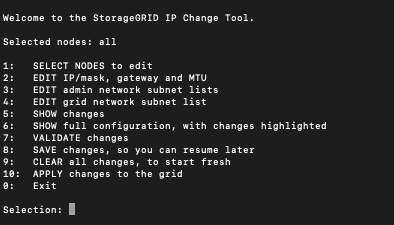
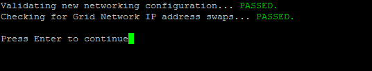

= 그리드의 모든 노드에 대한 IP 주소 변경
:allow-uri-read: 
:icons: font
:imagesdir: ../media/

[role="lead"]
그리드의 모든 노드에 대한 그리드 네트워크 IP 주소를 변경해야 하는 경우, 다음 특별 절차를 따라야 합니다.  개별 노드를 변경하는 절차를 사용하여 그리드 전체의 그리드 네트워크 IP를 변경할 수는 없습니다.

.시작하기 전에
* 당신은 가지고있다 `Passwords.txt` 파일.

그리드가 성공적으로 시작되도록 하려면 모든 변경 사항을 동시에 적용해야 합니다.

NOTE: 이 절차는 그리드 네트워크에만 적용됩니다.  이 절차를 사용하여 관리자 또는 클라이언트 네트워크의 IP 주소를 변경할 수 없습니다.

한 사이트의 노드에 대한 IP 주소와 MTU만 변경하려면 다음을 따르세요.link:changing-nodes-network-configuration.html["노드 네트워크 구성 변경"] 지침.

.단계
. DNS 또는 NTP 변경, SSO(Single Sign-On) 구성 변경(사용하는 경우) 등 IP 변경 도구 외부에서 변경해야 하는 사항을 미리 계획하세요.
+

NOTE: 기존 NTP 서버가 새로운 IP 주소에서 그리드에 접근할 수 없는 경우 IP 변경 절차를 수행하기 전에 새로운 NTP 서버를 추가하세요.

+

NOTE: 기존 DNS 서버가 새로운 IP 주소에서 그리드에 접근할 수 없는 경우 IP 변경 절차를 수행하기 전에 새로운 DNS 서버를 추가하세요.

+

NOTE: StorageGRID 시스템에서 SSO가 활성화되어 있고 모든 신뢰 당사자 트러스트가 권장되는 정규화된 도메인 이름 대신 관리자 노드 IP 주소를 사용하여 구성된 경우 IP 주소를 변경한 직후 AD FS(Active Directory Federation Services)에서 이러한 신뢰 당사자 트러스트를 업데이트하거나 재구성할 준비를 하세요. 보다 link:../admin/configuring-sso.html["단일 로그인 구성"] .

+

NOTE: 필요한 경우 새 IP 주소에 대한 새 서브넷을 추가합니다.

. 기본 관리 노드에 로그인합니다.
+
.. 다음 명령을 입력하세요: `ssh admin@_primary_Admin_Node_IP_`
.. 나열된 비밀번호를 입력하세요 `Passwords.txt` 파일.
.. 다음 명령을 입력하여 루트로 전환하세요. `su -`
.. 나열된 비밀번호를 입력하세요 `Passwords.txt` 파일.

+
루트로 로그인하면 프롬프트가 다음과 같이 변경됩니다. `$` 에게 `#` .

. 다음 명령을 입력하여 IP 변경 도구를 시작합니다. `change-ip`
. 프롬프트에 프로비저닝 암호를 입력합니다.
+
메인 메뉴가 나타납니다.  기본적으로, `Selected nodes` 필드가 설정됨 `all` .

+

. 메인 메뉴에서 *2*를 선택하여 모든 노드의 IP/서브넷 마스크, 게이트웨이, MTU 정보를 편집합니다.
+
.. 그리드 네트워크를 변경하려면 *1*을 선택하세요.
+
선택을 하면 프롬프트에 노드 이름, 그리드 네트워크 이름, 데이터 유형(IP/마스크, 게이트웨이 또는 MTU) 및 현재 값이 표시됩니다.

+
DHCP로 구성된 인터페이스의 IP 주소, 접두사 길이, 게이트웨이 또는 MTU를 편집하면 인터페이스가 정적으로 변경됩니다.  DHCP에 의해 구성된 각 인터페이스 앞에 경고가 표시됩니다.

+
인터페이스는 다음과 같이 구성되었습니다. `fixed` 편집할 수 없습니다.

.. 새 값을 설정하려면 현재 값에 표시된 형식으로 입력하세요.
.. 변경하려는 모든 노드를 편집한 후 *q*를 입력하여 메인 메뉴로 돌아갑니다.
+
변경 사항은 승인되거나 적용될 때까지 보류됩니다.

. 다음 옵션 중 하나를 선택하여 변경 사항을 검토하세요.
+
** *5*: 변경된 항목만 표시하도록 분리된 출력에서 편집 내용을 표시합니다.  변경 사항은 예시 출력에서 표시된 대로 녹색(추가) 또는 빨간색(삭제)으로 강조 표시됩니다.
+
image::../media/change_ip_tool_edit_ip_mask_sample_output.png[주변 텍스트로 설명된 스크린샷]

** *6*: 전체 구성을 표시하는 출력에서 편집 내용을 보여줍니다.  변경 사항은 녹색(추가) 또는 빨간색(삭제)으로 강조 표시됩니다.
+

NOTE: 일부 명령줄 인터페이스에서는 취소선 서식을 사용하여 추가 및 삭제 내용을 표시할 수 있습니다.  적절한 표시는 터미널 클라이언트가 필요한 VT100 이스케이프 시퀀스를 지원하는지에 따라 달라집니다.

. 모든 변경 사항을 확인하려면 옵션 *7*을 선택하세요.
+
이 검증은 중복되는 서브넷을 사용하지 않는 등 그리드 네트워크의 규칙이 위반되지 않았는지 확인합니다.

+
이 예에서는 검증에서 오류가 반환되었습니다.

+
image::../media/change_ip_tool_validate_sample_error_messages.gif[주변 텍스트로 설명된 스크린샷]

+
이 예에서는 검증이 통과되었습니다.

+

. 검증을 통과한 후 *10*을 선택하여 새로운 네트워크 구성을 적용합니다.
. 다음에 노드를 다시 시작할 때 변경 사항을 적용하려면 *단계*를 선택하세요.
+

NOTE: *단계*를 선택해야 합니다.  수동으로 또는 *단계* 대신 *적용*을 선택하여 롤링 재시작을 수행하지 마세요. 그리드가 성공적으로 시작되지 않습니다.

. 변경이 완료되면 *0*을 선택하여 IP 변경 도구를 종료합니다.
. 모든 노드를 동시에 종료합니다.
+

NOTE: 그리드 전체를 종료해야 모든 노드가 동시에 다운됩니다.

. 필요한 물리적 또는 가상 네트워킹 변경을 수행합니다.
. 모든 그리드 노드가 다운되었는지 확인하세요.
. 모든 노드의 전원을 켭니다.
. 그리드가 성공적으로 시작된 후:
+
.. 새로운 NTP 서버를 추가한 경우 기존 NTP 서버 값을 삭제하세요.
.. 새로운 DNS 서버를 추가한 경우 이전 DNS 서버 값을 삭제하세요.

. Grid Manager에서 새로운 복구 패키지를 다운로드하세요.
+
.. *유지관리* > *시스템* > *복구 패키지*를 선택하세요.
.. 프로비저닝 암호를 입력하세요.

.관련 정보
* link:adding-to-or-changing-subnet-lists-on-grid-network.html["Grid Network의 서브넷 목록에 추가하거나 변경"]
* link:shutting-down-grid-node.html["그리드 노드 종료"]

