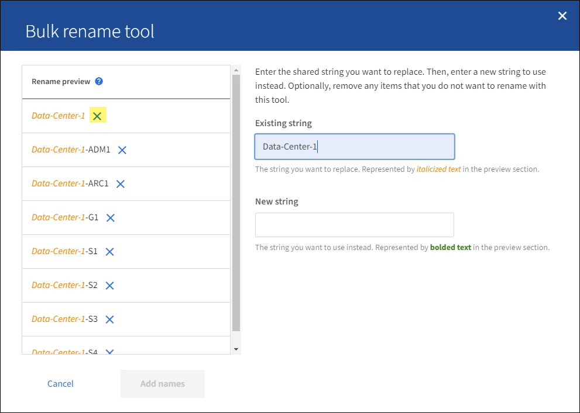

= 표시 이름 추가 또는 업데이트
:allow-uri-read: 
:icons: font
:imagesdir: ../media/

[role="lead"]
이 절차를 사용하면 그리드, 사이트 및 노드에 사용되는 표시 이름을 추가하거나 업데이트할 수 있습니다.  한 항목, 여러 항목 또는 모든 항목의 이름을 동시에 바꿀 수 있습니다.  표시 이름을 정의하거나 업데이트해도 StorageGRID 작업에 어떤 영향도 미치지 않습니다.

.시작하기 전에
* *기본 관리 노드*에서 다음을 사용하여 Grid Manager에 로그인합니다.link:../admin/web-browser-requirements.html["지원되는 웹 브라우저"] .
+

NOTE: 기본 관리 노드가 아닌 곳에서도 표시 이름을 추가하거나 업데이트할 수 있지만, 복구 패키지를 다운로드하려면 기본 관리 노드에 로그인해야 합니다.

* 당신은 가지고있다link:../admin/admin-group-permissions.html["유지 관리 또는 루트 액세스 권한"] .
* 프로비저닝 암호가 있습니다.
* 표시 이름에 대한 요구 사항과 모범 사례를 이해합니다. 보다 link:../maintain/rename-grid-site-node-overview.html["그리드, 사이트 및 노드 이름 바꾸기"] .

== 그리드, 사이트 또는 노드의 이름을 바꾸는 방법

StorageGRID 시스템, 하나 이상의 사이트 또는 하나 이상의 노드의 이름을 바꿀 수 있습니다.

다른 노드에서 이전에 사용했던 표시 이름을 사용할 수 있지만, 이름 변경으로 인해 표시 이름이나 시스템 이름이 중복되지 않아야 합니다.

=== 이름을 바꿀 항목을 선택하세요

시작하려면 이름을 바꾸려는 항목을 선택하세요.

.단계
. *유지관리* > *작업* > *그리드, 사이트 및 노드 이름 바꾸기*를 선택합니다.
. *이름 선택* 단계에서는 이름을 바꾸려는 항목을 선택합니다.
+
[cols="1a,2a"]
|===
| 변경할 항목 | 지침 

 a| 
시스템의 모든 것(또는 거의 모든 것)의 이름
 a| 
.. *모두 선택*을 선택하세요.
.. 선택적으로 이름을 바꾸고 싶지 않은 항목은 지웁니다.

 a| 
그리드의 이름
 a| 
그리드의 확인란을 선택하세요.

 a| 
사이트 이름과 일부 또는 모든 노드
 a| 
.. 사이트의 테이블 헤더에서 확인란을 선택합니다.
.. 선택적으로, 이름을 바꾸고 싶지 않은 노드를 지웁니다.

 a| 
사이트 이름
 a| 
해당 사이트의 확인란을 선택하세요.

 a| 
노드의 이름
 a| 
노드의 확인란을 선택하세요.

|===
. *계속*을 선택하세요.
. 선택한 항목이 포함된 표를 검토하세요.
+
** *표시 이름* 열에는 각 항목의 현재 이름이 표시됩니다.  해당 항목의 이름이 변경된 적이 없으면 표시 이름은 시스템 이름과 동일합니다.
** *시스템 이름* 열에는 설치 중에 각 항목에 입력한 이름이 표시됩니다.  시스템 이름은 내부 StorageGRID 작업에 사용되며 변경할 수 없습니다.  예를 들어, 노드의 시스템 이름은 호스트 이름이 될 수 있습니다.
** *유형* 열은 항목의 유형(그리드, 사이트 또는 특정 유형의 노드)을 나타냅니다.

=== 새로운 이름을 제안하세요

*새 이름 제안* 단계에서는 각 항목에 대한 표시 이름을 개별적으로 입력하거나 항목의 이름을 대량으로 바꿀 수 있습니다.

[role="tabbed-block"]
====
.항목 개별적으로 이름 바꾸기
--
이름을 바꾸려는 각 항목에 대한 표시 이름을 입력하려면 다음 단계를 따르세요.

.단계
. *표시 이름* 필드에 목록의 각 항목에 대해 제안된 표시 이름을 입력합니다.
+
보다link:../maintain/rename-grid-site-node-overview.html["그리드, 사이트 및 노드 이름 바꾸기"] 명명 요구 사항을 알아보세요.

. 이름을 바꾸고 싶지 않은 항목을 제거하려면 다음을 선택하세요.image:../media/icon-x-to-remove.png["X 아이콘"] *목록에서 제거* 열에 있습니다.
+
항목에 대한 새로운 이름을 제안하지 않을 경우 표에서 해당 항목을 제거해야 합니다.

. 표에 있는 모든 항목에 대한 새 이름을 제안했으면 *이름 바꾸기*를 선택합니다.
+
성공 메시지가 나타납니다.  새로운 표시 이름은 이제 Grid Manager 전체에서 사용됩니다.

--
.대량으로 항목 이름 바꾸기
--
항목 이름에 공통 문자열이 포함되어 있고 이를 다른 문자열로 바꾸고 싶은 경우 대량 이름 바꾸기 도구를 사용하세요.

.단계
. *새 이름 제안* 단계에서 *대량 이름 변경 도구 사용*을 선택합니다.
+
*이름 바꾸기 미리보기*에는 *새 이름 제안* 단계에 표시된 모든 항목이 포함됩니다.  공유 문자열을 바꾼 후 표시 이름이 어떻게 표시되는지 미리 보려면 미리보기를 사용할 수 있습니다.

. *기존 문자열* 필드에 바꾸려는 공유 문자열을 입력합니다.  예를 들어, 바꾸려는 문자열이 다음과 같은 경우 `Data-Center-1` , *데이터 센터-1*을 입력합니다.
+
입력하는 동안 왼쪽 이름에 있는 텍스트는 강조 표시됩니다.

. 선택하다image:../media/icon-x-to-remove.png["X 아이콘"] 이 도구로 이름을 바꾸고 싶지 않은 항목을 제거합니다.
+
예를 들어, 문자열을 포함하는 모든 노드의 이름을 바꾸고 싶다고 가정해 보겠습니다. `Data-Center-1` , 하지만 이름을 바꾸고 싶지는 않습니다. `Data-Center-1` 사이트 자체.  선택하다image:../media/icon-x-to-remove.png["X 아이콘"] 사이트를 이름 바꾸기 미리보기에서 제거합니다.

+

. *새 문자열* 필드에 대신 사용할 대체 문자열을 입력합니다.  예를 들어, *DC1*을 입력합니다.
+
보다link:../maintain/rename-grid-site-node-overview.html["그리드, 사이트 및 노드 이름 바꾸기"] 명명 요구 사항을 알아보세요.

+
대체 문자열을 입력하면 왼쪽의 이름이 업데이트되므로 새 이름이 올바른지 확인할 수 있습니다.

+
image::../media/rename-bulk-rename-tool-after.png[대량 이름 바꾸기 도구]

. 미리보기에 표시된 이름에 만족하면 *이름 추가*를 선택하여 *새 이름 제안* 단계에서 표에 이름을 추가합니다.
. 필요한 추가 변경 사항을 적용하거나 선택하세요.image:../media/icon-x-to-remove.png["X 아이콘"] 이름을 바꾸고 싶지 않은 항목을 제거합니다.
. 표에 있는 모든 항목의 이름을 바꿀 준비가 되면 *이름 바꾸기*를 선택하세요.
+
성공 메시지가 표시됩니다.  새로운 표시 이름은 이제 Grid Manager 전체에서 사용됩니다.

--
====

=== [[download-recovery-package]]복구 패키지 다운로드

항목 이름 변경이 끝나면 새로운 복구 패키지를 다운로드하여 저장하세요. 이름을 바꾼 항목의 새 표시 이름은 다음에 포함됩니다. `Passwords.txt` 파일.

.단계
. 프로비저닝 암호를 입력하세요.
. *복구 패키지 다운로드*를 선택하세요.
+
다운로드가 즉시 시작됩니다.

. 다운로드가 완료되면 다음을 엽니다. `Passwords.txt` 모든 노드의 서버 이름과 이름이 변경된 노드의 표시 이름을 확인하려면 파일을 사용하세요.
. 복사하다 `sgws-recovery-package-_id-revision_.zip` 안전하고 보안이 유지되는 두 개의 별도 장소로 파일을 보관하세요.
+

CAUTION: 복구 패키지 파일은 StorageGRID 시스템에서 데이터를 얻는 데 사용할 수 있는 암호화 키와 비밀번호가 포함되어 있으므로 보호되어야 합니다.

. 첫 번째 단계로 돌아가려면 *마침*을 선택하세요.

== 표시 이름을 시스템 이름으로 되돌리기

이름이 바뀐 그리드, 사이트 또는 노드를 원래 시스템 이름으로 되돌릴 수 있습니다.  항목을 해당 시스템 이름으로 되돌리면 Grid Manager 페이지와 기타 StorageGRID 위치에 해당 항목의 *표시 이름*이 더 이상 표시되지 않습니다.  해당 아이템의 시스템 이름만 표시됩니다.

.단계
. *유지관리* > *작업* > *그리드, 사이트 및 노드 이름 바꾸기*를 선택합니다.
. *이름 선택* 단계에서는 시스템 이름으로 되돌릴 항목을 선택합니다.
. *계속*을 선택하세요.
. *새 이름 제안* 단계에서는 표시 이름을 개별적으로 또는 대량으로 시스템 이름으로 되돌립니다.
+
[role="tabbed-block"]
====
.시스템 이름을 개별적으로 되돌리기
--
.. 각 항목의 원래 시스템 이름을 복사하여 *표시 이름* 필드에 붙여 넣거나 다음을 선택하십시오.image:../media/icon-x-to-remove.png["X 아이콘"] 되돌리고 싶지 않은 항목을 제거합니다.
+
표시 이름을 되돌리려면 시스템 이름이 *표시 이름* 필드에 나타나야 하지만 이름은 대소문자를 구분하지 않습니다.

.. *이름 바꾸기*를 선택하세요.
+
성공 메시지가 나타납니다.  이 항목의 표시 이름은 더 이상 사용되지 않습니다.

--
.대량으로 시스템 이름으로 되돌리기
--
.. *새 이름 제안* 단계에서 *대량 이름 변경 도구 사용*을 선택합니다.
.. *기존 문자열* 필드에 바꾸려는 표시 이름 문자열을 입력합니다.
.. *새 문자열* 필드에 대신 사용하려는 시스템 이름 문자열을 입력합니다.
.. *이름 추가*를 선택하여 *새 이름 제안* 단계에 사용할 이름을 표에 추가합니다.
.. *표시 이름* 필드의 각 항목이 *시스템 이름* 필드의 이름과 일치하는지 확인하세요.  변경 사항을 적용하거나 선택하세요image:../media/icon-x-to-remove.png["X 아이콘"] 되돌리고 싶지 않은 항목을 제거합니다.
+
표시 이름을 되돌리려면 시스템 이름이 *표시 이름* 필드에 나타나야 하지만 이름은 대소문자를 구분하지 않습니다.

.. *이름 바꾸기*를 선택하세요.
+
성공 메시지가 표시됩니다.  이 항목의 표시 이름은 더 이상 사용되지 않습니다.

--
====
. <<download-recovery-package,새로운 복구 패키지를 다운로드하고 저장하세요>> .
+
되돌린 항목의 표시 이름은 더 이상 포함되지 않습니다. `Passwords.txt` 파일.

