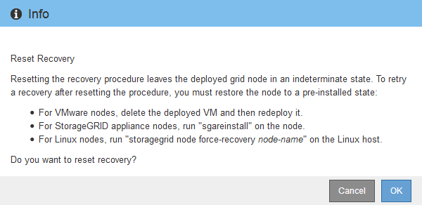

= 복구 시작을 선택하여 어플라이언스 스토리지 노드를 구성합니다.
:allow-uri-read: 
:icons: font
:imagesdir: ../media/

[role="lead"]
실패한 노드를 대체할 어플라이언스 스토리지 노드를 구성하려면 Grid Manager에서 복구 시작을 선택해야 합니다.

.시작하기 전에
* 다음을 사용하여 Grid Manager에 로그인했습니다.link:../admin/web-browser-requirements.html["지원되는 웹 브라우저"] .
* 당신은 가지고있다link:../admin/admin-group-permissions.html["유지 관리 또는 루트 액세스 권한"] .
* 프로비저닝 암호가 있습니다.
* 복구 어플라이언스 스토리지 노드를 배포했습니다.
* 삭제된 데이터에 대한 복구 작업의 시작 날짜를 알고 있습니다.
* 스토리지 노드가 지난 15일 동안 재구축되지 않았음을 확인했습니다.

.단계
. 그리드 관리자에서 *유지관리* > *작업* > *복구*를 선택합니다.
. 보류 중인 노드 목록에서 복구하려는 그리드 노드를 선택합니다.
+
노드는 실패한 후에도 목록에 나타나지만, 다시 설치하고 복구할 준비가 될 때까지는 노드를 선택할 수 없습니다.

. *프로비저닝 암호문구*를 입력하세요.
. *복구 시작*을 클릭하세요.
+
image::../media/4b_select_recovery_node.png[유지 관리 > 복구 페이지를 보여주는 스크린샷]

. 복구 중인 그리드 노드 테이블에서 복구 진행 상황을 모니터링합니다.
+
그리드 노드가 "수동 단계 대기" 단계에 도달하면 다음 항목으로 이동하여 수동 단계를 수행하여 어플라이언스 스토리지 볼륨을 다시 마운트하고 다시 포맷합니다.

+
image::../media/recovery_reset_button.gif[수동 단계를 기다리는 스테이지를 보여주는 스크린샷]

+

NOTE: 복구 중 언제든지 *재설정*을 클릭하여 새 복구를 시작할 수 있습니다.  프로시저를 재설정하면 노드가 불확정 상태로 남게 된다는 것을 알리는 대화 상자가 나타납니다.

+

+
절차를 재설정한 후 복구를 다시 시도하려면 다음을 실행하여 어플라이언스 노드를 사전 설치된 상태로 복원해야 합니다. `sgareinstall` 노드에.

