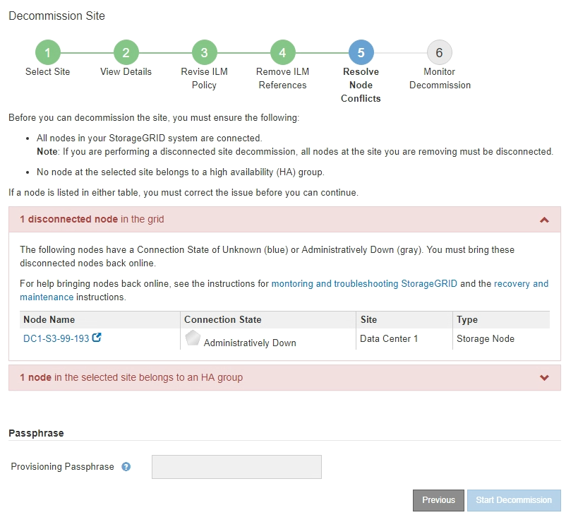

= 5단계: 노드 충돌 해결(및 서비스 해제 시작)
:allow-uri-read: 
:icons: font
:imagesdir: ../media/

[role="lead"]
사이트 서비스 해제 마법사의 5단계(노드 충돌 해결)에서 StorageGRID 시스템의 노드 중 연결이 끊어진 것이 있는지, 또는 선택한 사이트의 노드 중 고가용성(HA) 그룹에 속하는 것이 있는지 확인할 수 있습니다.  모든 노드 충돌이 해결되면 이 페이지에서 서비스 해제 절차를 시작합니다.

.시작하기 전에
다음과 같이 StorageGRID 시스템의 모든 노드가 올바른 상태인지 확인해야 합니다.

* StorageGRID 시스템의 모든 노드는 연결되어야 합니다.image:../media/icon_alert_green_checkmark.png["아이콘 경고 녹색 확인 표시"] ).
+

NOTE: 연결이 끊긴 사이트의 서비스 중단을 수행하는 경우 제거하려는 사이트의 모든 노드는 연결을 끊어야 하고, 다른 모든 사이트의 모든 노드는 연결되어야 합니다.

+

NOTE: 하나 이상의 볼륨이 오프라인(마운트 해제)이거나 온라인(마운트)이지만 오류 상태인 경우 서비스 해제가 시작되지 않습니다.

+

NOTE: 해체가 진행되는 동안 하나 이상의 볼륨이 오프라인 상태가 되면 해당 볼륨이 다시 온라인 상태가 된 후에 해체 프로세스가 완료됩니다.

* 제거하려는 사이트의 노드에는 고가용성(HA) 그룹에 속하는 인터페이스가 있을 수 없습니다.

.이 작업에 관하여
5단계(노드 충돌 해결)에 노드가 나열된 경우, 해제를 시작하기 전에 문제를 해결해야 합니다.

이 페이지에서 사이트 폐쇄 절차를 시작하기 전에 다음 사항을 검토하세요.

* 해체 절차를 완료하는 데 충분한 시간을 허용해야 합니다.
+

NOTE: 사이트에서 개체 데이터를 이동하거나 삭제하는 작업은 사이트의 데이터 양, 시스템 부하, 네트워크 지연 시간, 필요한 ILM 변경 사항의 특성에 따라 며칠, 몇 주 또는 몇 달이 걸릴 수 있습니다.

* 사이트 폐쇄 절차가 진행되는 동안:
+
** 폐쇄되는 사이트를 참조하는 ILM 규칙을 만들 수 없습니다.  기존 ILM 규칙을 편집하여 해당 사이트를 참조할 수도 없습니다.
** 확장이나 업그레이드 등 다른 유지 관리 절차를 수행할 수 없습니다.
+

NOTE: 연결된 사이트를 해체하는 동안 다른 유지 관리 절차를 수행해야 하는 경우 스토리지 노드를 제거하는 동안 절차를 일시 중지할 수 있습니다.  *일시 중지* 버튼은 "복제 및 삭제된 데이터 해제" 단계에서 활성화됩니다.

** 사이트 폐쇄 절차를 시작한 후 노드를 복구해야 하는 경우 지원팀에 문의해야 합니다.

.단계
. 5단계(노드 충돌 해결)의 연결이 끊긴 노드 섹션을 검토하여 StorageGRID 시스템의 노드 중 연결 상태가 알 수 없음(image:../media/icon_alarm_blue_unknown.png["아이콘 알람 파란색 알 수 없음"] ) 또는 관리상 다운(image:../media/icon_alarm_gray_administratively_down.png["아이콘 알람 회색 관리적으로 다운됨"] ).
+

. 연결이 끊어진 노드가 있으면 다시 온라인으로 전환하세요.
+
를 참조하십시오link:../maintain/grid-node-procedures.html["노드 절차"] . 도움이 필요하면 기술 지원팀에 문의하세요.

. 연결이 끊긴 모든 노드가 다시 온라인으로 전환되면 5단계(노드 충돌 해결)의 HA 그룹 섹션을 검토합니다.
+
이 표는 선택된 사이트에서 고가용성(HA) 그룹에 속하는 모든 노드를 나열합니다.

+
image::../media/decommission_site_step_5_ha_groups.png[해체 사이트 5단계 HA 그룹]

. 노드가 나열되어 있으면 다음 중 하나를 수행하세요.
+
** 영향을 받는 각 HA 그룹을 편집하여 노드 인터페이스를 제거합니다.
** 이 사이트의 노드만 포함하는 HA 그룹을 제거합니다.  StorageGRID 관리에 대한 지침을 참조하세요.

+
모든 노드가 연결되었고 선택한 사이트의 노드가 HA 그룹에서 사용되지 않으면 *프로비저닝 암호* 필드가 활성화됩니다.

. 프로비저닝 암호를 입력하세요.
+
*해제 시작* 버튼이 활성화됩니다.

+
image::../media/decommission_site_step_5_provision_passphrase.png[사이트 해체 5단계 암호 제공]

. 사이트 해체 절차를 시작할 준비가 되었다면 *해체 시작*을 선택하세요.
+
경고에는 제거될 사이트와 노드가 나열됩니다.  사이트를 완전히 삭제하는 데는 며칠, 몇 주 또는 몇 달이 걸릴 수 있다는 점을 알려드립니다.

+
image::../media/decommission_site_step_5_warning.png[해체 현장 5단계 경고]

. 경고를 검토하세요.  시작할 준비가 되었다면 *확인*을 선택하세요.
+
새로운 그리드 구성이 생성되면 메시지가 나타납니다.  이 프로세스는 폐기된 그리드 노드의 유형과 수에 따라 시간이 다소 걸릴 수 있습니다.

+
image::../media/decommission_site_step_5_grid_configuration.png[해체 사이트 5단계 그리드 구성]

+
새로운 그리드 구성이 생성되면 6단계(모니터 해제)가 나타납니다.

+

NOTE: *이전* 버튼은 해제가 완료될 때까지 비활성화 상태로 유지됩니다.

