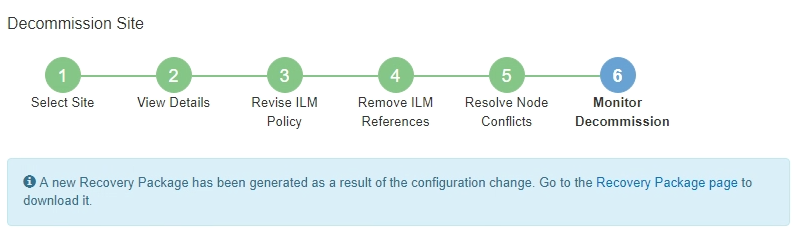

= 6단계: 해체 모니터링
:allow-uri-read: 
:icons: font
:imagesdir: ../media/

[role="lead"]
사이트 해체 페이지 마법사의 6단계(해체 모니터링)에서 사이트가 제거되는 진행 상황을 모니터링할 수 있습니다.

.이 작업에 관하여
StorageGRID 연결된 사이트를 제거할 때 다음 순서로 노드를 제거합니다.

. 게이트웨이 노드
. 관리 노드
. 저장 노드

StorageGRID 연결이 끊긴 사이트를 제거할 때 다음 순서로 노드를 제거합니다.

. 게이트웨이 노드
. 저장 노드
. 관리 노드

각 게이트웨이 노드나 관리 노드를 제거하는 데는 몇 분 또는 1시간 밖에 걸리지 않을 수 있지만, 스토리지 노드를 제거하는 데는 며칠 또는 몇 주가 걸릴 수 있습니다.

.단계
. 새로운 복구 패키지가 생성되면 파일을 다운로드하세요.
+

+

NOTE: 해체 절차 중에 문제가 발생할 경우 전력망을 복구할 수 있도록 최대한 빨리 복구 패키지를 다운로드하세요.

+
.. 메시지의 링크를 선택하거나 *유지관리* > *시스템* > *복구 패키지*를 선택하세요.
.. 다운로드 `.zip` 파일.
+
지침을 참조하세요link:downloading-recovery-package.html["복구 패키지 다운로드"] .

+

NOTE: 복구 패키지 파일은 StorageGRID 시스템에서 데이터를 얻는 데 사용할 수 있는 암호화 키와 비밀번호가 포함되어 있으므로 보호되어야 합니다.

. 데이터 이동 차트를 사용하여 이 사이트에서 다른 사이트로의 개체 데이터 이동을 모니터링합니다.
+
3단계(ILM 정책 개정)에서 새로운 ILM 정책을 활성화하면 데이터 이동이 시작됩니다.  데이터 이동은 해체 절차 전반에 걸쳐 이루어집니다.

+
image::../media/decommission_site_step_6_data_movement.png[해체 사이트 6단계 데이터 이동]

. 해당 페이지의 노드 진행률 섹션에서 노드가 제거됨에 따라 해제 절차의 진행 상황을 모니터링합니다.
+
저장 노드가 제거되면 각 노드는 일련의 단계를 거칩니다.  이러한 단계의 대부분은 빠르게 또는 눈에 띄지 않게 이루어지지만, 옮겨야 할 데이터의 양에 따라 다른 단계가 완료되기까지 며칠 또는 몇 주를 기다려야 할 수도 있습니다.  삭제된 데이터를 관리하고 ILM을 재평가하려면 추가 시간이 필요합니다.

+
image::../media/decommission_site_step_6_storage_node.png[해체 사이트 6단계 저장 노드]

+
연결된 사이트 해체 진행 상황을 모니터링하는 경우 다음 표를 참조하여 스토리지 노드의 해체 단계를 파악하세요.

+
[cols="1a,2a"]
|===
| 단계 | 예상 기간 

 a| 
보류 중
 a| 
1분 이하

 a| 
잠금을 기다리세요
 a| 
분

 a| 
작업 준비
 a| 
1분 이하

 a| 
LDR 폐기 표시
 a| 
분

 a| 
복제 및 삭제 코딩된 데이터 폐기
 a| 
데이터 양에 따라 시간, 일 또는 주

*참고*: 다른 유지 관리 활동을 수행해야 하는 경우 이 단계에서 사이트 서비스 중단을 일시 중지할 수 있습니다.

 a| 
LDR 설정 상태
 a| 
분

 a| 
플러시 감사 대기열
 a| 
메시지 수와 네트워크 지연 시간에 따라 몇 분에서 몇 시간까지 소요됩니다.

 a| 
완료
 a| 
분

|===
+
연결이 끊긴 사이트의 서비스 중단 진행 상황을 모니터링하는 경우 다음 표를 참조하여 스토리지 노드의 서비스 중단 단계를 파악하세요.

+
[cols="1a,1a"]
|===
| 단계 | 예상 기간 

 a| 
보류 중
 a| 
1분 이하

 a| 
잠금을 기다리세요
 a| 
분

 a| 
작업 준비
 a| 
1분 이하

 a| 
외부 서비스 비활성화
 a| 
분

 a| 
인증서 폐지
 a| 
분

 a| 
노드 등록 취소
 a| 
분

 a| 
저장 등급 등록 취소
 a| 
분

 a| 
스토리지 그룹 제거
 a| 
분

 a| 
엔티티 제거
 a| 
분

 a| 
완료
 a| 
분

|===
. 모든 노드가 완료 단계에 도달하면 나머지 사이트 해체 작업이 완료될 때까지 기다립니다.
+
** *Cassandra 복구* 단계에서 StorageGRID 그리드에 남아 있는 Cassandra 클러스터에 필요한 복구를 수행합니다.  이러한 복구 작업은 그리드에 남아 있는 스토리지 노드 수에 따라 며칠 이상 걸릴 수 있습니다.
+
image::../media/decommission_site_step_6_repair_cassandra.png[해체 현장 6단계 카산드라 수리]

** *EC 프로필 비활성화 및 스토리지 풀 삭제* 단계에서는 다음과 같은 ILM 변경 사항이 적용됩니다.
+
*** 해당 사이트를 참조하는 모든 삭제 코딩 프로필이 비활성화됩니다.
*** 해당 사이트를 참조하는 모든 스토리지 풀이 삭제됩니다.
+

NOTE: 모든 스토리지 노드 스토리지 풀(StorageGRID 11.6 및 이전 버전)도 모든 사이트 사이트를 사용하므로 제거되었습니다.

** 마지막으로, *구성 제거* 단계에서는 사이트와 해당 노드에 대한 참조가 그리드의 나머지 부분에서 제거됩니다.
+
image::../media/decommission_site_step_6_remove_configuration.png[사이트 해체 6단계 구성 제거]

. 해체 절차가 완료되면 해체 사이트 페이지에 성공 메시지가 표시되고 제거된 사이트는 더 이상 표시되지 않습니다.
+
image::../media/decommission_site_success_message.png[해체 현장 성공 메시지]

.당신이 완료한 후
사이트 폐쇄 절차를 완료한 후 다음 작업을 완료하세요.

* 폐쇄된 사이트의 모든 스토리지 노드 드라이브가 완전히 지워졌는지 확인하세요.  상업적으로 판매되는 데이터 삭제 도구나 서비스를 사용하여 드라이브에서 데이터를 영구적이고 안전하게 제거하세요.
* 사이트에 하나 이상의 관리 노드가 포함되어 있고 StorageGRID 시스템에 대해 SSO(Single Sign-On)가 활성화된 경우, Active Directory Federation Services(AD FS)에서 해당 사이트의 모든 신뢰 당사자 트러스트를 제거합니다.
* 연결된 사이트 해체 절차의 일부로 노드의 전원이 자동으로 정상적으로 꺼진 후, 연관된 가상 머신을 제거합니다.

