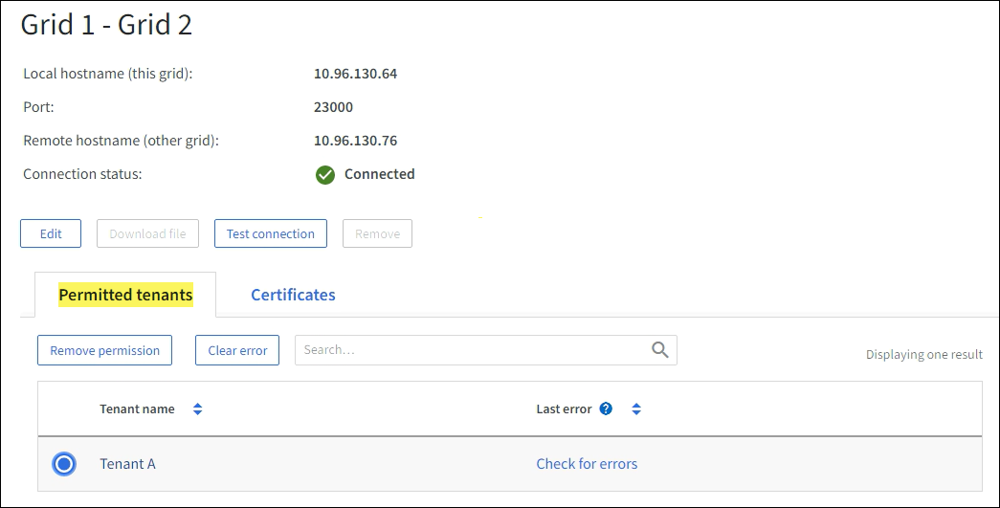

= 그리드 연합 연결 모니터링
:allow-uri-read: 
:icons: font
:imagesdir: ../media/

[role="lead"]
모든 기본 정보를 모니터링할 수 있습니다.link:../admin/grid-federation-overview.html["그리드 페더레이션 연결"] 특정 연결에 대한 자세한 정보 또는 크로스 그리드 복제 작업에 대한 Prometheus 메트릭입니다.  두 그리드 모두에서 연결을 모니터링할 수 있습니다.

.시작하기 전에
* 두 그리드 중 하나를 사용하여 그리드 관리자에 로그인했습니다.link:../admin/web-browser-requirements.html["지원되는 웹 브라우저"] .
* 당신은 가지고있다link:../admin/admin-group-permissions.html["루트 액세스 권한"] 귀하가 로그인한 그리드에 대해.

== 모든 연결 보기

그리드 페더레이션 페이지는 모든 그리드 페더레이션 연결과 그리드 페더레이션 연결을 사용할 수 있는 모든 테넌트 계정에 대한 기본 정보를 보여줍니다.

.단계
. *구성* > *시스템* > *그리드 연합*을 선택합니다.
+
그리드 연합 페이지가 나타납니다.

. 이 그리드의 모든 연결에 대한 기본 정보를 보려면 *연결* 탭을 선택하세요.
+
이 탭에서는 다음을 수행할 수 있습니다.

+
** link:../admin/grid-federation-create-connection.html["새로운 연결을 만듭니다"] .
** 기존 연결을 선택하세요link:../admin/grid-federation-manage-connection.html["편집하거나 테스트하다"] .

+
image::../media/grid-federation-connections-tab.png[그리드 페더레이션 연결 탭]

. 이 그리드에서 *그리드 페더레이션 연결 사용* 권한이 있는 모든 테넌트 계정에 대한 기본 정보를 보려면 *허용된 테넌트* 탭을 선택하세요.
+
이 탭에서는 다음을 수행할 수 있습니다.

+
** link:../monitor/monitoring-tenant-activity.html["허용된 각 세입자에 대한 세부 정보 페이지를 확인하세요."] .
** 각 연결에 대한 세부 정보 페이지를 확인하세요. 보다 <<view-specific-connection,특정 연결 보기>> .
** 허가된 세입자를 선택하고link:../admin/grid-federation-manage-tenants.html["권한을 제거하다"] .
** 그리드 간 복제 오류를 확인하고 마지막 오류가 있으면 지웁니다. 보다 link:../admin/grid-federation-troubleshoot.html["그리드 페더레이션 오류 문제 해결"] .
+
image::../media/grid-federation-permitted-tenants-tab.png[그리드 연합 허용된 테넌트 탭]

== [[view-specific-connection]]특정 연결 보기

특정 그리드 연합 연결에 대한 세부 정보를 볼 수 있습니다.

.단계
. 그리드 연합 페이지에서 두 탭을 선택한 다음 테이블에서 연결 이름을 선택합니다.
+
연결에 대한 세부 정보 페이지에서 다음을 수행할 수 있습니다.

+
** 로컬 및 원격 호스트 이름, 포트, 연결 상태를 포함하여 연결에 대한 기본 상태 정보를 확인하세요.
** 연결을 선택하세요link:../admin/grid-federation-manage-connection.html["편집, 테스트 또는 제거"] .

. 특정 연결을 볼 때 *허용된 테넌트* 탭을 선택하면 해당 연결에 허용된 테넌트에 대한 세부 정보를 볼 수 있습니다.
+
이 탭에서는 다음을 수행할 수 있습니다.

+
** link:../monitor/monitoring-tenant-activity.html["허용된 각 세입자에 대한 세부 정보 페이지를 확인하세요."] .
** link:../admin/grid-federation-manage-tenants.html["세입자의 허가를 제거하세요"]연결을 사용하려면.
** 그리드 간 복제 오류를 확인하고 마지막 오류를 지웁니다. 보다 link:../admin/grid-federation-troubleshoot.html["그리드 페더레이션 오류 문제 해결"] .
+

. 특정 연결을 볼 때 *인증서* 탭을 선택하면 이 연결에 대한 시스템 생성 서버 및 클라이언트 인증서가 표시됩니다.
+
이 탭에서는 다음을 수행할 수 있습니다.

+
** link:../admin/grid-federation-manage-connection.html["연결 인증서 회전"] .
** 연관된 인증서를 보거나 다운로드하거나 인증서 PEM을 복사하려면 *서버* 또는 *클라이언트*를 선택하세요.
+
image::../media/grid-federation-certificates-tab.png[그리드 페더레이션 인증서 탭]

== 크로스 그리드 복제 지표 검토

Grafana의 Cross-Grid Replication 대시보드를 사용하면 그리드에서 Cross-Grid 복제 작업에 대한 Prometheus 메트릭을 볼 수 있습니다.

.단계
. 그리드 관리자에서 *지원* > *도구* > *메트릭*을 선택합니다.
+

NOTE: 메트릭 페이지에서 제공되는 도구는 기술 지원팀에서 사용하도록 만들어졌습니다.  이러한 도구 내의 일부 기능과 메뉴 항목은 의도적으로 작동하지 않으며 변경될 수 있습니다.  목록을 확인하세요link:../monitor/commonly-used-prometheus-metrics.html["일반적으로 사용되는 Prometheus 메트릭"] .

. 해당 페이지의 Grafana 섹션에서 *크로스 그리드 복제*를 선택합니다.
+
자세한 지침은 다음을 참조하세요.link:../monitor/reviewing-support-metrics.html["지원 지표 검토"] .

. 복제에 실패한 개체의 복제를 다시 시도하려면 다음을 참조하세요.link:../admin/grid-federation-retry-failed-replication.html["실패한 복제 작업을 식별하고 다시 시도합니다."] .

