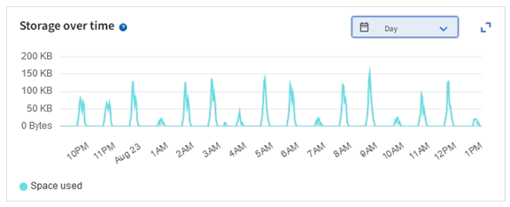

= 저장 용량 모니터링
:allow-uri-read: 
:icons: font
:imagesdir: ../media/

[role="lead"]
StorageGRID 시스템에서 객체나 객체 메타데이터에 대한 저장 공간이 부족해지지 않도록 사용 가능한 총 공간을 모니터링합니다.

StorageGRID 객체 데이터와 객체 메타데이터를 별도로 저장하고, 객체 메타데이터가 포함된 분산 Cassandra 데이터베이스에 대해 특정 양의 공간을 예약합니다.  객체와 객체 메타데이터에 사용된 총 공간량을 모니터링하고, 각각에 대해 사용된 공간량의 추세도 파악합니다.  이를 통해 노드 추가를 미리 계획하고 서비스 중단을 방지할 수 있습니다.

당신은 할 수 있습니다link:viewing-storage-tab.html["저장 용량 정보 보기"] StorageGRID 시스템의 전체 그리드, 각 사이트 및 각 스토리지 노드에 대해.

== 전체 그리드의 저장 용량 모니터링

그리드의 전체 저장 용량을 모니터링하여 개체 데이터와 개체 메타데이터에 충분한 여유 공간이 남아 있는지 확인하세요.  시간이 지남에 따라 저장 용량이 어떻게 변하는지 이해하면 그리드의 사용 가능한 저장 용량이 소모되기 전에 저장 노드나 저장 볼륨을 추가할 계획을 세우는 데 도움이 될 수 있습니다.

Grid Manager 대시보드를 사용하면 전체 그리드와 각 데이터 센터에서 사용 가능한 저장 용량을 빠르게 평가할 수 있습니다.  노드 페이지는 객체 데이터와 객체 메타데이터에 대한 더 자세한 값을 제공합니다.

.단계
. 전체 그리드와 각 데이터 센터에서 얼마나 많은 저장 용량을 사용할 수 있는지 평가합니다.
+
.. *대시보드 > 개요*를 선택합니다.
.. 데이터 공간 사용량 내역 카드와 메타데이터 허용 공간 사용량 내역 카드의 값을 확인하세요.  각 카드에는 저장 공간 사용량의 백분율, 사용된 공간의 용량, 사이트에서 사용 가능하거나 허용되는 총 공간이 나열됩니다.
+

NOTE: 요약에는 보관 매체가 포함되지 않습니다.

+
image::../media/dashboard_data_and_metadata_space_usage_breakdown.png[데이터 및 메타데이터 공간 사용 내역]

.. 시간 경과에 따른 저장 카드의 차트를 참고하세요.  기간 드롭다운을 사용하면 저장 공간이 얼마나 빨리 소모되는지 확인하는 데 도움이 됩니다.
+

. 그리드에서 객체 데이터와 객체 메타데이터를 위해 사용된 저장 공간의 양과 남아 있는 저장 공간의 양에 대한 자세한 내용은 노드 페이지를 참조하세요.
+
.. *노드*를 선택하세요.
.. *_grid_* > *저장소*를 선택합니다.
+
image::../media/nodes_deployment_storage_tab.png[노드 배포 스토리지 탭]

.. *사용된 저장소 - 개체 데이터* 및 *사용된 저장소 - 개체 메타데이터* 차트 위에 커서를 놓으면 전체 그리드에서 사용 가능한 개체 저장소와 개체 메타데이터 저장소의 양과 시간 경과에 따른 사용량을 확인할 수 있습니다.
+

NOTE: 사이트 또는 그리드의 총 값에는 오프라인 노드와 같이 최소 5분 동안 메트릭을 보고하지 않은 노드는 포함되지 않습니다.

. 그리드의 사용 가능한 저장 용량이 소모되기 전에 저장 노드나 저장 볼륨을 추가하는 확장을 계획하세요.
+
확장 시기를 계획할 때, 추가 저장 공간을 조달하고 설치하는 데 얼마나 걸리는지 고려하세요.

+

NOTE: ILM 정책에서 삭제 코딩을 사용하는 경우, 추가해야 하는 노드 수를 줄이기 위해 기존 스토리지 노드가 약 70% 채워졌을 때 확장하는 것이 좋습니다.

+
저장소 확장 계획에 대한 자세한 내용은 다음을 참조하세요.link:../expand/index.html["StorageGRID 확장을 위한 지침"] .

== 각 스토리지 노드의 스토리지 용량 모니터링

각 스토리지 노드의 총 사용 가능 공간을 모니터링하여 노드에 새 개체 데이터를 저장할 충분한 공간이 있는지 확인합니다.

.이 작업에 관하여
사용 가능한 공간은 객체를 저장하는 데 사용할 수 있는 저장 공간의 양입니다.  저장 노드의 총 사용 가능 공간은 노드 내 모든 개체 저장소의 사용 가능한 공간을 모두 더하여 계산됩니다.

image::../media/calculating_watermarks.gif[총 사용 가능 공간에 대한 개념 도면]

.단계
. *노드* > *_스토리지 노드_* > *스토리지*를 선택합니다.
+
노드에 대한 그래프와 표가 나타납니다.

. 저장소 사용 - 개체 데이터 그래프 위에 커서를 올려놓으세요.
+
다음 값이 표시됩니다.

+
** *사용됨(%)*: 전체 사용 가능 공간 중 개체 데이터에 사용된 백분율입니다.
** *사용됨*: 개체 데이터에 사용된 총 사용 가능 공간의 양입니다.
** *복제된 데이터*: 이 노드, 사이트 또는 그리드에서 복제된 개체 데이터의 양에 대한 추정치입니다.
** *삭제된 코드화된 데이터*: 이 노드, 사이트 또는 그리드에 있는 삭제된 코드화된 객체 데이터의 양에 대한 추정치입니다.
** *전체*: 이 노드, 사이트 또는 그리드에서 사용 가능한 총 공간입니다.  사용된 값은 `storagegrid_storage_utilization_data_bytes` 미터법.
+
image::../media/nodes_page_storage_used_object_data.png[노드 페이지 저장소 사용 객체 데이터]

. 그래프 아래의 볼륨 및 개체 저장소 표에서 사용 가능한 값을 검토하세요.
+

NOTE: 이러한 값의 그래프를 보려면 차트 아이콘을 클릭하세요.image:../media/icon_chart_new_for_11_5.png["차트 아이콘"] 사용 가능한 열에서.

+
image::../media/nodes_page_storage_tables.png[객체는 테이블을 저장합니다]

. 시간 경과에 따른 값을 모니터링하여 사용 가능한 저장 공간이 소모되는 속도를 추정합니다.
. 정상적인 시스템 운영을 유지하려면 사용 가능한 공간이 소모되기 전에 스토리지 노드를 추가하거나, 스토리지 볼륨을 추가하거나, 개체 데이터를 보관하세요.
+
확장 시기를 계획할 때, 추가 저장 공간을 조달하고 설치하는 데 얼마나 걸리는지 고려하세요.

+

NOTE: ILM 정책에서 삭제 코딩을 사용하는 경우, 추가해야 하는 노드 수를 줄이기 위해 기존 스토리지 노드가 약 70% 채워졌을 때 확장하는 것이 좋습니다.

+
저장소 확장 계획에 대한 자세한 내용은 다음을 참조하세요.link:../expand/index.html["StorageGRID 확장을 위한 지침"] .

+
그만큼link:../troubleshoot/troubleshooting-low-object-data-storage-alert.html["낮은 객체 데이터 저장"] 스토리지 노드에 개체 데이터를 저장할 공간이 부족하면 경고가 발생합니다.

== 각 스토리지 노드에 대한 개체 메타데이터 용량 모니터링

각 스토리지 노드의 메타데이터 사용량을 모니터링하여 필수 데이터베이스 작업에 충분한 공간이 남아 있는지 확인합니다.  허용된 메타데이터 공간의 100%를 개체 메타데이터가 초과하기 전에 각 사이트에 새로운 스토리지 노드를 추가해야 합니다.

.이 작업에 관하여
StorageGRID 중복성을 제공하고 개체 메타데이터의 손실을 방지하기 위해 각 사이트에 개체 메타데이터의 사본을 3개씩 보관합니다.  3개의 사본은 각 스토리지 노드의 스토리지 볼륨 0에 있는 메타데이터를 위해 예약된 공간을 사용하여 각 사이트의 모든 스토리지 노드에 균등하게 분산됩니다.

어떤 경우에는 그리드의 개체 메타데이터 용량이 개체 스토리지 용량보다 더 빨리 소모될 수 있습니다.  예를 들어, 일반적으로 많은 수의 작은 객체를 수집하는 경우 객체 저장 용량이 충분하더라도 메타데이터 용량을 늘리기 위해 스토리지 노드를 추가해야 할 수 있습니다.

메타데이터 사용량을 늘릴 수 있는 요인으로는 사용자 메타데이터와 태그의 크기와 양, 멀티파트 업로드의 총 파트 수, ILM 스토리지 위치의 변경 빈도 등이 있습니다.

.단계
. *노드* > *_스토리지 노드_* > *스토리지*를 선택합니다.
. 특정 시간의 값을 보려면 '사용된 저장소 - 개체 메타데이터 그래프' 위에 커서를 올려놓으세요.
+
image::../media/storage_used_object_metadata.png[사용된 저장소 - 개체 메타데이터]

+
사용된 (%):: 이 스토리지 노드에서 사용된 허용된 메타데이터 공간의 백분율입니다.
+
--
프로메테우스 지표: `storagegrid_storage_utilization_metadata_bytes` 그리고 `storagegrid_storage_utilization_metadata_allowed_bytes`

--
사용된:: 이 스토리지 노드에서 사용된 허용된 메타데이터 공간의 바이트입니다.
+
--
프로메테우스 미터법: `storagegrid_storage_utilization_metadata_bytes`

--
허용된:: 이 스토리지 노드에서 개체 메타데이터에 허용된 공간입니다.  각 스토리지 노드에 대해 이 값이 어떻게 결정되는지 알아보려면 다음을 참조하세요.link:../admin/managing-object-metadata-storage.html#allowed-metadata-space["허용된 메타데이터 공간에 대한 전체 설명"] .
+
--
프로메테우스 미터법: `storagegrid_storage_utilization_metadata_allowed_bytes`

--
실제 예약됨:: 이 스토리지 노드에서 메타데이터에 예약된 실제 공간입니다.  여기에는 허용된 공간과 필수 메타데이터 작업에 필요한 공간이 포함됩니다.  각 스토리지 노드에 대해 이 값이 어떻게 계산되는지 알아보려면 다음을 참조하세요.link:../admin/managing-object-metadata-storage.html#actual-reserved-space-for-metadata["메타데이터에 대한 실제 예약 공간에 대한 전체 설명"] .
+
--
_Prometheus 메트릭은 향후 릴리스에서 추가될 예정입니다._

--

+

NOTE: 사이트 또는 그리드의 총 값에는 오프라인 노드와 같이 최소 5분 동안 메트릭을 보고하지 않은 노드는 포함되지 않습니다.

. *사용됨(%)* 값이 70% 이상이면 각 사이트에 스토리지 노드를 추가하여 StorageGRID 시스템을 확장하세요.
+

CAUTION: *메타데이터 저장 공간 부족* 경고는 *사용됨(%)* 값이 특정 임계값에 도달하면 발생합니다.  개체 메타데이터가 허용된 공간의 100%를 초과하여 사용하는 경우 바람직하지 않은 결과가 발생할 수 있습니다.

+
새로운 노드를 추가하면 시스템은 사이트 내 모든 스토리지 노드에서 개체 메타데이터를 자동으로 재조정합니다. 를 참조하십시오link:../expand/index.html["StorageGRID 시스템 확장을 위한 지침"] .

== 공간 사용 예측 모니터링

사용자 데이터 및 메타데이터에 대한 공간 사용 예측을 모니터링하여 언제 필요할지 추정합니다.link:../expand/index.html["그리드 확장"] .

소비율이 시간에 따라 변하는 것을 발견하면 *평균* 풀다운에서 더 짧은 범위를 선택하여 가장 최근의 섭취 패턴만 반영합니다.  계절적 패턴이 눈에 띄는 경우, 더 긴 범위를 선택하세요.

새로운 StorageGRID 설치한 경우 공간 사용량 예측을 평가하기 전에 데이터와 메타데이터가 누적되도록 하세요.

.단계
. 대시보드에서 *저장소*를 선택합니다.
. 대시보드 카드, 스토리지 풀별 데이터 사용량 예측, 사이트별 메타데이터 사용량 예측을 확인하세요.
. 이러한 값을 사용하여 데이터 및 메타데이터 저장을 위해 새로운 스토리지 노드를 추가해야 하는 시기를 추정합니다.

image::../media/forecast-metadata-usage.png[사이트별 메타데이터 사용량 예측]
