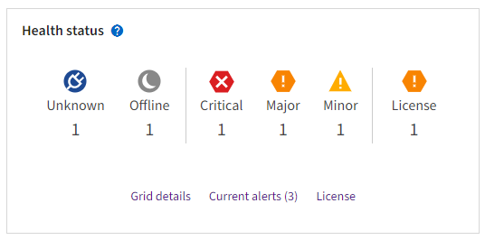

= 시스템 상태 모니터링
:allow-uri-read: 
:icons: font
:imagesdir: ../media/

[role="lead"]
매일 StorageGRID 시스템의 전반적인 상태를 모니터링하세요.

.이 작업에 관하여
StorageGRID 시스템은 그리드의 일부를 사용할 수 없더라도 계속 작동할 수 있습니다.  경고로 나타난 잠재적인 문제는 반드시 시스템 운영에 문제가 있다는 뜻은 아닙니다.  Grid Manager 대시보드의 Health 상태 카드에 요약된 문제를 조사합니다.

알림이 발생하자마자 알림을 받으려면 다음을 수행할 수 있습니다. https://docs.netapp.com/us-en/storagegrid-appliances/installconfig/setting-up-email-notifications-for-alerts.html["알림을 위한 이메일 알림 설정"^] 또는link:using-snmp-monitoring.html["SNMP 트랩 구성"] .

문제가 있는 경우 추가 세부 정보를 볼 수 있는 링크가 나타납니다.

[cols="1a,2a"]
|===
| 링크 | ...때 나타납니다. 

 a| 
그리드 세부 정보
 a| 
모든 노드가 연결이 끊어졌습니다(연결 상태를 알 수 없음 또는 관리자가 중단).

 a| 
현재 경고(중요, 주요, 사소)
 a| 
알림은<<현재 및 해결된 알림 보기,현재 활동 중>> .

 a| 
최근 해결된 알림
 a| 
지난주에 발생한 알림<<현재 및 해결된 알림 보기,이제 해결되었습니다>> .

 a| 
특허
 a| 
이 StorageGRID 시스템의 소프트웨어 라이선스에 문제가 있습니다. 당신은 할 수 있어요 link:../admin/updating-storagegrid-license-information.html["필요에 따라 라이센스 정보를 업데이트하세요"].

|===

== 모니터 노드 연결 상태

하나 이상의 노드가 그리드에서 분리되면 중요한 StorageGRID 작업에 영향을 미칠 수 있습니다.  노드 연결 상태를 모니터링하고 문제가 발생하면 즉시 해결합니다.

[cols="1a,3a,3a"]
|===
| 상 | 설명 | 필요한 조치 

 a| 
image:../media/icon_alarm_blue_unknown.png["파란색 물음표 아이콘"]
 a| 
*연결되지 않음 - 알 수 없음*

알 수 없는 이유로 노드 연결이 끊어지거나 노드의 서비스가 예기치 않게 중단되었습니다.  예를 들어, 노드의 서비스가 중지되었거나, 정전이나 예상치 못한 정전으로 인해 노드의 네트워크 연결이 끊어졌을 수 있습니다.

*노드와 통신할 수 없습니다* 경고가 발생할 수도 있습니다.  다른 알림도 활성화되어 있을 수 있습니다.
 a| 
즉각적인 조치가 필요합니다. <<현재 및 해결된 알림 보기,각 알림을 선택하세요>> 그리고 권장되는 조치를 따르세요.

예를 들어, 중지된 서비스를 다시 시작하거나 노드의 호스트를 다시 시작해야 할 수 있습니다.

*참고*: 관리형 종료 작업 중에 노드가 알 수 없음으로 나타날 수 있습니다.  이런 경우에는 알 수 없음 상태를 무시할 수 있습니다.

 a| 
image:../media/icon_alarm_gray_administratively_down.png["회색 물음표 아이콘"]
 a| 
*연결되지 않음 - 관리상 다운됨*

예상한 이유로 노드가 그리드에 연결되지 않았습니다.

예를 들어, 노드 또는 노드의 서비스가 정상적으로 종료되었거나, 노드가 재부팅 중이거나, 소프트웨어가 업그레이드 중입니다.  하나 이상의 알림이 활성화되어 있을 수도 있습니다.

기본 문제에 따라 이러한 노드는 종종 아무런 개입 없이 다시 온라인으로 돌아갑니다.
 a| 
이 노드에 영향을 미치는 알림이 있는지 확인하세요.

하나 이상의 알림이 활성화되어 있는 경우<<현재 및 해결된 알림 보기,각 알림을 선택하세요>> 그리고 권장되는 조치를 따르세요.

 a| 
image:../media/icon_alert_green_checkmark.png["아이콘 경고 녹색 확인 표시"]
 a| 
*연결됨*

노드는 그리드에 연결됩니다.
 a| 
아무런 조치도 필요하지 않습니다.

|===

== 현재 및 해결된 알림 보기

*현재 알림*: 알림이 발생하면 대시보드에 알림 아이콘이 표시됩니다.  노드 페이지에는 해당 노드에 대한 알림 아이콘도 표시됩니다.  만약에link:email-alert-notifications.html["알림 이메일 알림이 구성되었습니다"] 알림이 꺼져 있지 않은 경우 이메일 알림도 전송됩니다.

*해결된 알림*: 해결된 알림의 기록을 검색하고 볼 수 있습니다.

선택적으로 비디오를 시청했습니다. https://netapp.hosted.panopto.com/Panopto/Pages/Viewer.aspx?id=2eea81c5-8323-417f-b0a0-b1ff008506c1["비디오: 알림 개요"^]

[link=https://netapp.hosted.panopto.com/Panopto/Pages/Viewer.aspx?id=2eea81c5-8323-417f-b0a0-b1ff008506c1]
image::../media/video-screenshot-alert-overview-118.png[비디오: 알림 개요]

다음 표에서는 Grid Manager에 표시되는 현재 알림과 해결된 알림에 대한 정보를 설명합니다.

[cols="1a,3a"]
|===
| 열 머리글 | 설명 

 a| 
이름 또는 직함
 a| 
알림의 이름과 설명입니다.

 a| 
심각성
 a| 
경고의 심각도.  현재 알림의 경우 여러 알림이 그룹화되어 있으면 제목 행에 각 심각도에서 발생한 알림 인스턴스 수가 표시됩니다.

image:../media/icon_alert_red_critical.png["아이콘 경고 빨간색 위험"]*중요*: StorageGRID 노드 또는 서비스의 정상적인 작동을 중단시키는 비정상적인 조건이 존재합니다.  즉시 근본적인 문제를 해결해야 합니다.  문제가 해결되지 않으면 서비스가 중단되거나 데이터가 손실될 수 있습니다.

image:../media/icon_alert_orange_major.png["아이콘 경고 오렌지 메이저"]*중요*: 현재 작업에 영향을 미치거나 중요 경보 임계값에 접근하는 비정상적인 상황이 존재합니다.  주요 경고를 조사하고 근본적인 문제를 해결하여 비정상적인 상태로 인해 StorageGRID 노드나 서비스의 정상적인 작동이 중단되지 않는지 확인해야 합니다.

image:../media/icon_alert_yellow_minor.png["아이콘 경고 노란색 사소한"]*사소한*: 시스템은 정상적으로 작동하고 있지만, 계속 작동할 경우 시스템 작동에 영향을 줄 수 있는 비정상적인 상황이 존재합니다.  더 심각한 문제로 이어지지 않도록 자체적으로 해결되지 않는 사소한 경고를 모니터링하고 해결해야 합니다.

 a| 
시간 트리거됨
 a| 
*현재 알림*: 알림이 발생한 날짜와 시간(현지 시간 및 UTC 기준)입니다.  여러 개의 알림이 그룹화된 경우 제목 행에는 가장 최근의 알림(_newest_)과 가장 오래된 알림(_oldest_)에 대한 시간이 표시됩니다.

*해결된 알림*: 알림이 발생한 지 얼마나 되었는지.

 a| 
사이트/노드
 a| 
경고가 발생 중이거나 발생한 사이트 및 노드의 이름입니다.

 a| 
상태
 a| 
경고가 활성화되었는지, 꺼졌는지, 해결되었는지 여부입니다.  여러 개의 알림이 그룹화되어 있고 드롭다운에서 *모든 알림*이 선택된 경우 제목 행에는 해당 알림의 활성 인스턴스 수와 음소거된 인스턴스 수가 표시됩니다.

 a| 
해결된 시간(해결된 알림만 해당)
 a| 
경고가 해결된 지 얼마나 되었는가.

 a| 
현재 값 또는 _데이터 값_
 a| 
경고가 발생한 메트릭의 값입니다.  일부 알림의 경우 알림을 이해하고 조사하는 데 도움이 되도록 추가 값이 표시됩니다.  예를 들어, *개체 데이터 저장 공간 부족* 경고에 대해 표시되는 값에는 사용된 디스크 공간의 백분율, 총 디스크 공간, 사용된 디스크 공간의 양이 포함됩니다.

*참고:* 여러 개의 현재 알림이 그룹화된 경우 현재 값은 제목 행에 표시되지 않습니다.

 a| 
트리거된 값(해결된 알림만 해당)
 a| 
경고가 발생한 메트릭의 값입니다.  일부 알림의 경우 알림을 이해하고 조사하는 데 도움이 되도록 추가 값이 표시됩니다.  예를 들어, *개체 데이터 저장 공간 부족* 경고에 대해 표시되는 값에는 사용된 디스크 공간의 백분율, 총 디스크 공간, 사용된 디스크 공간의 양이 포함됩니다.

|===
.단계
. *현재 알림* 또는 *해결된 알림* 링크를 선택하면 해당 카테고리의 알림 목록을 볼 수 있습니다.  *노드* > *_노드_* > *개요*를 선택한 다음 알림 표에서 알림을 선택하여 알림에 대한 세부 정보를 볼 수도 있습니다.
+
기본적으로 현재 알림은 다음과 같이 표시됩니다.

+
** 가장 최근에 발생한 알림이 먼저 표시됩니다.
** 동일한 유형의 여러 알림이 그룹으로 표시됩니다.
** 음소거된 알림은 표시되지 않습니다.
** 특정 노드의 특정 경고에 대해 심각도 임계값에 두 개 이상 도달하면 가장 심각한 경고만 표시됩니다.  즉, 경미, 주요, 위험 심각도에 대한 경보 임계값에 도달하면 위험 경보만 표시됩니다.
+
현재 알림 페이지는 2분마다 새로 고쳐집니다.

. 알림 그룹을 확장하려면 아래쪽 캐럿을 선택하세요.image:../media/icon_alert_caret_down.png["아래쪽 캐럿 아이콘"] .  그룹 내 개별 알림을 축소하려면 위쪽 캐럿을 선택하세요.image:../media/icon_alert_caret_up.png["위쪽 캐럿 아이콘"] 또는 그룹 이름을 선택하세요.
. 알림 그룹 대신 개별 알림을 표시하려면 *알림 그룹* 확인란을 선택 취소합니다.
. 현재 알림이나 알림 그룹을 정렬하려면 위쪽/아래쪽 화살표를 선택하세요.image:../media/icon_alert_sort_column.png["정렬 화살표 아이콘"] 각 열 머리글에.
+
** *그룹 알림*을 선택하면 알림 그룹과 각 그룹 내의 개별 알림이 모두 정렬됩니다.  예를 들어, 특정 알림의 가장 최근 인스턴스를 찾으려면 알림을 *발생 시간*별로 그룹으로 정렬할 수 있습니다.
** *그룹 알림*을 지우면 전체 알림 목록이 정렬됩니다.  예를 들어, 특정 노드에 영향을 미치는 모든 알림을 보려면 모든 알림을 *노드/사이트*로 정렬할 수 있습니다.

. 현재 알림을 상태(*모든 알림*, *활성* 또는 *무음*)별로 필터링하려면 표 상단의 드롭다운 메뉴를 사용하세요.
+
보다 link:silencing-alert-notifications.html["알림음 끄기"] .

. 해결된 알림을 정렬하려면:
+
** *트리거 시* 드롭다운 메뉴에서 기간을 선택하세요.
** *심각도* 드롭다운 메뉴에서 하나 이상의 심각도를 선택하세요.
** *알림 규칙* 드롭다운 메뉴에서 하나 이상의 기본 또는 사용자 지정 알림 규칙을 선택하여 특정 알림 규칙과 관련된 해결된 알림을 필터링합니다.
** *노드* 드롭다운 메뉴에서 하나 이상의 노드를 선택하여 특정 노드와 관련된 해결된 알림을 필터링합니다.

. 특정 알림에 대한 세부 정보를 보려면 알림을 선택하세요.  대화 상자에는 선택한 알림에 대한 세부 정보와 권장 조치가 제공됩니다.
. (선택 사항) 특정 알림에 대해 이 알림을 음소거하면 해당 알림이 트리거된 알림 규칙이 음소거됩니다.
+
당신은 가지고 있어야 합니다link:../admin/admin-group-permissions.html["알림 또는 루트 액세스 권한 관리"] 경고 규칙을 해제합니다.

+

CAUTION: 알림 규칙을 비활성화하기로 결정할 때는 주의하세요.  경고 규칙이 비활성화되면 중요한 작업이 완료되지 못할 때까지 근본적인 문제를 감지하지 못할 수 있습니다.

. 알림 규칙의 현재 조건을 보려면:
+
.. 알림 세부정보에서 *조건 보기*를 선택하세요.
+
정의된 각 심각도에 대한 Prometheus 표현식을 나열하는 팝업이 나타납니다.

.. 팝업을 닫으려면 팝업 외부의 아무 곳이나 클릭하세요.

. 선택적으로, *규칙 편집*을 선택하여 이 알림이 발생하게 된 알림 규칙을 편집합니다.
+
당신은 가지고 있어야 합니다link:../admin/admin-group-permissions.html["알림 또는 루트 액세스 권한 관리"] 알림 규칙을 편집하려면.

+

CAUTION: 알림 규칙을 편집하기로 결정할 때는 주의하세요.  트리거 값을 변경하면 중요한 작업이 완료되지 못할 때까지 근본적인 문제를 감지하지 못할 수 있습니다.

. 알림 세부 정보를 닫으려면 *닫기*를 선택하세요.

