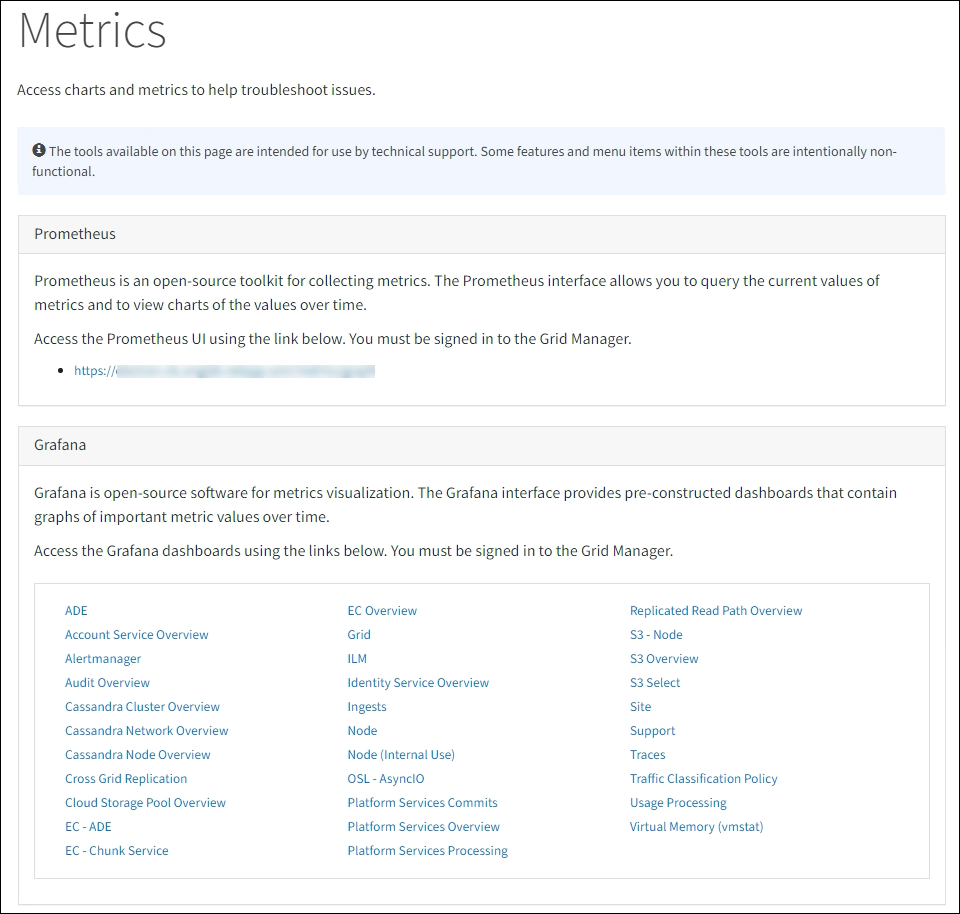

= 지원 지표 검토
:allow-uri-read: 
:icons: font
:imagesdir: ../media/

[role="lead"]
문제를 해결할 때 기술 지원팀과 협력하여 StorageGRID 시스템에 대한 자세한 지표와 차트를 검토할 수 있습니다.

.시작하기 전에
* Grid Manager에 로그인하려면 다음을 사용해야 합니다.link:../admin/web-browser-requirements.html["지원되는 웹 브라우저"] .
* 당신은 가지고있다link:../admin/admin-group-permissions.html["특정 액세스 권한"] .

.이 작업에 관하여
메트릭 페이지를 통해 Prometheus와 Grafana 사용자 인터페이스에 액세스할 수 있습니다.  프로메테우스는 지표를 수집하는 오픈소스 소프트웨어입니다.  Grafana는 지표 시각화를 위한 오픈소스 소프트웨어입니다.

NOTE: 메트릭 페이지에서 제공되는 도구는 기술 지원팀에서 사용하도록 만들어졌습니다.  이러한 도구 내의 일부 기능과 메뉴 항목은 의도적으로 작동하지 않으며 변경될 수 있습니다.  목록을 확인하세요link:commonly-used-prometheus-metrics.html["일반적으로 사용되는 Prometheus 메트릭"] .

.단계
. 기술 지원팀의 지시에 따라 *지원* > *도구* > *측정항목*을 선택하세요.
+
다음은 메트릭 페이지의 예입니다.

+

. StorageGRID 메트릭의 현재 값을 쿼리하고 시간 경과에 따른 값의 그래프를 보려면 Prometheus 섹션의 링크를 클릭하세요.
+
프로메테우스 인터페이스가 나타납니다.  이 인터페이스를 사용하면 사용 가능한 StorageGRID 메트릭에 대한 쿼리를 실행하고 시간에 따른 StorageGRID 메트릭을 그래프로 표시할 수 있습니다.

+

NOTE: 이름에 _private_이 포함된 메트릭은 내부적으로만 사용하도록 의도되었으며 StorageGRID 릴리스 간에 사전 통지 없이 변경될 수 있습니다.

. 시간 경과에 따른 StorageGRID 지표 그래프가 포함된 사전 구성된 대시보드에 액세스하려면 Grafana 섹션의 링크를 클릭하세요.
+
선택한 링크의 Grafana 인터페이스가 나타납니다.

+
image::../media/metrics_page_grafana.png[메트릭 페이지 Grafana]

