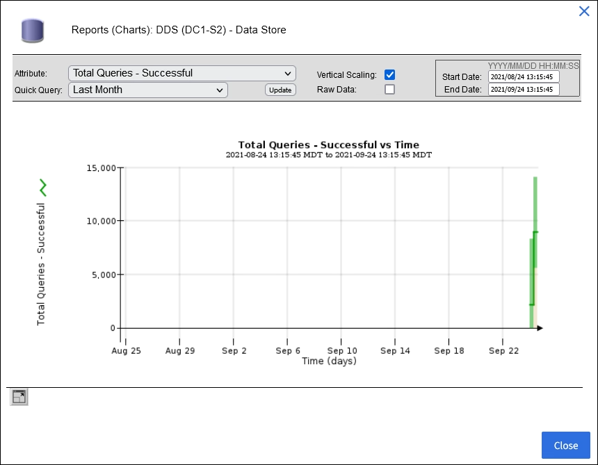

= 차트와 그래프를 활용하세요
:allow-uri-read: 
:icons: font
:imagesdir: ../media/

[role="lead"]
차트와 보고서를 사용하여 StorageGRID 시스템의 상태를 모니터링하고 문제를 해결할 수 있습니다.

NOTE: 그리드 관리자는 각 릴리스마다 업데이트되므로 이 페이지의 예시 스크린샷과 일치하지 않을 수 있습니다.

== 차트의 종류

차트와 그래프는 특정 StorageGRID 메트릭과 속성의 값을 요약합니다.

그리드 관리자 대시보드에는 그리드와 각 사이트에 사용 가능한 저장 공간을 요약한 카드가 포함되어 있습니다.

image::../media/dashboard_data_and_metadata_space_usage_breakdown.png[대시보드 데이터 및 메타데이터 공간 사용 내역]

테넌트 관리자 대시보드의 스토리지 사용량 패널에는 다음이 표시됩니다.

* 테넌트에 대한 가장 큰 버킷(S3) 또는 컨테이너(Swift) 목록
* 가장 큰 버킷이나 컨테이너의 상대적 크기를 나타내는 막대형 차트
* 사용된 총 공간량과 할당량이 설정된 경우 남은 공간량 및 백분율

image::../media/tenant_dashboard_with_buckets.png[테넌트 대시보드]

또한, StorageGRID 메트릭과 속성이 시간에 따라 어떻게 변경되는지 보여주는 그래프는 노드 페이지와 *지원* > *도구* > *그리드 토폴로지* 페이지에서 사용할 수 있습니다.

그래프에는 네 가지 유형이 있습니다.

* *Grafana 차트*: 노드 페이지에 표시되는 Grafana 차트는 시간 경과에 따른 Prometheus 메트릭 값을 표시하는 데 사용됩니다.  예를 들어, 스토리지 노드의 *노드* > *네트워크* 탭에는 네트워크 트래픽에 대한 Grafana 차트가 포함되어 있습니다.
+
image::../media/nodes_page_network_tab.png[노드 페이지 네트워크 탭]

+

NOTE: Grafana 차트는 *지원* > *도구* > *메트릭* 페이지에서 제공되는 사전 구축된 대시보드에도 포함되어 있습니다.

* *선 그래프*: 노드 페이지 및 *지원* > *도구* > *격자 토폴로지* 페이지에서 사용 가능(차트 아이콘 선택)image:../media/icon_chart_new_for_11_5.png["아이콘 차트(신규)"] 데이터 값 다음에 선 그래프를 사용하여 단위 값(예: ppm 단위의 NTP 주파수 오프셋)이 있는 StorageGRID 속성의 값을 표시합니다.  값의 변화는 시간에 따라 정기적인 데이터 간격(빈)으로 표시됩니다.
+
image::../media/line_graph.gif[선 그래프]

* *면적 그래프*: 노드 페이지 및 *지원* > *도구* > *격자 토폴로지* 페이지에서 사용 가능(차트 아이콘 선택)image:../media/icon_chart_new_for_11_5.png["아이콘 차트(신규)"] 데이터 값 다음에 나오는) 면적 그래프는 객체 수나 서비스 부하 값과 같은 체적 속성 수량을 표시하는 데 사용됩니다.  면적 그래프는 선 그래프와 비슷하지만 선 아래에 밝은 갈색 음영이 포함됩니다.  값의 변화는 시간에 따라 정기적인 데이터 간격(빈)으로 표시됩니다.
+
image::../media/area_graph.gif[면적 그래프]

* 일부 그래프는 다른 유형의 차트 아이콘으로 표시됩니다.image:../media/icon_chart_new_for_11_5.png["차트 아이콘"] 그리고 다른 형식을 갖습니다:
+
image::../media/charts_lost_object_detected.png[차트 분실물 감지됨]

* *상태 그래프*: *지원* > *도구* > *그리드 토폴로지* 페이지에서 사용 가능(차트 아이콘 선택)image:../media/icon_chart_new_for_11_5.png["아이콘 차트(신규)"] 데이터 값 다음에 나오는) 상태 그래프는 온라인, 대기 또는 오프라인과 같은 서비스 상태와 같은 고유한 상태를 나타내는 속성 값을 표시하는 데 사용됩니다.  상태 그래프는 선 그래프와 비슷하지만, 전환이 불연속적입니다. 즉, 값이 한 상태 값에서 다른 상태 값으로 넘어갑니다.
+
image::../media/state_graph.gif[상태 그래프]

.관련 정보
* link:viewing-nodes-page.html["노드 페이지 보기"]
* link:viewing-grid-topology-tree.html["그리드 토폴로지 트리 보기"]
* link:reviewing-support-metrics.html["지원 지표 검토"]

== 차트 범례

차트를 그리는 데 사용되는 선과 색상은 특정한 의미를 갖습니다.

[cols="1a,3a"]
|===
| 예 | 의미 

 a| 
image:../media/dark_green_chart_line.gif["짙은 녹색 선을 보여주는 스크린샷"]
 a| 
보고된 속성 값은 짙은 녹색 선을 사용하여 표시됩니다.

 a| 
image:../media/light_green_chart_line.gif["데이터 비닝을 나타내는 음영을 보여주는 스크린샷"]
 a| 
진한 녹색 선 주변의 밝은 녹색 음영은 해당 시간 범위의 실제 값이 다양하며 더 빠른 플로팅을 위해 "구획"되었음을 나타냅니다.  검은색 선은 가중 평균을 나타냅니다.  밝은 녹색 범위는 빈 내의 최대값과 최소값을 나타냅니다.  면적 그래프에서는 밝은 갈색 음영을 사용하여 체적 데이터를 나타냅니다.

 a| 
image:../media/no_data_plotted_chart.gif["플롯 라인의 빈 영역을 보여주는 스크린샷"]
 a| 
빈 영역(데이터가 표시되지 않음)은 속성 값을 사용할 수 없음을 나타냅니다.  배경은 해당 속성을 보고하는 서비스 상태에 따라 파란색, 회색 또는 회색과 파란색이 혼합된 색상이 될 수 있습니다.

 a| 
image:../media/light_blue_chart_shading.gif["불확실한 값을 나타내는 밝은 파란색 음영을 보여주는 스크린샷"]
 a| 
밝은 파란색 음영은 해당 시점에 일부 또는 모든 속성 값이 불확실했음을 나타냅니다. 즉, 서비스의 상태를 알 수 없기 때문에 속성이 값을 보고하지 않았습니다.

 a| 
image:../media/gray_chart_shading.gif["알 수 없는 값으로 인해 회색 음영이 나타나는 스크린샷"]
 a| 
회색 음영은 해당 속성을 보고하는 서비스가 관리상 중단되어 해당 시점에 일부 또는 모든 속성 값을 알 수 없었음을 나타냅니다.

 a| 
image:../media/gray_blue_chart_shading.gif["불확정 값과 알 수 없는 값이 혼합된 것을 보여주는 스크린샷"]
 a| 
회색과 파란색 음영이 섞인 것은 당시 일부 속성 값이 불확실했음(서비스 상태를 알 수 없었기 때문)을 나타내고, 다른 속성 값은 속성을 보고하는 서비스가 관리상 중단되었기 때문에 알 수 없었음을 나타냅니다.

|===

== 차트와 그래프 표시

노드 페이지에는 저장 용량 및 처리량과 같은 속성을 모니터링하기 위해 정기적으로 액세스해야 하는 차트와 그래프가 포함되어 있습니다.  어떤 경우, 특히 기술 지원을 받을 때 *지원* > *도구* > *그리드 토폴로지* 페이지를 사용하여 추가 차트에 액세스할 수 있습니다.

.시작하기 전에
Grid Manager에 로그인하려면 다음을 사용해야 합니다.link:../admin/web-browser-requirements.html["지원되는 웹 브라우저"] .

.단계
. *노드*를 선택하세요.  그런 다음 노드, 사이트 또는 전체 그리드를 선택합니다.
. 정보를 보려는 탭을 선택하세요.
+
일부 탭에는 시간 경과에 따른 Prometheus 지표 값을 표시하는 데 사용되는 하나 이상의 Grafana 차트가 포함되어 있습니다.  예를 들어, 노드의 *노드* > *하드웨어* 탭에는 두 개의 Grafana 차트가 포함됩니다.

+
image::../media/nodes_page_hardware_tab_graphs.png[노드 페이지 하드웨어 탭 그래프]

. 선택적으로, 차트 위에 커서를 올려놓으면 특정 시점에 대한 더 자세한 값을 볼 수 있습니다.
+
image::../media/nodes_page_memory_usage_details.png[노드 페이지 메모리 사용량 세부 정보]

. 필요에 따라 특정 속성이나 지표에 대한 차트를 표시할 수 있습니다.  노드 페이지의 테이블에서 차트 아이콘을 선택하세요.image:../media/icon_chart_new_for_11_5.png["차트 아이콘"] 속성 이름의 오른쪽에 있습니다.
+

NOTE: 모든 지표와 속성에 대한 차트를 사용할 수 있는 것은 아닙니다.

+
*예 1*: 스토리지 노드의 개체 탭에서 차트 아이콘을 선택할 수 있습니다.image:../media/icon_chart_new_for_11_5.png["차트 아이콘"] 스토리지 노드에 대한 성공적인 메타데이터 저장소 쿼리의 총 수를 확인합니다.

+
image::../media/nodes_page_objects_successful_metadata_queries.png[성공적인 메타데이터 쿼리]

+

+
*예 2*: 스토리지 노드의 개체 탭에서 차트 아이콘을 선택할 수 있습니다.image:../media/icon_chart_new_for_11_5.png["차트 아이콘"] 시간 경과에 따라 감지된 분실물 개수를 Grafana 그래프로 확인하세요.

+
image::../media/object_count_table.png[객체 개수 표]

+
image::../media/charts_lost_object_detected.png[차트 분실물 감지됨]

. 노드 페이지에 표시되지 않은 속성에 대한 차트를 표시하려면 *지원* > *도구* > *그리드 토폴로지*를 선택하세요.
. *_grid node_* > *_component or service_* > *Overview* > *Main*을 선택합니다.
+
image::../media/nms_chart.gif[주변 텍스트로 설명된 스크린샷]

. 차트 아이콘을 선택하세요image:../media/icon_chart_new_for_11_5.png["차트 아이콘"] 속성 옆에 있습니다.
+
디스플레이가 자동으로 *보고서* > *차트* 페이지로 변경됩니다.  차트는 지난 하루 동안의 속성 데이터를 표시합니다.

== 차트 생성

차트는 속성 데이터 값을 그래픽으로 표현합니다.  데이터 센터 사이트, 그리드 노드, 구성 요소 또는 서비스에 대해 보고할 수 있습니다.

.시작하기 전에
* Grid Manager에 로그인하려면 다음을 사용해야 합니다.link:../admin/web-browser-requirements.html["지원되는 웹 브라우저"] .
* 당신은 가지고있다link:../admin/admin-group-permissions.html["특정 액세스 권한"] .

.단계
. *지원* > *도구* > *그리드 토폴로지*를 선택하세요.
. *_그리드 노드_* > *_구성요소 또는 서비스_* > *보고서* > *차트*를 선택합니다.
. *속성* 드롭다운 목록에서 보고할 속성을 선택합니다.
. Y축을 0에서 시작하도록 하려면 *수직 크기 조정* 확인란을 선택 취소합니다.
. 전체 정밀도로 값을 표시하려면 *원시 데이터* 확인란을 선택하고, 값을 소수점 이하 세 자리까지 반올림하려면(예: 백분율로 보고된 속성의 경우) *원시 데이터* 확인란을 선택 취소합니다.
. *빠른 쿼리* 드롭다운 목록에서 보고할 기간을 선택하세요.
+
특정 시간 범위를 선택하려면 사용자 정의 쿼리 옵션을 선택하세요.

+
잠시 후 차트가 나타납니다.  긴 시간 범위를 집계하는 데는 몇 분이 걸릴 수 있습니다.

. 사용자 지정 쿼리를 선택한 경우, *시작 날짜*와 *종료 날짜*를 입력하여 차트의 기간을 사용자 지정합니다.
+
형식을 사용하세요 `_YYYY/MM/DDHH:MM:SS_` 현지 시간으로.  형식에 맞게 앞에 0이 필요합니다.  예를 들어, 2017/4/6 7:30:00은 검증에 실패합니다.  올바른 형식은 다음과 같습니다: 2017/04/06 07:30:00.

. *업데이트*를 선택하세요.
+
몇 초 후에 차트가 생성됩니다.  긴 시간 범위를 집계하는 데는 몇 분이 걸릴 수 있습니다.  쿼리에 대해 설정된 시간의 길이에 따라 원시 텍스트 보고서 또는 집계 텍스트 보고서가 표시됩니다.

