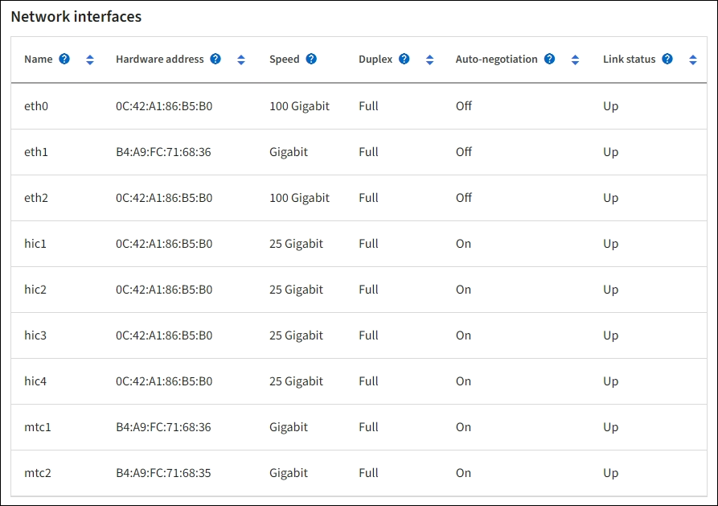

= 하드웨어 탭 보기
:allow-uri-read: 
:icons: font
:imagesdir: ../media/

[role="lead"]
하드웨어 탭에는 각 노드의 CPU 사용률과 메모리 사용량이 표시되고, 어플라이언스에 대한 추가 하드웨어 정보가 표시됩니다.

NOTE: 그리드 관리자는 각 릴리스마다 업데이트되므로 이 페이지의 예시 스크린샷과 일치하지 않을 수 있습니다.

모든 노드에 대해 하드웨어 탭이 표시됩니다.

image::../media/nodes_page_hardware_tab_graphs.png[노드 페이지 하드웨어 탭]

다른 시간 간격을 표시하려면 차트나 그래프 위에 있는 컨트롤 중 하나를 선택하세요.  1시간, 1일, 1주일, 1개월 간격으로 정보를 표시할 수 있습니다.  사용자 정의 간격을 설정하면 날짜와 시간 범위를 지정할 수 있습니다.

CPU 사용률과 메모리 사용량에 대한 자세한 내용을 보려면 각 그래프 위에 커서를 올려놓으세요.

image::../media/nodes_page_memory_usage_details.png[노드 페이지 > 하드웨어 > 메모리 사용량 세부 정보]

노드가 어플라이언스 노드인 경우 이 탭에는 어플라이언스 하드웨어에 대한 자세한 정보가 있는 섹션도 포함됩니다.

== 어플라이언스 스토리지 노드에 대한 정보 보기

노드 페이지에는 각 어플라이언스 스토리지 노드의 서비스 상태와 모든 계산, 디스크 장치 및 네트워크 리소스에 대한 정보가 나열됩니다.  또한 메모리, 저장 하드웨어, 컨트롤러 펌웨어 버전, 네트워크 리소스, 네트워크 인터페이스, 네트워크 주소를 확인하고 데이터를 수신 및 전송하는 것도 가능합니다.

.단계
. 노드 페이지에서 어플라이언스 스토리지 노드를 선택합니다.
. *개요*를 선택하세요.
+
개요 탭의 노드 정보 섹션에는 노드의 이름, 유형, ID, 연결 상태 등 노드에 대한 요약 정보가 표시됩니다.  IP 주소 목록에는 다음과 같이 각 주소에 대한 인터페이스 이름이 포함됩니다.

+
** *eth*: 그리드 네트워크, 관리 네트워크 또는 클라이언트 네트워크.
** *hic*: 어플라이언스의 물리적인 10, 25 또는 100GbE 포트 중 하나.  이러한 포트는 서로 결합되어 StorageGRID 그리드 네트워크(eth0) 및 클라이언트 네트워크(eth2)에 연결될 수 있습니다.
** *mtc*: 어플라이언스의 물리적 1GbE 포트 중 하나.  하나 이상의 mtc 인터페이스가 결합되어 StorageGRID 관리 네트워크 인터페이스(eth1)를 형성합니다.  데이터 센터의 기술자가 일시적으로 로컬 연결을 사용할 수 있도록 다른 MTC 인터페이스를 남겨둘 수 있습니다.
+
image::../media/nodes_page_overview_tab_extended.png[노드 페이지 개요 확장]

+
개요 탭의 알림 섹션에는 노드에 대한 모든 활성 알림이 표시됩니다.

. *하드웨어*를 선택하면 해당 기기에 대한 자세한 정보를 볼 수 있습니다.
+
.. CPU 사용률 및 메모리 그래프를 보고 시간 경과에 따른 CPU 및 메모리 사용률을 확인하세요.  다른 시간 간격을 표시하려면 차트나 그래프 위에 있는 컨트롤 중 하나를 선택하세요.  1시간, 1일, 1주일, 1개월 간격으로 정보를 표시할 수 있습니다.  사용자 정의 간격을 설정하면 날짜와 시간 범위를 지정할 수 있습니다.
+
image::../media/nodes_page_hardware_tab_graphs.png[하드웨어 그래프]

.. 아래로 스크롤하여 해당 기기의 구성품 표를 확인하세요.  이 표에는 기기의 모델 이름, 컨트롤러 이름, 일련 번호, IP 주소, 각 구성 요소의 상태와 같은 정보가 포함되어 있습니다.
+

NOTE: 컴퓨팅 컨트롤러 BMC IP 및 컴퓨팅 하드웨어와 같은 일부 필드는 해당 기능이 있는 어플라이언스에만 표시됩니다.

+
보관 선반용 구성 요소와 설비의 일부인 경우 확장 선반용 구성 요소는 기기 표 아래의 별도 표에 나와 있습니다.

+
image::../media/nodes_page_hardware_tab_for_appliance.png[어플라이언스용 노드 페이지 하드웨어 탭]

+
[cols="1a,2a"]
|===
| Appliance 테이블의 필드 | 설명 

 a| 
가전제품 모델
 a| 
SANtricity OS에 표시된 이 StorageGRID 어플라이언스의 모델 번호입니다.

 a| 
스토리지 컨트롤러 이름
 a| 
SANtricity OS에 표시되는 이 StorageGRID 어플라이언스의 이름입니다.

 a| 
스토리지 컨트롤러 A 관리 IP
 a| 
스토리지 컨트롤러 A의 관리 포트 1에 대한 IP 주소입니다. 이 IP를 사용하여 SANtricity OS에 액세스하여 스토리지 문제를 해결할 수 있습니다.

 a| 
스토리지 컨트롤러 B 관리 IP
 a| 
스토리지 컨트롤러 B의 관리 포트 1에 대한 IP 주소입니다. 이 IP를 사용하여 SANtricity OS에 액세스하여 스토리지 문제를 해결할 수 있습니다.

일부 가전제품 모델에는 저장 컨트롤러 B가 없습니다.

 a| 
스토리지 컨트롤러 WWID
 a| 
SANtricity OS에 표시되는 스토리지 컨트롤러의 전 세계 식별자입니다.

 a| 
저장 장치 섀시 일련 번호
 a| 
기기의 섀시 일련번호입니다.

 a| 
스토리지 컨트롤러 펌웨어 버전
 a| 
이 어플라이언스의 저장 컨트롤러에 있는 펌웨어 버전입니다.

 a| 
스토리지 컨트롤러 SANtricity OS 버전
 a| 
스토리지 컨트롤러 A의 SANtricity OS 버전.

 a| 
스토리지 컨트롤러 NVSRAM 버전
 a| 
SANtricity System Manager에서 보고한 스토리지 컨트롤러의 NVSRAM 버전입니다.

SG6060 및 SG6160의 경우 두 컨트롤러 간에 NVSRAM 버전이 일치하지 않으면 컨트롤러 A의 버전이 표시됩니다.  컨트롤러 A가 설치되지 않았거나 작동하지 않으면 컨트롤러 B의 버전이 표시됩니다.

 a| 
스토리지 하드웨어
 a| 
스토리지 컨트롤러 하드웨어의 전반적인 상태입니다.  SANtricity System Manager가 스토리지 하드웨어에 대한 주의 필요 상태를 보고하는 경우 StorageGRID 시스템도 이 값을 보고합니다.

상태가 "주의 필요"인 경우 먼저 SANtricity OS를 사용하여 스토리지 컨트롤러를 확인하세요.  그런 다음, 컴퓨팅 컨트롤러에 적용되는 다른 경고가 없는지 확인합니다.

 a| 
스토리지 컨트롤러 실패 드라이브 수
 a| 
최적이 아닌 드라이브의 수.

 a| 
스토리지 컨트롤러 A
 a| 
저장 컨트롤러 A의 상태.

 a| 
스토리지 컨트롤러 B
 a| 
저장 컨트롤러 B의 상태입니다. 일부 기기 모델에는 저장 컨트롤러 B가 없습니다.

 a| 
저장 컨트롤러 전원 공급 장치 A
 a| 
저장 컨트롤러의 전원 공급 장치 A의 상태입니다.

 a| 
스토리지 컨트롤러 전원 공급 장치 B
 a| 
저장 컨트롤러의 전원 공급 장치 B의 상태입니다.

 a| 
저장 데이터 드라이브 유형
 a| 
HDD(하드 드라이브) 또는 SSD(솔리드 스테이트 드라이브)와 같은 어플라이언스의 드라이브 유형입니다.

 a| 
저장 데이터 드라이브 크기
 a| 
하나의 데이터 드라이브의 실제 크기입니다.

SG6160의 경우 캐시 드라이브의 크기도 표시됩니다.

*참고*: 확장 선반이 있는 노드의 경우 다음을 사용하세요.<<shelf_data_drive_size,각 선반의 데이터 드라이브 크기>> 대신에.  효과적인 드라이브 크기는 선반마다 다를 수 있습니다.

 a| 
스토리지 RAID 모드
 a| 
어플라이언스에 구성된 RAID 모드입니다.

 a| 
스토리지 연결
 a| 
저장소 연결 상태.

 a| 
전체 전원 공급
 a| 
기기의 모든 전원 공급 장치 상태입니다.

 a| 
컴퓨팅 컨트롤러 BMC IP
 a| 
컴퓨팅 컨트롤러의 베이스보드 관리 컨트롤러(BMC) 포트의 IP 주소입니다.  이 IP를 사용하여 BMC 인터페이스에 연결하여 어플라이언스 하드웨어를 모니터링하고 진단합니다.

BMC 포함되지 않은 기기 모델의 경우 이 필드는 표시되지 않습니다.

 a| 
컴퓨팅 컨트롤러 일련 번호
 a| 
컴퓨팅 컨트롤러의 일련 번호입니다.

 a| 
컴퓨팅 하드웨어
 a| 
컴퓨팅 컨트롤러 하드웨어의 상태입니다.  별도의 컴퓨팅 하드웨어와 스토리지 하드웨어가 없는 어플라이언스 모델에는 이 필드가 표시되지 않습니다.

 a| 
컴퓨팅 컨트롤러 CPU 온도
 a| 
컴퓨팅 컨트롤러 CPU의 온도 상태입니다.

 a| 
컴퓨팅 컨트롤러 섀시 온도
 a| 
컴퓨팅 컨트롤러의 온도 상태입니다.

|===
+
[cols="1a,2a"]
|===
| 보관 선반 테이블의 열 | 설명 

 a| 
선반 섀시 일련 번호
 a| 
보관 선반 섀시의 일련 번호입니다.

 a| 
선반 ID
 a| 
보관 선반의 숫자 식별자입니다.

*** 99: 스토리지 컨트롤러 선반
*** 0: 첫 번째 확장 선반
*** 1: 두 번째 확장 선반

*참고:* 확장 선반은 SG6060 및 SG6160에만 적용됩니다.

 a| 
선반 상태
 a| 
보관 선반의 전반적인 상태입니다.

 a| 
IOM 상태
 a| 
모든 확장 선반의 입출력 모듈(IOM) 상태입니다.  확장 선반이 아닌 경우 해당 없음.

 a| 
전원 공급 상태
 a| 
보관 선반의 전원 공급 장치의 전반적인 상태입니다.

 a| 
서랍 상태
 a| 
보관 선반의 서랍 상태.  선반에 서랍이 없는 경우 해당 없음.

 a| 
팬 상태
 a| 
보관 선반에 있는 냉각 팬의 전반적인 상태입니다.

 a| 
드라이브 슬롯
 a| 
저장 선반에 있는 드라이브 슬롯의 총 수입니다.

 a| 
데이터 드라이브
 a| 
저장 선반에서 데이터 저장에 사용되는 드라이브의 수입니다.

 a| 
[[shelf_data_drive_size]]데이터 드라이브 크기
 a| 
저장 선반에 있는 하나의 데이터 드라이브의 효과적인 크기입니다.

 a| 
캐시 드라이브
 a| 
저장 선반에서 캐시로 사용되는 드라이브의 수입니다.

 a| 
캐시 드라이브 크기
 a| 
저장 선반에 있는 가장 작은 캐시 드라이브의 크기입니다.  일반적으로 캐시 드라이브는 모두 같은 크기입니다.

 a| 
구성 상태
 a| 
저장 선반의 구성 상태입니다.

|===
.. 모든 상태가 "명목상"인지 확인하세요.
+
상태가 "명목상"이 아닌 경우 현재 알림을 검토하세요.  SANtricity System Manager를 사용하여 이러한 하드웨어 값에 대해 자세히 알아볼 수도 있습니다.  기기 설치 및 유지관리에 대한 지침을 참조하세요.

. 각 네트워크에 대한 정보를 보려면 *네트워크*를 선택하세요.
+
네트워크 트래픽 그래프는 전체 네트워크 트래픽에 대한 요약을 제공합니다.

+
image::../media/nodes_page_network_traffic_graph.png[노드 페이지 네트워크 트래픽 그래프]

+
.. 네트워크 인터페이스 섹션을 검토하세요.
+
image::../media/nodes_page_network_interfaces.png[노드 페이지 네트워크 인터페이스]

+
네트워크 인터페이스 표의 *속도* 열에 있는 값을 사용하여 어플라이언스의 10/25GbE 네트워크 포트가 활성/백업 모드 또는 LACP 모드를 사용하도록 구성되었는지 확인하세요.

+

NOTE: 표에 표시된 값은 4개의 링크가 모두 사용된다고 가정합니다.

+
[cols="1a,1a,1a,1a"]
|===
| 링크 모드 | 본드 모드 | 개별 HIC 링크 속도(hic1, hic2, hic3, hic4) | 예상 그리드/클라이언트 네트워크 속도(eth0, eth2) 

 a| 
골재
 a| 
LACP
 a| 
25
 a| 
100

 a| 
결정된
 a| 
LACP
 a| 
25
 a| 
50

 a| 
결정된
 a| 
활성/백업
 a| 
25
 a| 
25

 a| 
골재
 a| 
LACP
 a| 
10
 a| 
40

 a| 
결정된
 a| 
LACP
 a| 
10
 a| 
20

 a| 
결정된
 a| 
활성/백업
 a| 
10
 a| 
10

|===
+
보다 https://docs.netapp.com/us-en/storagegrid-appliances/installconfig/configuring-network-links.html["네트워크 링크 구성"^] 10/25GbE 포트 구성에 대한 자세한 내용은 다음을 참조하세요.

.. 네트워크 커뮤니케이션 섹션을 검토하세요.
+
수신 및 전송 표는 각 네트워크를 통해 수신 및 전송된 바이트와 패킷 수와 기타 수신 및 전송 메트릭을 보여줍니다.

+
image::../media/nodes_page_network_communication.png[노드 페이지 네트워크 커뮤니케이션]

. *저장소*를 선택하면 시간 경과에 따라 개체 데이터와 개체 메타데이터에 사용된 저장 공간의 백분율을 보여주는 그래프와 디스크 장치, 볼륨, 개체 저장소에 대한 정보를 볼 수 있습니다.
+
image::../media/nodes_page_storage_used_object_data.png[사용된 저장소 - 개체 데이터]

+
image::../media/storage_used_object_metadata.png[사용된 저장소 - 개체 메타데이터]

+
.. 아래로 스크롤하여 각 볼륨과 개체 저장소에 사용 가능한 저장 용량을 확인하세요.
+
각 디스크의 WWID(전 세계 이름)는 SANtricity OS(어플라이언스의 스토리지 컨트롤러에 연결된 관리 소프트웨어)에서 표준 볼륨 속성을 볼 때 나타나는 볼륨 WWID(전 세계 식별자)와 일치합니다.

+
볼륨 마운트 지점과 관련된 디스크 읽기 및 쓰기 통계를 해석하는 데 도움이 되도록 디스크 장치 표의 *이름* 열에 표시된 이름의 첫 번째 부분(즉, _sdc_, _sdd_, _sde_ 등)이 볼륨 표의 *장치* 열에 표시된 값과 일치합니다.

+
image::../media/nodes_page_storage_tables.png[노드 페이지 스토리지 테이블]

== 어플라이언스 관리 노드 및 게이트웨이 노드에 대한 정보 보기

노드 페이지에는 관리 노드 또는 게이트웨이 노드로 사용되는 각 서비스 어플라이언스의 서비스 상태 및 모든 계산, 디스크 장치 및 네트워크 리소스에 대한 정보가 나열됩니다.  또한 메모리, 저장 하드웨어, 네트워크 리소스, 네트워크 인터페이스, 네트워크 주소를 확인하고 데이터를 수신 및 전송할 수 있습니다.

.단계
. 노드 페이지에서 어플라이언스 관리 노드 또는 어플라이언스 게이트웨이 노드를 선택합니다.
. *개요*를 선택하세요.
+
개요 탭의 노드 정보 섹션에는 노드의 이름, 유형, ID, 연결 상태 등 노드에 대한 요약 정보가 표시됩니다.  IP 주소 목록에는 다음과 같이 각 주소에 대한 인터페이스 이름이 포함됩니다.

+
** *adllb* 및 *adlli*: 관리 네트워크 인터페이스에 활성/백업 본딩이 사용되는 경우 표시됩니다.
** *eth*: 그리드 네트워크, 관리 네트워크 또는 클라이언트 네트워크.
** *hic*: 어플라이언스의 물리적인 10, 25 또는 100GbE 포트 중 하나.  이러한 포트는 서로 결합되어 StorageGRID 그리드 네트워크(eth0) 및 클라이언트 네트워크(eth2)에 연결될 수 있습니다.
** *mtc*: 어플라이언스의 물리적 1GbE 포트 중 하나.  하나 이상의 mtc 인터페이스가 결합되어 관리 네트워크 인터페이스(eth1)를 형성합니다.  데이터 센터의 기술자가 일시적으로 로컬 연결을 사용할 수 있도록 다른 MTC 인터페이스를 남겨둘 수 있습니다.
+
image::../media/nodes_page_overview_tab_services_appliance.png[서비스 어플라이언스에 대한 노드 페이지 개요 탭]

+
개요 탭의 알림 섹션에는 노드에 대한 모든 활성 알림이 표시됩니다.

. *하드웨어*를 선택하면 해당 기기에 대한 자세한 정보를 볼 수 있습니다.
+
.. CPU 사용률 및 메모리 그래프를 보고 시간 경과에 따른 CPU 및 메모리 사용률을 확인하세요.  다른 시간 간격을 표시하려면 차트나 그래프 위에 있는 컨트롤 중 하나를 선택하세요.  1시간, 1일, 1주일, 1개월 간격으로 정보를 표시할 수 있습니다.  사용자 정의 간격을 설정하면 날짜와 시간 범위를 지정할 수 있습니다.
+
image::../media/nodes_page_hardware_tab_graphs_services_appliance.png[서비스 어플라이언스에 대한 노드 페이지 하드웨어 탭 그래프]

.. 아래로 스크롤하여 해당 기기의 구성품 표를 확인하세요.  이 표에는 모델명, 일련번호, 컨트롤러 펌웨어 버전, 각 구성 요소의 상태와 같은 정보가 포함되어 있습니다.
+
image::../media/nodes_page_hardware_tab_services_appliance.png[서비스 어플라이언스의 노드 페이지 하드웨어 탭]

+
[cols="1a,2a"]
|===
| Appliance 테이블의 필드 | 설명 

 a| 
가전제품 모델
 a| 
이 StorageGRID 어플라이언스의 모델 번호입니다.

 a| 
스토리지 컨트롤러 실패 드라이브 수
 a| 
최적이 아닌 드라이브의 수.

 a| 
저장 데이터 드라이브 유형
 a| 
HDD(하드 드라이브) 또는 SSD(솔리드 스테이트 드라이브)와 같은 어플라이언스의 드라이브 유형입니다.

 a| 
저장 데이터 드라이브 크기
 a| 
하나의 데이터 드라이브의 실제 크기입니다.

 a| 
스토리지 RAID 모드
 a| 
어플라이언스의 RAID 모드입니다.

 a| 
전체 전원 공급
 a| 
기기의 모든 전원 공급 장치 상태입니다.

 a| 
컴퓨팅 컨트롤러 BMC IP
 a| 
컴퓨팅 컨트롤러의 베이스보드 관리 컨트롤러(BMC) 포트의 IP 주소입니다.  이 IP를 사용하면 BMC 인터페이스에 연결하여 어플라이언스 하드웨어를 모니터링하고 진단할 수 있습니다.

BMC 포함되지 않은 기기 모델의 경우 이 필드는 표시되지 않습니다.

 a| 
컴퓨팅 컨트롤러 일련 번호
 a| 
컴퓨팅 컨트롤러의 일련 번호입니다.

 a| 
컴퓨팅 하드웨어
 a| 
컴퓨팅 컨트롤러 하드웨어의 상태입니다.

 a| 
컴퓨팅 컨트롤러 CPU 온도
 a| 
컴퓨팅 컨트롤러 CPU의 온도 상태입니다.

 a| 
컴퓨팅 컨트롤러 섀시 온도
 a| 
컴퓨팅 컨트롤러의 온도 상태입니다.

|===
.. 모든 상태가 "명목상"인지 확인하세요.
+
상태가 "명목상"이 아닌 경우 현재 알림을 검토하세요.

. 각 네트워크에 대한 정보를 보려면 *네트워크*를 선택하세요.
+
네트워크 트래픽 그래프는 전체 네트워크 트래픽에 대한 요약을 제공합니다.

+
image::../media/nodes_page_network_traffic_graph.png[노드 페이지 네트워크 트래픽 그래프]

+
.. 네트워크 인터페이스 섹션을 검토하세요.
+

+
네트워크 인터페이스 표의 *속도* 열에 있는 값을 사용하여 어플라이언스의 40/100GbE 네트워크 포트 4개가 액티브/백업 모드 또는 LACP 모드를 사용하도록 구성되었는지 확인합니다.

+

NOTE: 표에 표시된 값은 4개의 링크가 모두 사용된다고 가정합니다.

+
[cols="1a,1a,1a,1a"]
|===
| 링크 모드 | 본드 모드 | 개별 HIC 링크 속도(hic1, hic2, hic3, hic4) | 예상 그리드/클라이언트 네트워크 속도(eth0, eth2) 

 a| 
골재
 a| 
LACP
 a| 
100
 a| 
400

 a| 
결정된
 a| 
LACP
 a| 
100
 a| 
200

 a| 
결정된
 a| 
활성/백업
 a| 
100
 a| 
100

 a| 
골재
 a| 
LACP
 a| 
40
 a| 
160

 a| 
결정된
 a| 
LACP
 a| 
40
 a| 
80

 a| 
결정된
 a| 
활성/백업
 a| 
40
 a| 
40

|===
.. 네트워크 커뮤니케이션 섹션을 검토하세요.
+
수신 및 전송 표는 각 네트워크를 통해 수신 및 전송된 바이트와 패킷 수, 기타 수신 및 전송 메트릭을 보여줍니다.

+
image::../media/nodes_page_network_communication.png[노드 페이지 네트워크 커뮤니케이션]

. 서비스 어플라이언스의 디스크 장치 및 볼륨에 대한 정보를 보려면 *저장소*를 선택하세요.
+
image::../media/nodes_page_storage_tab_services_appliance.png[노드 페이지 스토리지 탭 서비스 어플라이언스]

