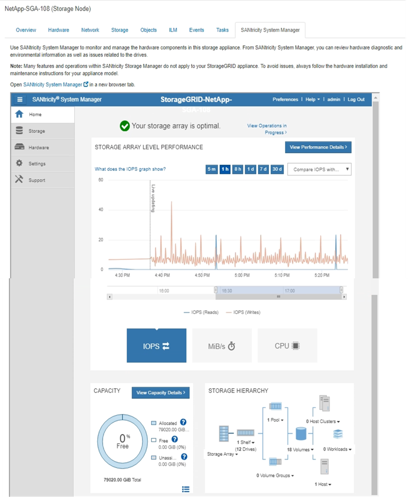

= SANtricity 시스템 관리자 탭 보기(E-시리즈만 해당)
:allow-uri-read: 
:icons: font
:imagesdir: ../media/

[role="lead"]
SANtricity System Manager 탭을 사용하면 스토리지 어플라이언스의 관리 포트를 구성하거나 연결하지 않고도 SANtricity System Manager에 액세스할 수 있습니다.  이 탭을 사용하면 하드웨어 진단 및 환경 정보는 물론 드라이브 관련 문제도 검토할 수 있습니다.

CAUTION: Grid Manager에서 SANtricity System Manager에 액세스하는 것은 일반적으로 어플라이언스 하드웨어를 모니터링하고 E-Series AutoSupport 구성하는 데에만 사용됩니다.  SANtricity System Manager의 많은 기능과 작업(예: 펌웨어 업그레이드)은 StorageGRID 어플라이언스 모니터링에 적용되지 않습니다.  문제를 방지하려면 항상 해당 기기의 하드웨어 유지 관리 지침을 따르세요.  SANtricity 펌웨어를 업그레이드하려면 다음을 참조하세요. https://docs.netapp.com/us-en/storagegrid-appliances/landing-maintain-hdwr/index.html["유지 관리 구성 절차"^] 귀하의 저장 기기에 대한

NOTE: SANtricity 시스템 관리자 탭은 E-시리즈 하드웨어를 사용하는 스토리지 어플라이언스 노드에만 표시됩니다.

SANtricity System Manager를 사용하면 다음 작업을 수행할 수 있습니다.

* 스토리지 어레이 수준 성능, I/O 지연 시간, 스토리지 컨트롤러 CPU 사용률, 처리량 등의 성능 데이터를 확인합니다.
* 하드웨어 구성 요소 상태를 확인하세요.
* 진단 데이터 보기, E-Series AutoSupport 구성 등의 지원 기능을 수행합니다.
+

NOTE: SANtricity System Manager를 사용하여 E-Series AutoSupport 대한 프록시를 구성하려면 다음을 참조하세요.link:../admin/sending-eseries-autosupport-messages-through-storagegrid.html["StorageGRID 통해 E-Series AutoSupport 패키지를 보내세요"] .

Grid Manager를 통해 SANtricity System Manager에 액세스하려면 다음이 필요합니다.link:../admin/admin-group-permissions.html["스토리지 어플라이언스 관리자 또는 루트 액세스 권한"] .

NOTE: Grid Manager를 사용하여 SANtricity System Manager에 액세스하려면 SANtricity 펌웨어 8.70 이상이 있어야 합니다.

이 탭에는 SANtricity System Manager의 홈페이지가 표시됩니다.

NOTE: SANtricity System Manager 링크를 사용하면 새 브라우저 창에서 SANtricity System Manager를 열어 더 쉽게 볼 수 있습니다.

스토리지 어레이 수준 성능과 용량 사용에 대한 자세한 내용을 보려면 각 그래프 위에 커서를 올려놓으세요.

SANtricity System Manager 탭에서 접근 가능한 정보를 보는 방법에 대한 자세한 내용은 다음을 참조하세요. https://docs.netapp.com/us-en/e-series-family/index.html["NetApp E-Series 및 SANtricity 설명서"^] .
