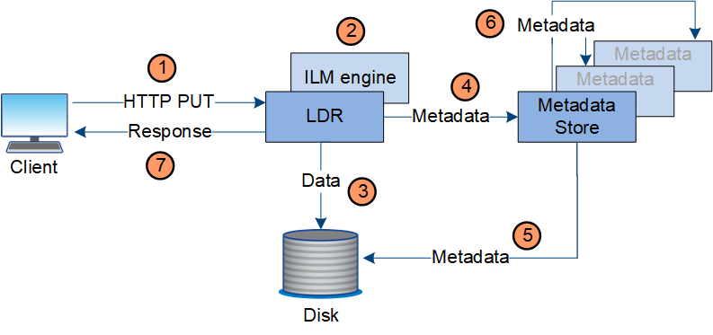

= 데이터 흐름 수집
:allow-uri-read: 
:icons: font
:imagesdir: ../media/

[role="lead"]
수집 또는 저장 작업은 클라이언트와 StorageGRID 시스템 간의 정의된 데이터 흐름으로 구성됩니다.

== 데이터 흐름

클라이언트가 StorageGRID 시스템에 객체를 수집하면 스토리지 노드의 LDR 서비스가 요청을 처리하고 메타데이터와 데이터를 디스크에 저장합니다.

. 클라이언트 애플리케이션은 객체를 생성하여 HTTP PUT 요청을 통해 StorageGRID 시스템으로 전송합니다.
. 해당 객체는 시스템의 ILM 정책에 따라 평가됩니다.
. LDR 서비스는 개체 데이터를 복제된 사본이나 삭제 코드가 적용된 사본으로 저장합니다.  (이 다이어그램은 복제된 사본을 디스크에 저장하는 단순화된 버전을 보여줍니다.)
. LDR 서비스는 개체 메타데이터를 메타데이터 저장소로 전송합니다.
. 메타데이터 저장소는 개체 메타데이터를 디스크에 저장합니다.
. 메타데이터 저장소는 개체 메타데이터의 사본을 다른 스토리지 노드로 전파합니다.  이러한 사본은 디스크에도 저장됩니다.
. LDR 서비스는 객체가 수집되었음을 확인하기 위해 클라이언트에게 HTTP 200 OK 응답을 반환합니다.

