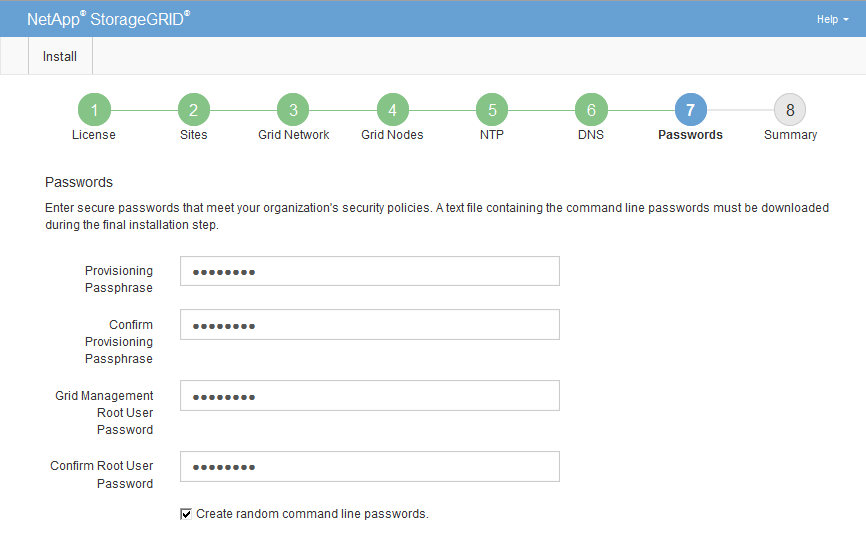

= StorageGRID 시스템 비밀번호를 지정하세요
:allow-uri-read: 
:icons: font
:imagesdir: ../media/

[role="lead"]
StorageGRID 시스템을 설치하는 과정에서 시스템 보안과 유지 관리 작업 수행에 사용할 비밀번호를 입력해야 합니다.

.이 작업에 관하여
설치 암호 페이지를 사용하여 프로비저닝 암호와 그리드 관리 루트 사용자 암호를 지정합니다.

* 프로비저닝 암호문구는 암호화 키로 사용되며 StorageGRID 시스템에 저장되지 않습니다.
* 복구 패키지 다운로드를 포함한 설치, 확장 및 유지 관리 절차를 위해서는 프로비저닝 암호가 필요합니다.  따라서 프로비저닝 암호를 안전한 장소에 저장하는 것이 중요합니다.
* 현재 프로비저닝 암호가 있는 경우 Grid Manager에서 프로비저닝 암호를 변경할 수 있습니다.
* 그리드 관리 루트 사용자 비밀번호는 그리드 관리자를 사용하여 변경할 수 있습니다.
* 무작위로 생성된 명령줄 콘솔 및 SSH 암호는 다음에 저장됩니다. `Passwords.txt` 복구 패키지의 파일입니다.

.단계
. *프로비저닝 암호*에 StorageGRID 시스템의 그리드 토폴로지를 변경하는 데 필요한 프로비저닝 암호를 입력합니다.
+
프로비저닝 암호를 안전한 곳에 보관하세요.

+

NOTE: 설치가 완료된 후 나중에 프로비저닝 암호를 변경하려면 Grid Manager를 사용할 수 있습니다. *구성* > *접근 제어* > *그리드 비밀번호*를 선택하세요.

. *프로비저닝 암호문구 확인*에서 프로비저닝 암호문구를 다시 입력하여 확인합니다.
. *그리드 관리 루트 사용자 비밀번호*에 "루트" 사용자로 그리드 관리자에 액세스하는 데 사용할 비밀번호를 입력합니다.
+
비밀번호를 안전한 곳에 보관하세요.

. *루트 사용자 비밀번호 확인*에서 Grid Manager 비밀번호를 다시 입력하여 확인하세요.
+

. 개념 증명이나 데모 목적으로 그리드를 설치하는 경우, 선택적으로 *임의의 명령줄 비밀번호 만들기* 체크박스를 선택 취소합니다.
+
실제 운영 환경에서는 보안상의 이유로 항상 임의의 비밀번호를 사용해야 합니다.  "root" 또는 "admin" 계정을 사용하여 명령줄에서 그리드 노드에 액세스하기 위해 기본 비밀번호를 사용하려면 데모 그리드에 대해서만 *임의의 명령줄 비밀번호 만들기*를 선택 취소하세요.

+

NOTE: 복구 패키지 파일을 다운로드하라는 메시지가 표시됩니다.(`sgws-recovery-package-id-revision.zip` ) 요약 페이지에서 *설치*를 클릭한 후.  당신은해야합니다link:../maintain/downloading-recovery-package.html["이 파일을 다운로드하세요"] 설치를 완료합니다.  시스템에 접근하는 데 필요한 비밀번호는 다음 위치에 저장됩니다. `Passwords.txt` 복구 패키지 파일에 포함된 파일입니다.

. *다음*을 클릭하세요.

