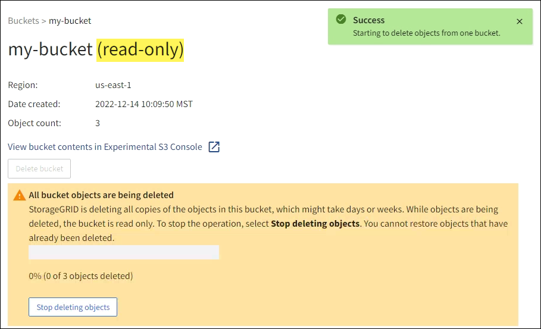

= 버킷에서 객체 삭제
:allow-uri-read: 
:icons: font
:imagesdir: ../media/

[role="lead"]
테넌트 관리자를 사용하여 하나 이상의 버킷에 있는 객체를 삭제할 수 있습니다.

.고려 사항 및 요구 사항
이러한 단계를 수행하기 전에 다음 사항에 유의하세요.

* 버킷에 있는 객체를 삭제하면 StorageGRID StorageGRID 시스템의 모든 노드와 사이트에서 선택한 각 버킷에 있는 모든 객체와 모든 객체 버전을 영구적으로 제거합니다.  StorageGRID 관련된 모든 개체 메타데이터도 제거합니다.  이 정보는 복구할 수 없습니다.
* 버킷에 있는 모든 객체를 삭제하는 데는 객체 수, 객체 복사본, 동시 작업 수에 따라 몇 분, 며칠 또는 몇 주가 걸릴 수 있습니다.
* 버킷이 있는 경우link:using-s3-object-lock.html["S3 객체 잠금이 활성화되었습니다."] , *개체 삭제: 읽기 전용* 상태가 _년_ 동안 유지될 수 있습니다.
+

TIP: S3 객체 잠금을 사용하는 버킷은 모든 객체의 보존 날짜에 도달하고 모든 법적 보존이 제거될 때까지 *객체 삭제: 읽기 전용* 상태를 유지합니다.

* 객체가 삭제되는 동안 버킷의 상태는 *객체 삭제: 읽기 전용*입니다.  이 상태에서는 버킷에 새로운 객체를 추가할 수 없습니다.
* 모든 객체가 삭제되면 버킷은 읽기 전용 상태로 유지됩니다.  다음 중 하나를 수행할 수 있습니다.
+
** 버킷을 쓰기 모드로 되돌리고 새 객체에 재사용합니다.
** 버킷 삭제
** 나중에 사용할 수 있도록 버킷 이름을 예약하려면 버킷을 읽기 전용 모드로 유지하세요.

* 버킷에 개체 버전 관리가 활성화된 경우 StorageGRID 11.8 이상에서 생성된 삭제 마커는 버킷의 개체 삭제 작업을 사용하여 제거할 수 있습니다.
* 버킷에 개체 버전 관리가 활성화된 경우 개체 삭제 작업은 StorageGRID 11.7 이하에서 생성된 삭제 마커를 제거하지 않습니다.  버킷에서 객체를 삭제하는 방법에 대한 정보를 참조하세요.link:../ilm/how-objects-are-deleted.html#delete-s3-versioned-objects["S3 버전이 지정된 객체가 삭제되는 방식"] .
* 당신이 사용하는 경우link:grid-federation-manage-cross-grid-replication.html["크로스 그리드 복제"] 다음 사항에 유의하세요.
+
** 이 옵션을 사용해도 다른 그리드의 버킷에서 어떤 객체도 삭제되지 않습니다.
** 소스 버킷에 대해 이 옵션을 선택하면 다른 그리드의 대상 버킷에 객체를 추가하면 *크로스 그리드 복제 실패* 경고가 트리거됩니다.  다른 그리드의 버킷에 아무도 객체를 추가하지 않을 것이라고 보장할 수 없는 경우,link:../tenant/grid-federation-manage-cross-grid-replication.html["크로스 그리드 복제 비활성화"] 모든 버킷 객체를 삭제하기 전에 해당 버킷에 대한 삭제를 수행합니다.

.시작하기 전에
* 귀하는 다음을 사용하여 테넌트 관리자에 로그인했습니다.link:../admin/web-browser-requirements.html["지원되는 웹 브라우저"] .
* 당신은 다음 사용자 그룹에 속해 있습니다.link:tenant-management-permissions.html["루트 액세스 권한"] .  이 권한은 그룹 또는 버킷 정책의 권한 설정을 재정의합니다.

.단계
. 대시보드에서 *버킷 보기*를 선택하거나 *스토리지(S3)* > *버킷*을 선택하세요.
+
버킷 페이지가 나타나고 기존 S3 버킷이 모두 표시됩니다.

. 특정 버킷의 *작업* 메뉴나 세부 정보 페이지를 사용하세요.
+
[role="tabbed-block"]
====
.작업 메뉴
--
.. 객체를 삭제할 각 버킷의 확인란을 선택합니다.
.. *작업* > *버킷에서 개체 삭제*를 선택합니다.

--
.세부 정보 페이지
--
.. 버킷 이름을 선택하면 세부 정보가 표시됩니다.
.. *버킷에서 개체 삭제*를 선택합니다.

--
====
. 확인 대화 상자가 나타나면 세부 정보를 검토하고 *예*를 입력한 후 *확인*을 선택합니다.
. 삭제 작업이 시작될 때까지 기다리세요.
+
몇 분 후:

+
** 버킷 세부 정보 페이지에 노란색 상태 배너가 나타납니다.  진행률 표시줄은 개체의 삭제 비율을 나타냅니다.
** *(읽기 전용)*은 버킷 세부 정보 페이지에서 버킷 이름 뒤에 나타납니다.
** 버킷 페이지에서 버킷 이름 옆에 *(객체 삭제: 읽기 전용)*이 표시됩니다.

+

. 작업이 실행되는 동안 필요에 따라 *개체 삭제 중지*를 선택하여 프로세스를 중지합니다.  그런 다음, 선택적으로 *버킷에서 개체 삭제*를 선택하여 프로세스를 다시 시작합니다.
+
*객체 삭제 중지*를 선택하면 버킷이 쓰기 모드로 돌아갑니다. 하지만 삭제된 객체에 액세스하거나 복원할 수 없습니다.

. 작업이 완료될 때까지 기다리세요.
+
버킷이 비어 있으면 상태 배너가 업데이트되지만 버킷은 읽기 전용으로 유지됩니다.

+
image::../media/delete-bucket-objects-complete.png[모든 버킷 객체가 삭제된 것을 보여주는 스크린샷]

. 다음 중 하나를 수행하세요.
+
** 버킷을 읽기 전용 모드로 유지하려면 페이지를 종료하세요.  예를 들어, 나중에 사용할 버킷 이름을 예약하기 위해 읽기 전용 모드로 빈 버킷을 보관할 수 있습니다.
** 버킷을 삭제합니다.  *버킷 삭제*를 선택하여 단일 버킷을 삭제할 수 있고, 버킷 페이지로 돌아가서 *작업* > *버킷 삭제*를 선택하여 두 개 이상의 버킷을 제거할 수 있습니다.
+

NOTE: 모든 객체를 삭제한 후에 버전이 지정된 버킷을 삭제할 수 없는 경우 삭제 마커가 남아 있을 수 있습니다.  버킷을 삭제하려면 남아 있는 삭제 마커를 모두 제거해야 합니다.

** 버킷을 쓰기 모드로 되돌리고 필요한 경우 새 객체에 재사용합니다.  단일 버킷에 대해 *객체 삭제 중지*를 선택하거나 버킷 페이지로 돌아가서 두 개 이상의 버킷에 대해 *작업* > *객체 삭제 중지*를 선택할 수 있습니다.

