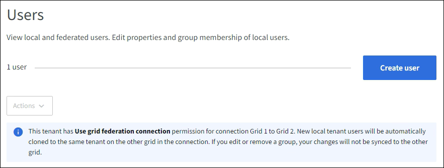

= 로컬 사용자 관리
:allow-uri-read: 
:icons: font
:imagesdir: ../media/

[role="lead"]
로컬 사용자를 만들고 로컬 그룹에 할당하여 해당 사용자가 액세스할 수 있는 기능을 결정할 수 있습니다. 테넌트 관리자에는 "root"라는 이름의 미리 정의된 로컬 사용자가 하나 포함됩니다. 로컬 사용자를 추가하거나 제거할 수 있지만 루트 사용자는 제거할 수 없습니다.

NOTE: StorageGRID 시스템에서 SSO(Single Sign-On)가 활성화된 경우 로컬 사용자는 테넌트 관리자 또는 테넌트 관리 API에 로그인할 수 없지만, 그룹 권한에 따라 클라이언트 애플리케이션을 사용하여 테넌트 리소스에 액세스할 수 있습니다.

.시작하기 전에
* 귀하는 다음을 사용하여 테넌트 관리자에 로그인했습니다.link:../admin/web-browser-requirements.html["지원되는 웹 브라우저"] .
* 당신은 다음 사용자 그룹에 속해 있습니다.link:tenant-management-permissions.html["루트 액세스 권한"] .
* 테넌트 계정에 *그리드 페더레이션 연결 사용* 권한이 있는 경우 워크플로 및 고려 사항을 검토한 것입니다.link:grid-federation-account-clone.html["테넌트 그룹 및 사용자 복제"] , 테넌트의 소스 그리드에 로그인되었습니다.

== [[create-user]]로컬 사용자 생성

로컬 사용자를 만들고 하나 이상의 로컬 그룹에 할당하여 액세스 권한을 제어할 수 있습니다.

어떤 그룹에도 속하지 않은 S3 사용자에게는 관리 권한이 없으며 S3 그룹 정책도 적용되지 않습니다.  이러한 사용자는 버킷 정책을 통해 S3 버킷 액세스 권한을 부여받을 수 있습니다.

어떤 그룹에도 속하지 않은 Swift 사용자에게는 관리 권한이나 Swift 컨테이너 액세스 권한이 없습니다.

=== 사용자 생성 마법사에 액세스하세요

.단계
. *액세스 관리* > *사용자*를 선택합니다.
+
테넌트 계정에 *그리드 페더레이션 연결 사용* 권한이 있는 경우 파란색 배너는 이것이 테넌트의 소스 그리드임을 나타냅니다.  이 그리드에서 생성하는 모든 로컬 사용자는 연결에 있는 다른 그리드에 복제됩니다.

+

. *사용자 만들기*를 선택하세요.

=== 자격 증명을 입력하세요

.단계
. *사용자 자격 증명 입력* 단계에서는 다음 필드를 완료하세요.
+
[cols="1a,3a"]
|===
| 필드 | 설명 

 a| 
성명
 a| 
이 사용자의 전체 이름, 예를 들어 사람의 이름과 성 또는 애플리케이션 이름입니다.

 a| 
사용자 이름
 a| 
이 사용자가 로그인하는 데 사용할 이름입니다. 사용자 이름은 고유해야 하며 변경할 수 없습니다.

*참고*: 테넌트 계정에 *그리드 페더레이션 연결 사용* 권한이 있는 경우 대상 그리드의 테넌트에 대해 동일한 *사용자 이름*이 이미 있으면 복제 오류가 발생합니다.

 a| 
비밀번호 및 비밀번호 확인
 a| 
사용자가 로그인할 때 처음 사용할 비밀번호입니다.

 a| 
접근 거부
 a| 
사용자가 하나 이상의 그룹에 속해 있더라도 테넌트 계정에 로그인하는 것을 방지하려면 *예*를 선택합니다.

예를 들어, 사용자의 로그인 기능을 일시적으로 중단하려면 *예*를 선택합니다.

|===
. *계속*을 선택하세요.

=== 그룹에 할당

.단계
. 사용자를 하나 이상의 로컬 그룹에 할당하여 해당 사용자가 수행할 수 있는 작업을 결정합니다.
+
사용자를 그룹에 할당하는 것은 선택 사항입니다.  원하시면 그룹을 만들거나 편집할 때 사용자를 선택할 수 있습니다.

+
어떤 그룹에도 속하지 않은 사용자는 관리 권한이 없습니다.  권한은 누적됩니다.  사용자는 자신이 속한 모든 그룹에 대한 모든 권한을 갖습니다. 보다 link:tenant-management-permissions.html["테넌트 관리 권한"] .

. *사용자 만들기*를 선택하세요.
+
테넌트 계정에 *그리드 페더레이션 연결 사용* 권한이 있고 테넌트의 소스 그리드에 있는 경우 새 로컬 사용자가 테넌트의 대상 그리드에 복제됩니다.  *성공*은 사용자 세부 정보 페이지의 개요 섹션에 *복제 상태*로 표시됩니다.

. *마침*을 선택하여 사용자 페이지로 돌아갑니다.

== 로컬 사용자 보기 또는 편집

.단계
. *액세스 관리* > *사용자*를 선택합니다.
. 이 테넌트 계정의 모든 로컬 및 페더레이션 사용자에 대한 기본 정보가 나열된 사용자 페이지에 제공된 정보를 검토하세요.
+
테넌트 계정에 *그리드 페더레이션 연결 사용* 권한이 있고 테넌트의 소스 그리드에서 사용자를 보고 있는 경우:

+
** 배너 메시지는 사용자를 편집하거나 제거하면 변경 사항이 다른 그리드와 동기화되지 않음을 나타냅니다.
** 필요에 따라 사용자가 대상 그리드의 테넌트에 복제되지 않은 경우 배너 메시지가 표시됩니다. 당신은 할 수 있어요 <<clone-users,실패한 사용자 복제를 다시 시도합니다.>>.

. 사용자의 전체 이름을 변경하려면:
+
.. 사용자의 확인란을 선택하세요.
.. *작업* > *전체 이름 편집*을 선택하세요.
.. 새로운 이름을 입력하세요.
.. *변경 사항 저장*을 선택하세요.

. 더 자세한 내용을 보거나 추가 편집을 하려면 다음 중 하나를 수행하세요.
+
** 사용자 이름을 선택하세요.
** 사용자의 확인란을 선택하고 *작업* > *사용자 세부 정보 보기*를 선택합니다.

. 각 사용자에 대한 다음 정보가 표시되는 개요 섹션을 검토하세요.
+
** 성명
** 사용자 이름
** 사용자 유형
** 접근 거부됨
** 접근 모드
** 그룹 멤버십
** 테넌트 계정에 *그리드 페더레이션 연결 사용* 권한이 있고 테넌트의 소스 그리드에서 사용자를 보고 있는 경우 추가 필드:
+
*** 복제 상태는 *성공* 또는 *실패*입니다.
*** 이 사용자를 편집하면 변경 사항이 다른 그리드와 동기화되지 않음을 나타내는 파란색 배너입니다.

. 필요에 따라 사용자 설정을 편집합니다. 보다<<create-user,로컬 사용자 생성>> 입력해야 할 내용에 대한 자세한 내용은 다음을 참조하세요.
+
.. 개요 섹션에서 이름이나 편집 아이콘을 선택하여 전체 이름을 변경합니다.image:../media/icon_edit_tm.png["편집 아이콘"] .
+
사용자 이름을 변경할 수 없습니다.

.. *비밀번호* 탭에서 사용자의 비밀번호를 변경하고 *변경 사항 저장*을 선택합니다.
.. *액세스* 탭에서 사용자가 로그인하도록 허용하려면 *아니요*를 선택하고, 사용자가 로그인하지 못하도록 하려면 *예*를 선택합니다. 그런 다음 *변경 사항 저장*을 선택합니다.
.. *액세스 키* 탭에서 *키 만들기*를 선택하고 지침을 따르세요.link:creating-another-users-s3-access-keys.html["다른 사용자의 S3 액세스 키 생성"] .
.. *그룹* 탭에서 *그룹 편집*을 선택하여 사용자를 그룹에 추가하거나 그룹에서 사용자를 제거합니다.  그런 다음 *변경 사항 저장*을 선택하세요.

. 변경한 각 섹션에 대해 *변경 사항 저장*을 선택했는지 확인하세요.

== 중복된 로컬 사용자

로컬 사용자를 복제하면 더 빠르게 새로운 사용자를 만들 수 있습니다.

NOTE: 테넌트 계정에 *그리드 페더레이션 연결 사용* 권한이 있고 테넌트의 소스 그리드에서 사용자를 복제하는 경우, 복제된 사용자는 테넌트의 대상 그리드에 복제됩니다.

.단계
. *액세스 관리* > *사용자*를 선택합니다.
. 복제하려는 사용자의 확인란을 선택하세요.
. *작업* > *사용자 복제*를 선택합니다.
. 보다<<create-user,로컬 사용자 생성>> 입력해야 할 내용에 대한 자세한 내용은 다음을 참조하세요.
. *사용자 만들기*를 선택하세요.

== [[clone-users]]사용자 복제를 다시 시도하세요

실패한 복제를 다시 시도하려면:

. 사용자 이름 아래에 _(복제 실패)_가 표시된 각 사용자를 선택하세요.
. *작업* > *사용자 복제*를 선택합니다.
. 복제 중인 각 사용자의 세부 정보 페이지에서 복제 작업의 상태를 확인합니다.

추가 정보는 다음을 참조하세요.link:grid-federation-account-clone.html["테넌트 그룹 및 사용자 복제"] .

== 하나 이상의 로컬 사용자를 삭제합니다.

더 이상 StorageGRID 테넌트 계정에 액세스할 필요가 없는 한 명 이상의 로컬 사용자를 영구적으로 삭제할 수 있습니다.

NOTE: 테넌트 계정에 *그리드 페더레이션 연결 사용* 권한이 있고 로컬 사용자를 삭제하는 경우 StorageGRID 다른 그리드의 해당 사용자를 삭제하지 않습니다.  이 정보를 동기화 상태로 유지해야 하는 경우 두 그리드에서 동일한 사용자를 삭제해야 합니다.

NOTE: 페더레이션 사용자를 삭제하려면 페더레이션 ID 소스를 사용해야 합니다.

.단계
. *액세스 관리* > *사용자*를 선택합니다.
. 삭제하려는 각 사용자에 대한 확인란을 선택하세요.
. *작업* > *사용자 삭제* 또는 *작업* > *사용자 삭제*를 선택합니다.
+
확인 대화 상자가 나타납니다.

. *사용자 삭제* 또는 *사용자 삭제*를 선택하세요.

