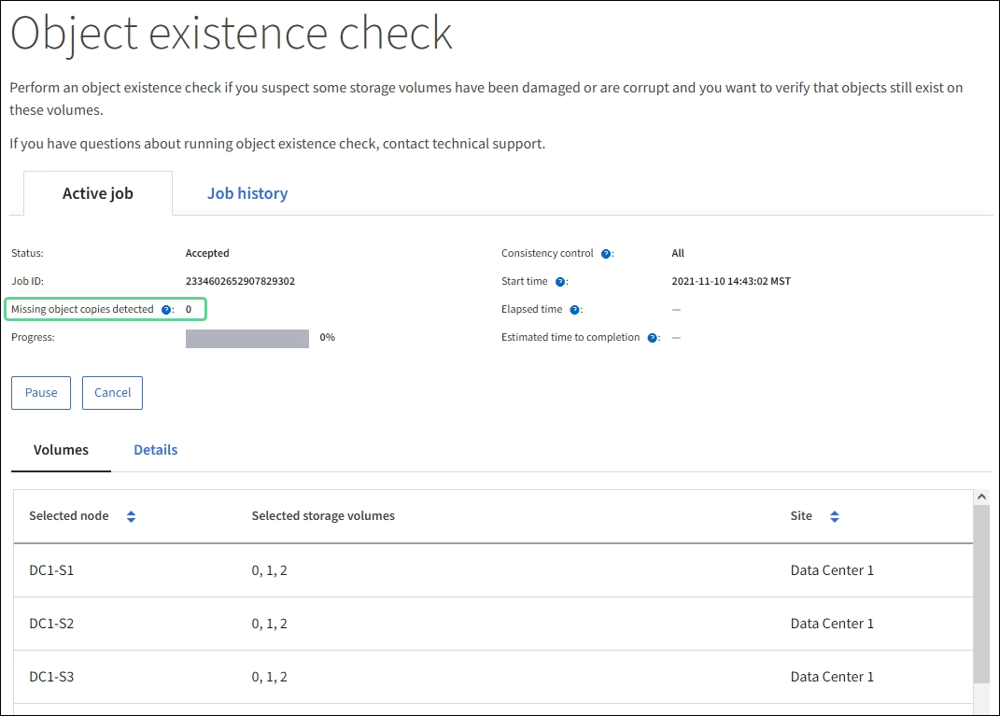

= 객체 무결성 확인
:allow-uri-read: 
:icons: font
:imagesdir: ../media/

[role="lead"]
StorageGRID 시스템은 스토리지 노드에 있는 객체 데이터의 무결성을 검증하여 손상되었거나 누락된 객체가 있는지 확인합니다.

검증 프로세스에는 백그라운드 검증과 객체 존재 확인(이전에는 포그라운드 검증이라고 함)의 두 가지가 있습니다.  이들은 데이터 무결성을 보장하기 위해 협력합니다.  백그라운드 검증은 자동으로 실행되며, 객체 데이터의 정확성을 지속적으로 확인합니다.  객체 존재 검사는 사용자가 객체의 존재 여부(정확성은 아님)를 더 빠르게 검증하기 위해 트리거할 수 있습니다.

== 배경 조사란 무엇인가요?

백그라운드 검증 프로세스는 스토리지 노드에서 객체 데이터의 손상된 사본이 있는지 자동으로 지속적으로 확인하고, 발견된 모든 문제를 자동으로 복구하려고 시도합니다.

백그라운드 검증은 복제된 객체와 삭제된 객체의 무결성을 다음과 같이 확인합니다.

* *복제된 개체*: 백그라운드 검증 프로세스에서 손상된 복제 개체가 발견되면 손상된 사본은 해당 위치에서 제거되고 스토리지 노드의 다른 곳에 격리됩니다.  그런 다음, 손상되지 않은 새 복사본이 생성되어 활성 ILM 정책을 충족하도록 배치됩니다.  새로운 복사본은 원본 복사본에 사용된 스토리지 노드에 배치되지 않을 수 있습니다.

NOTE: 손상된 개체 데이터는 시스템에서 삭제되지 않고 격리되므로 계속 액세스할 수 있습니다.  격리된 개체 데이터에 액세스하는 방법에 대한 자세한 내용은 기술 지원팀에 문의하세요.

* *삭제된 코드화된 객체*: 백그라운드 검증 프로세스에서 삭제된 코드화된 객체의 조각이 손상된 것을 감지하면 StorageGRID 남아 있는 데이터와 패리티 조각을 사용하여 동일한 스토리지 노드에 있는 누락된 조각을 자동으로 재구성하려고 시도합니다.  손상된 조각을 다시 작성할 수 없는 경우 해당 객체의 다른 사본을 검색하려고 시도합니다.  검색이 성공하면 ILM 평가를 수행하여 삭제 코드가 지정된 개체의 대체 사본을 만듭니다.
+
백그라운드 확인 프로세스는 스토리지 노드의 객체만 확인합니다.  Cloud Storage Pool의 객체를 확인하지 않습니다.  배경 검증을 받으려면 해당 물건이 4일 이상 지난 것이어야 합니다.

백그라운드 검증은 일반적인 시스템 활동을 방해하지 않도록 설계된 지속적인 속도로 실행됩니다.  배경 조사는 중단될 수 없습니다.  하지만 문제가 의심되는 경우 백그라운드 확인 비율을 높여 스토리지 노드의 내용을 더 빠르게 확인할 수 있습니다.

=== 백그라운드 확인 관련 알림

시스템이 자동으로 수정할 수 없는 손상된 객체를 감지하는 경우(손상으로 인해 객체를 식별할 수 없는 경우), *식별되지 않은 손상된 객체가 감지됨* 경고가 발생합니다.

백그라운드 확인에서 다른 사본을 찾을 수 없어 손상된 객체를 교체할 수 없는 경우 *객체 손실* 경고가 발생합니다.

=== 백그라운드 검증율 변경

데이터 무결성에 대한 우려가 있는 경우 스토리지 노드에서 복제된 개체 데이터를 백그라운드에서 확인하는 속도를 변경할 수 있습니다.

.시작하기 전에
* Grid Manager에 로그인하려면 다음을 사용해야 합니다.link:../admin/web-browser-requirements.html["지원되는 웹 브라우저"] .
* 당신은 가지고있다link:../admin/admin-group-permissions.html["특정 액세스 권한"] .

.이 작업에 관하여
스토리지 노드의 백그라운드 검증에 대한 검증 속도를 변경할 수 있습니다.

* 적응형: 기본 설정.  이 작업은 최대 4MB/s 또는 10개 객체/초(둘 중 먼저 초과하는 것)로 검증하도록 설계되었습니다.
* 높음: 저장소 검증이 빠르게 진행되어 일반적인 시스템 활동이 느려질 수 있습니다.

하드웨어 또는 소프트웨어 오류로 인해 개체 데이터가 손상되었을 수 있다고 의심되는 경우에만 높은 검증률을 사용하세요.  높은 우선순위 배경 확인이 완료되면 확인 비율이 자동으로 적응형으로 재설정됩니다.

.단계
. *지원* > *도구* > *그리드 토폴로지*를 선택하세요.
. *_저장 노드_* > *LDR* > *확인*을 선택합니다.
. *구성* > *기본*을 선택합니다.
. *LDR* > *확인* > *구성* > *기본*으로 이동합니다.
. 백그라운드 확인에서 *확인 비율* > *높음* 또는 *확인 비율* > *적응형*을 선택합니다.
+
image::../media/background_verification_rate.png[검증율 설정]

. *변경 사항 적용*을 클릭하세요.
. 복제된 객체에 대한 백그라운드 검증 결과를 모니터링합니다.
+
.. *노드* > *_스토리지 노드_* > *객체*로 이동합니다.
.. 확인 섹션에서 *손상된 개체* 및 *식별되지 않은 손상된 개체* 값을 모니터링합니다.
+
백그라운드 검증에서 손상된 복제된 개체 데이터가 발견되면 *손상된 개체* 메트릭이 증가하고 StorageGRID 다음과 같이 데이터에서 개체 식별자를 추출하려고 시도합니다.

+
*** 개체 식별자를 추출할 수 있는 경우 StorageGRID 자동으로 개체 데이터의 새 사본을 만듭니다.  새로운 복사본은 활성 ILM 정책을 충족하는 StorageGRID 시스템의 어느 곳에서나 만들 수 있습니다.
*** 개체 식별자를 추출할 수 없는 경우(손상되었기 때문), *식별되지 않은 손상된 개체* 메트릭이 증가하고, *식별되지 않은 손상된 개체가 감지됨* 경고가 발생합니다.

.. 손상된 복제된 개체 데이터가 발견되면 기술 지원팀에 문의하여 손상의 근본 원인을 확인하세요.

. 삭제된 객체에 대한 백그라운드 검증 결과를 모니터링합니다.
+
백그라운드 검증에서 삭제된 개체 데이터의 손상된 조각을 발견하면 손상된 조각 감지 특성이 증가합니다.  StorageGRID 동일한 스토리지 노드에 손상된 조각을 다시 구축하여 복구합니다.

+
.. *지원* > *도구* > *그리드 토폴로지*를 선택하세요.
.. *_저장 노드_* > *LDR* > *삭제 코딩*을 선택합니다.
.. 검증 결과 테이블에서 손상된 조각이 감지됨(ECCD) 특성을 모니터링합니다.

. 손상된 개체가 StorageGRID 시스템에 의해 자동으로 복구된 후 손상된 개체 수를 재설정합니다.
+
.. *지원* > *도구* > *그리드 토폴로지*를 선택하세요.
.. *_저장 노드_* > *LDR* > *확인* > *구성*을 선택합니다.
.. *손상된 개체 수 재설정*을 선택합니다.
.. *변경 사항 적용*을 클릭하세요.

. 격리된 객체가 필요하지 않다고 확신하는 경우 해당 객체를 삭제할 수 있습니다.
+

NOTE: *객체 손실* 경고가 발생한 경우 기술 지원팀은 격리된 객체에 액세스하여 기본 문제를 디버깅하거나 데이터 복구를 시도할 수 있습니다.

+
.. *지원* > *도구* > *그리드 토폴로지*를 선택하세요.
.. *_저장 노드_* > *LDR* > *확인* > *구성*을 선택합니다.
.. *격리된 개체 삭제*를 선택합니다.
.. *변경 사항 적용*을 선택하세요.

== 객체 존재 확인이란 무엇인가요?

객체 존재 검사는 예상되는 모든 복제된 객체 사본과 삭제 코드화된 조각이 스토리지 노드에 있는지 확인합니다.  객체 존재 확인은 객체 데이터 자체를 확인하지 않습니다(백그라운드 확인이 이를 수행합니다). 대신, 최근 하드웨어 문제로 인해 데이터 무결성에 영향을 미쳤을 수 있는 경우 저장 장치의 무결성을 확인하는 방법을 제공합니다.

자동으로 수행되는 백그라운드 검증과 달리, 객체 존재 확인 작업은 수동으로 시작해야 합니다.

객체 존재 확인은 StorageGRID 에 저장된 모든 객체의 메타데이터를 읽고 복제된 객체 사본과 삭제 코딩된 객체 조각의 존재를 확인합니다.  누락된 데이터는 다음과 같이 처리됩니다.

* *복제된 사본*: 복제된 개체 데이터의 사본이 누락된 경우 StorageGRID 시스템의 다른 곳에 저장된 사본에서 자동으로 사본을 교체하려고 시도합니다.  스토리지 노드는 ILM 평가를 통해 기존 복사본을 실행하는데, 이를 통해 다른 복사본이 없기 때문에 이 개체에 대한 현재 ILM 정책이 더 이상 충족되지 않는다는 것을 확인합니다.  시스템의 활성 ILM 정책을 충족시키기 위해 새로운 사본이 생성되어 배치됩니다.  이 새로운 사본은 분실된 사본이 보관된 동일한 위치에 배치되지 않을 수 있습니다.
* *삭제 코드화된 조각*: 삭제 코드화된 객체의 조각이 누락된 경우 StorageGRID 나머지 조각을 사용하여 동일한 스토리지 노드에 누락된 조각을 자동으로 다시 빌드하려고 시도합니다.  누락된 조각을 다시 작성할 수 없는 경우(너무 많은 조각이 손실되었기 때문), ILM은 해당 개체의 다른 사본을 찾으려고 시도하며, 이를 사용하여 새로운 삭제 코딩된 조각을 생성합니다.

=== 객체 존재 여부 확인 실행

한 번에 하나의 개체 존재 확인 작업을 만들고 실행합니다.  작업을 생성할 때 검증하려는 스토리지 노드와 볼륨을 선택합니다.  또한 작업에 대한 일관성을 선택합니다.

.시작하기 전에
* 다음을 사용하여 Grid Manager에 로그인했습니다.link:../admin/web-browser-requirements.html["지원되는 웹 브라우저"] .
* 당신은 가지고있다link:../admin/admin-group-permissions.html["유지 관리 또는 루트 액세스 권한"] .
* 확인하려는 스토리지 노드가 온라인 상태인지 확인하세요. 노드 표를 보려면 *노드*를 선택하세요. 확인하려는 노드의 노드 이름 옆에 알림 아이콘이 나타나지 않는지 확인하세요.
* 검사하려는 노드에서 다음 절차가 실행되고 있지 않은지 확인하세요.
+
** 스토리지 노드를 추가하기 위한 그리드 확장
** 저장 노드 서비스 중단
** 실패한 스토리지 볼륨 복구
** 시스템 드라이브에 오류가 발생한 스토리지 노드 복구
** EC 재조정
** 어플라이언스 노드 복제

이러한 절차가 진행되는 동안에는 객체 존재 확인이 유용한 정보를 제공하지 않습니다.

.이 작업에 관하여
개체 존재 여부 확인 작업은 그리드에 있는 개체 수, 선택한 스토리지 노드와 볼륨, 선택한 일관성에 따라 완료하는 데 며칠에서 몇 주가 걸릴 수 있습니다.  한 번에 하나의 작업만 실행할 수 있지만, 여러 스토리지 노드와 볼륨을 동시에 선택할 수 있습니다.

.단계
. *유지관리* > *작업* > *객체 존재 확인*을 선택합니다.
. *작업 만들기*를 선택하세요.  개체 존재 여부 확인 작업 마법사가 나타납니다.
. 검증하려는 볼륨이 포함된 노드를 선택하세요.  모든 온라인 노드를 선택하려면 열 머리글에서 *노드 이름* 확인란을 선택합니다.
+
노드 이름이나 사이트로 검색할 수 있습니다.

+
그리드에 연결되지 않은 노드는 선택할 수 없습니다.

. *계속*을 선택하세요.
. 목록에서 각 노드에 대해 하나 이상의 볼륨을 선택합니다.  저장 볼륨 번호나 노드 이름을 사용하여 볼륨을 검색할 수 있습니다.
+
선택한 각 노드의 모든 볼륨을 선택하려면 열 머리글에서 *저장 볼륨* 확인란을 선택합니다.

. *계속*을 선택하세요.
. 작업에 맞는 일관성을 선택하세요.
+
일관성은 개체 존재 확인에 사용되는 개체 메타데이터 사본의 수를 결정합니다.

+
** *강력한 사이트*: 단일 사이트에 메타데이터 사본이 두 개 있습니다.
** *강력한 글로벌*: 각 사이트에 메타데이터 사본이 두 개 있습니다.
** *모두* (기본값): 각 사이트의 메타데이터 사본 3개 모두.
+
일관성에 대한 자세한 내용은 마법사의 설명을 참조하세요.

. *계속*을 선택하세요.
. 선택 사항을 검토하고 확인하세요.  *이전*을 선택하면 마법사의 이전 단계로 이동하여 선택 사항을 업데이트할 수 있습니다.
+
개체 존재 확인 작업이 생성되고 다음 중 하나가 발생할 때까지 실행됩니다.

+
** 작업이 완료되었습니다.
** 작업을 일시 중지하거나 취소합니다.  일시 중지한 작업은 다시 시작할 수 있지만, 취소한 작업은 다시 시작할 수 없습니다.
** 일자리가 중단됩니다.  *객체 존재 확인이 중단되었습니다* 경고가 발생합니다.  경고에 따라 지정된 시정 조치를 따르세요.
** 작업이 실패했습니다.  *객체 존재 확인에 실패했습니다* 경고가 발생합니다.  경고에 따라 지정된 시정 조치를 따르세요.
** "서비스를 사용할 수 없습니다" 또는 "내부 서버 오류" 메시지가 나타납니다.  1분 후에 페이지를 새로 고쳐 작업 모니터링을 계속하세요.
+

NOTE: 필요에 따라 개체 존재 확인 페이지에서 벗어나 작업 모니터링을 계속할 수 있습니다.

. 작업이 실행되는 동안 *활성 작업* 탭을 보고 누락된 개체 복사본이 감지됨의 값을 기록합니다.
+
이 값은 복제된 객체와 하나 이상의 누락된 조각이 있는 삭제 코딩된 객체의 누락된 사본의 총 수를 나타냅니다.

+
감지된 누락된 개체 복사본 수가 100보다 큰 경우 스토리지 노드의 스토리지에 문제가 있을 수 있습니다.

+

. 작업이 완료된 후 필요한 추가 작업을 수행합니다.
+
** 감지된 누락된 개체 복사본이 0이면 문제가 발견되지 않은 것입니다.  아무런 조치도 필요하지 않습니다.
** 감지된 누락된 개체 복사본이 0보다 크고 *손실된 개체* 경고가 발생하지 않은 경우, 모든 누락된 복사본은 시스템에서 복구되었습니다. 향후 객체 복사본이 손상되는 것을 방지하기 위해 모든 하드웨어 문제가 해결되었는지 확인하세요.
** 감지된 누락된 개체 사본이 0보다 크고 *손실된 개체* 경고가 발생한 경우 데이터 무결성에 영향을 미칠 수 있습니다. 기술 지원팀에 문의하세요.
** grep을 사용하여 LLST 감사 메시지를 추출하면 손실된 객체 복사본을 조사할 수 있습니다. `grep LLST audit_file_name` .
+
이 절차는 다음 절차와 유사합니다.link:../troubleshoot/investigating-lost-objects.html["분실물 조사"] , 객체 복사본의 경우 검색합니다. `LLST` 대신에 `OLST` .

. 작업에 대해 강력한 사이트 일관성이나 강력한 글로벌 일관성을 선택한 경우 메타데이터 일관성을 위해 약 3주 동안 기다린 다음 동일한 볼륨에서 작업을 다시 실행합니다.
+
StorageGRID 작업에 포함된 노드와 볼륨에 대한 메타데이터 일관성을 확보할 시간이 있을 때 작업을 다시 실행하면 잘못 보고된 누락된 객체 복사본을 지우거나 누락된 객체 복사본이 있는 경우 추가 객체 복사본을 확인할 수 있습니다.

+
.. *유지관리* > *객체 존재 확인* > *작업 기록*을 선택합니다.
.. 다시 실행할 준비가 된 작업을 확인합니다.
+
... *종료 시간* 열을 확인하여 3주 전에 실행된 작업을 확인하세요.
... 이러한 작업의 경우, 일관성 제어 열에서 strong-site 또는 strong-global을 검사합니다.

.. 다시 실행하려는 각 작업에 대한 확인란을 선택한 다음, *다시 실행*을 선택합니다.
+
image::../media/oec_rerun.png[OEC 재방송]

.. 재실행 작업 마법사에서 선택한 노드와 볼륨, 일관성을 검토합니다.
.. 작업을 다시 실행할 준비가 되면 *다시 실행*을 선택하세요.

활성 작업 탭이 나타납니다.  선택한 모든 작업은 강력한 사이트의 일관성을 유지하며 하나의 작업으로 다시 실행됩니다.  세부 정보 섹션의 *관련 직무* 필드에는 원래 직무의 직무 ID가 나열됩니다.

.당신이 완료한 후
데이터 무결성에 대한 우려가 여전히 있는 경우 *지원* > *도구* > *그리드 토폴로지* > *_사이트_* > *_스토리지 노드_* > *LDR* > *검증* > *구성* > *기본*으로 이동하여 백그라운드 검증률을 높이세요.  백그라운드 검증은 저장된 모든 객체 데이터의 정확성을 확인하고 발견된 문제를 수정합니다.  가능한 한 빨리 잠재적인 문제를 찾아 복구하면 데이터 손실 위험이 줄어듭니다.
