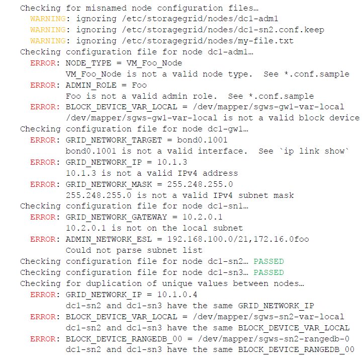

= StorageGRID 구성을 검증합니다.
:allow-uri-read: 
:icons: font
:imagesdir: ../media/

[role="lead"]
구성 파일을 만든 후 `/etc/storagegrid/nodes` 각 StorageGRID 노드에 대해 해당 파일의 내용을 검증해야 합니다.

구성 파일의 내용을 검증하려면 각 호스트에서 다음 명령을 실행합니다.

[listing]
----
sudo storagegrid node validate all
----
파일이 올바르면 예시에서 볼 수 있듯이 각 구성 파일에 대해 *PASSED*가 출력됩니다.

NOTE: 메타데이터 전용 노드에서 LUN을 하나만 사용하는 경우 무시해도 되는 경고 메시지가 표시될 수 있습니다.

image::../media/rhel_node_configuration_file_output.gif[이 이미지는 주변 텍스트로 설명됩니다.]

TIP: 자동 설치의 경우 다음을 사용하여 이 출력을 억제할 수 있습니다. `-q` 또는 `--quiet` 옵션 `storagegrid` 명령(예: `storagegrid --quiet...` ).  출력을 억제하면 구성 경고나 오류가 감지되면 명령은 0이 아닌 종료 값을 갖게 됩니다.

구성 파일이 올바르지 않으면 예시에서 볼 수 있듯이 문제가 *경고* 및 *오류*로 표시됩니다.  구성 오류가 발견되면 설치를 계속하기 전에 해당 오류를 수정해야 합니다.

